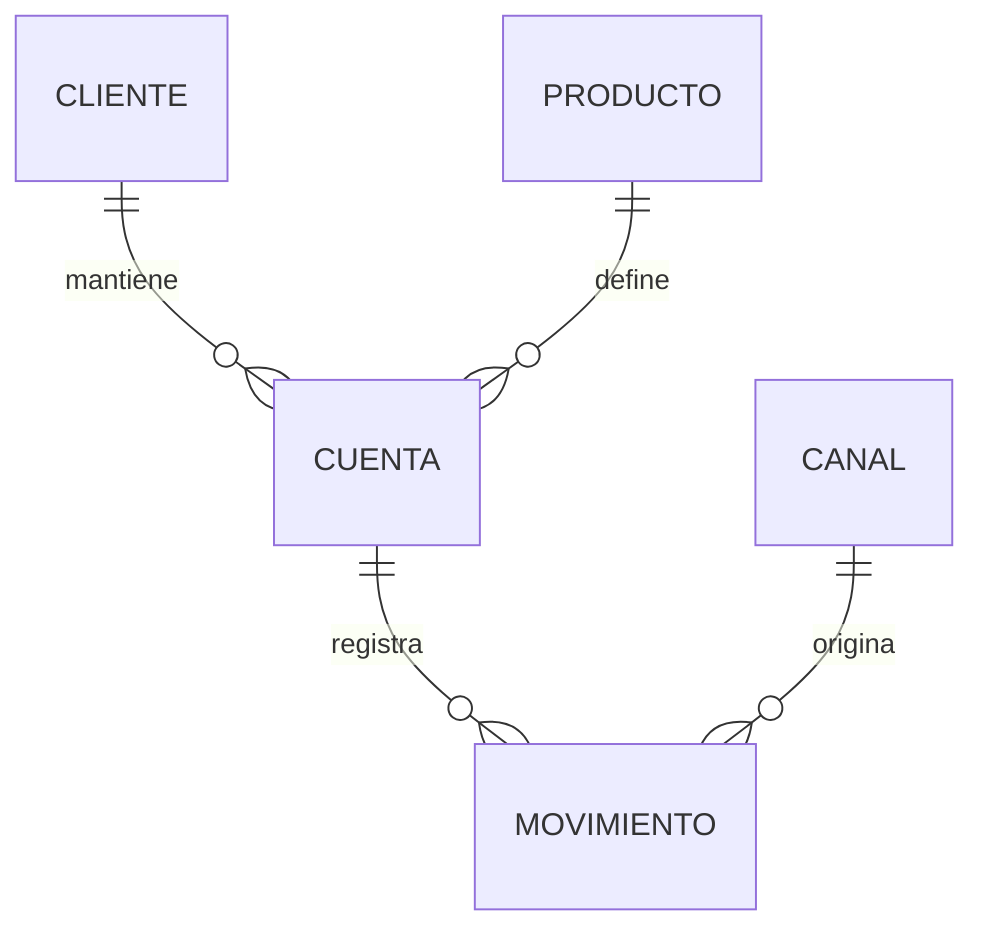

# El rol del Data Modeler de comienzo a fin

> Documento base del programa. Explica qué hace un modelador de datos, en qué orden, con qué
> insumos y qué entrega en cada etapa. Los 10 casos del repositorio son aplicaciones de este ciclo.

---

## 1. Definición operativa

**Data Modeler**: profesional responsable de definir la estructura, el significado y las reglas de
los datos de una organización, expresándolos en modelos conceptuales, lógicos y físicos que sirven
de contrato entre el negocio y la tecnología.

Su producto no es código: es **una decisión de diseño documentada y defendible**.

### La prueba del buen modelo

Un modelo está bien hecho si supera estas cinco preguntas:

1. **¿Un usuario de negocio entiende el modelo conceptual sin ayuda técnica?**
2. **¿Es imposible guardar un dato incoherente?** (las reglas viven en el modelo, no en el código)
3. **¿Puedo responder las preguntas de negocio sin reescribir el modelo?**
4. **¿Puedo reconstruir la foto de cualquier fecha pasada?** (historia)
5. **¿Puedo rastrear cada campo hasta su origen?** (linaje)

---

## 2. Las 10 fases, en detalle

### Fase 1 — Entender el negocio y la normativa

**Insumos:** manuales de producto, tarifario, reglamentos SBS aplicables, contratos, procesos.

En banca peruana esta fase es distinta a otros sectores: **una parte del modelo está impuesta por
la norma**. Ejemplo: no se puede diseñar libremente el campo "clasificación del deudor" porque la
Resolución SBS N.º 11356-2008 define exactamente cinco categorías. Modelarlo como texto libre es un
error de diseño que se paga en el reporte regulatorio.

**Preguntas que hace el modelador:**
- ¿Qué norma regula este producto y qué campos obliga a conservar?
- ¿Qué plazos de retención aplican?
- ¿Qué datos son personales o sensibles (Ley 29733)?
- ¿Qué reportes regulatorios deben salir de aquí?

**Entregable:** nota de supuestos y restricciones normativas.

---

### Fase 2 — Levantamiento de requerimientos de información

**Técnica central: definir la GRANULARIDAD.** Es la decisión más cara de revertir.

> *"¿Una fila representa un cliente, una cuenta, un movimiento, o un cliente-producto-mes?"*

**Herramienta práctica — la matriz de preguntas de negocio:**

| # | Pregunta de negocio | Granularidad requerida | Historia requerida | Frecuencia |
|---|---|---|---|---|
| 1 | ¿Cuánto saldo tiene hoy el cliente X? | cuenta | no | tiempo real |
| 2 | ¿Cómo evolucionó el saldo promedio por región? | cuenta-mes | sí | mensual |
| 3 | ¿Qué clientes pasaron de Normal a CPP? | deudor-mes | sí (SCD2) | mensual |

Si una pregunta no se puede responder con la granularidad elegida, el modelo está mal dimensionado.

**Entregable:** documento de requerimientos + matriz de preguntas de negocio.

---

### Fase 3 — Modelo conceptual

**Objetivo:** acordar *qué existe* con el negocio, en su lenguaje.

**Reglas:**
- Entidades en **sustantivo singular** y en el idioma del negocio (`CLIENTE`, no `TB_CLI_01`).
- Sin tipos de dato, sin llaves técnicas, sin tablas puente.
- Toda relación con **cardinalidad y verbo**: "un CLIENTE *mantiene* una o más CUENTAS".
- Cada entidad y relación se define en el **glosario**.

**Cómo identificar entidades:** subraya los sustantivos de las reglas de negocio; los que tienen
identidad propia y ciclo de vida son entidades, el resto suelen ser atributos.

**Entregable:** diagrama conceptual + glosario de negocio firmado por el usuario.

---

### Fase 4 — Modelo lógico

**Objetivo:** estructura completa e independiente del motor.

Aquí se decide el **estilo de modelado**, según el propósito:

| Propósito | Estilo | Por qué |
|---|---|---|
| Sistema transaccional (core, originación) | **Normalizado 3FN** | Evita anomalías de actualización, garantiza consistencia |
| Consumo analítico / BI | **Dimensional (estrella)** | Rendimiento de consulta y comprensión del usuario |
| Capa integrada auditable | **Data Vault 2.0** | Absorbe cambios de origen, trazabilidad total, cargas paralelas |
| Datos maestros | **MDM / golden record** | Una versión única y gobernada de la entidad |

#### Normalización — lo mínimo exigible

| Forma normal | Regla | Error que evita |
|---|---|---|
| **1FN** | Valores atómicos, sin grupos repetidos | `telefonos = '999111222 / 999333444'` |
| **2FN** | 1FN + todo atributo depende de la PK **completa** | En `(cuenta_id, fecha)`, guardar `nombre_cliente` |
| **3FN** | 2FN + ningún atributo depende de otro no clave | Guardar `distrito` y `departamento` deducible del `ubigeo` |
| **BCNF** | Todo determinante es superclave | Casos con claves candidatas solapadas |

**Desnormalizar es legítimo** — pero es una *decisión documentada con motivo*, no un descuido.

#### Manejo de historia (SCD)

| Tipo | Qué hace | Cuándo usarlo en banca |
|---|---|---|
| **SCD 1** | Sobrescribe | Corrección de un error de tipeo |
| **SCD 2** | Nueva fila con vigencia `desde`/`hasta` | Clasificación del deudor, dirección, segmento. **El estándar en banca** |
| **SCD 3** | Columna "valor anterior" | Casos puntuales con un solo cambio relevante |

**Entregable:** diagrama E-R lógico + diccionario de datos preliminar.

---

### Fase 5 — Modelo físico

**Objetivo:** que funcione en el motor real, a volumen real.

Decisiones típicas y su criterio:

| Decisión | Criterio en banca |
|---|---|
| **Tipos numéricos de dinero** | `NUMERIC/DECIMAL(18,2)` — **nunca** `FLOAT`: los errores de redondeo no cuadran con contabilidad |
| **Llave primaria** | Natural si es estable y regulada (ej. `ubigeo`); sustituta (`BIGINT`/identidad) en tablas de alto volumen |
| **Fechas** | `DATE` para fechas contables; `TIMESTAMP` con zona para eventos |
| **Particionamiento** | Por rango de fecha en tablas de movimientos (permite purga y mejora consulta) |
| **Índices** | Por FK, por campos de filtro frecuente; evitar sobre-indexar tablas de escritura intensiva |
| **Constraints** | `CHECK` para dominios regulatorios; `UNIQUE` para reglas de negocio; FK siempre declaradas |
| **Nulos** | Un `NULL` debe significar "no aplica" o "desconocido" — nunca "cero" |

**Entregable:** script DDL versionado en Git, con migraciones incrementales.

---

### Fase 6 — Mapeo origen-destino (source-to-target)

Es **el contrato con el Data Engineer**. Sin esto, el pipeline se construye a criterio de quien lo
programa y el modelo se corrompe.

| Destino | Campo destino | Origen | Campo origen | Transformación | Regla de calidad |
|---|---|---|---|---|---|
| `dim_cliente` | `tipo_documento` | core | `TIP_DOC` | mapear `1→DNI`, `6→RUC` | debe existir en catálogo |
| `fact_saldo` | `saldo_mn` | core | `SALDO` | si moneda=USD → `SALDO * tc_venta` | no negativo en ahorros |

**Entregable:** matriz source-to-target versionada.

---

### Fase 7 — Reglas de calidad

Una regla de calidad sirve solo si es **ejecutable y se ejecuta**. Seis familias:

| Familia | Ejemplo bancario | Cómo se prueba |
|---|---|---|
| **Unicidad** | No hay dos clientes con el mismo DNI | `GROUP BY ... HAVING COUNT(*)>1` |
| **Integridad referencial** | Todo movimiento apunta a una cuenta existente | `LEFT JOIN ... WHERE t2.id IS NULL` |
| **Dominio** | Clasificación ∈ {0,1,2,3,4} | `WHERE clasificacion NOT IN (...)` |
| **Completitud** | Todo crédito vigente tiene tipo de crédito | `WHERE campo IS NULL` |
| **Consistencia / cuadre** | Σ movimientos = saldo de la cuenta | comparación agregada |
| **Oportunidad** | El dato de ayer llegó antes de las 6 a.m. | control de carga |

**Entregable:** suite SQL de validación que corre en cada carga.

---

### Fase 8 — Documentación

1. **Diccionario de datos**: nombre, tipo, dominio, obligatoriedad, descripción de negocio, origen,
   sensibilidad, ejemplo.
2. **Linaje**: de dónde viene y a dónde va cada campo.
3. **Clasificación de sensibilidad**:

| Nivel | Ejemplos | Tratamiento |
|---|---|---|
| Público | Tipo de cambio, tarifario | Sin restricción |
| Interno | Catálogos, parámetros | Acceso por rol |
| Confidencial | Saldos, ingresos, scoring | Acceso mínimo necesario |
| **Dato personal** (Ley 29733) | DNI, nombre, dirección, teléfono | Finalidad limitada, enmascarar fuera de producción |
| **Dato sensible** (Ley 29733) | Salud, biometría, datos que revelen origen étnico | Prohibido salvo base legal expresa |

---

### Fase 9 — Gobierno del modelo

- **Versionado en Git**: el modelo es código (DDL + diagramas Mermaid + diccionario en Markdown).
- **Control de cambios**: todo cambio de esquema pasa por revisión; se evalúa impacto aguas abajo.
- **Cambios compatibles vs. rompientes**:

| Compatible (bajo riesgo) | Rompiente (requiere plan) |
|---|---|
| Agregar columna opcional | Eliminar o renombrar columna |
| Agregar tabla o índice | Cambiar tipo o reducir longitud |
| Ampliar un dominio | Restringir un dominio, cambiar granularidad |

- **Registro de decisiones (ADR)**: por qué se eligió esta llave, por qué se desnormalizó.

---

### Fase 10 — Evolución y deuda de modelo

Síntomas de deuda de modelo que el modelador debe detectar y reportar:

- Columnas `campo_libre_1..10` usadas para cosas distintas según el área.
- Tablas con sufijos `_v2`, `_final`, `_nuevo` conviviendo con las originales.
- Reglas de negocio implementadas solo en reportes y no en el modelo.
- Ausencia de historia donde el negocio necesita comparar contra el pasado.
- La misma entidad definida distinto en dos data marts (el clásico "cliente activo").

---

## 3. Antipatrones frecuentes en banca

| Antipatrón | Por qué duele | Qué hacer |
|---|---|---|
| Guardar dinero en `FLOAT` | No cuadra con contabilidad | `NUMERIC(18,2)` |
| Un solo campo de saldo sin moneda | Suma soles con dólares | `moneda` obligatoria + tipo de cambio fechado |
| Estado del crédito sin historia | Imposible reconstruir el reporte del mes pasado | SCD2 o tabla de hechos *snapshot* mensual |
| Texto libre para categorías reguladas | Rompe el reporte SBS | Tabla catálogo + `CHECK`/FK |
| DNI como llave primaria de todo | Cambia, se corrige, se duplica en migraciones | Llave sustituta + `UNIQUE` sobre el DNI |
| Borrado físico de operaciones | Rompe auditoría y PLAFT | Borrado lógico + bitácora |
| Datos personales sin enmascarar en QA | Riesgo sancionable (Ley 29733) | Enmascaramiento en ambientes no productivos |

---

## 4. Ruta de carrera en el Perú

| Nivel | Se espera que | Foco |
|---|---|---|
| Analista de datos junior | Lea y consulte modelos existentes | SQL, entender el E-R |
| Data Modeler junior | Modele un data mart con supervisión | Normalización, dimensional básico |
| Data Modeler senior | Modele dominios completos, negocie con negocio | SCD, Data Vault, regulación |
| Arquitecto de datos | Defina estándares y plataforma de toda la organización | Arquitectura, gobierno |
| Gerente de gobierno de datos | Responda por calidad y cumplimiento ante la SBS | Riesgo, normativa, comité |

**Cómo se demuestra el nivel en una entrevista peruana:** te dan un caso ("modela el producto de
ahorros y dime cómo sacas el reporte de saldos promedio del mes") y evalúan si preguntas por
**granularidad, moneda, historia y regulación** antes de dibujar. Los 10 casos de este repositorio
están construidos para entrenar exactamente ese reflejo.
