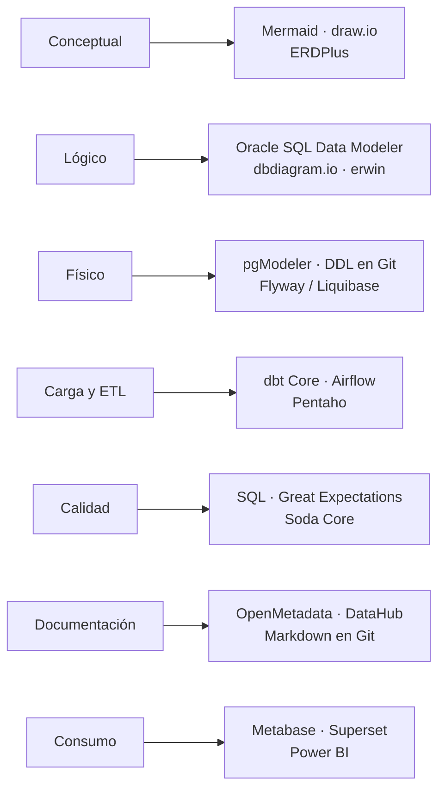

# Herramientas del Data Modeler — gratuitas, online y empresariales

> Todo lo marcado **Gratis** se puede usar sin pagar para aprender y para los 10 casos de este
> repositorio. Verifica siempre la licencia vigente antes de un uso comercial.

---

## 1. Stack mínimo para hacer este programa

Con estas cuatro piezas puedes completar los 10 casos:

| Pieza | Herramienta | Licencia | Descarga |
|---|---|---|---|
| Motor de BD | **PostgreSQL 14+** | PostgreSQL License (libre) | <https://www.postgresql.org/download/> |
| Cliente SQL | **DBeaver Community** | Apache 2.0 | <https://dbeaver.io/download/> |
| Modelado visual | **pgModeler** o **Oracle SQL Developer Data Modeler** | GPLv3 / gratuito | <https://pgmodeler.io/> · <https://www.oracle.com/database/sqldeveloper/technologies/sql-data-modeler/> |
| Versionado | **Git + GitHub** | Libre / plan gratuito | <https://git-scm.com/> |

¿No puedes instalar nada? Usa la **ruta 100% navegador** de la sección 6.

---

## 2. Herramientas de modelado E-R

### 2.1 Escritorio gratuitas

| Herramienta | Fuerte en | Genera DDL | Ingeniería inversa | Notas |
|---|---|---|---|---|
| **pgModeler** | PostgreSQL | Sí | Sí | El mejor gratuito para PostgreSQL; hay binarios de pago pero el código es libre y compilable |
| **Oracle SQL Developer Data Modeler** | Modelos lógicos, relacionales y multidimensionales | Sí (multi-motor) | Sí | Gratuito, muy usado en banca; soporta Oracle, SQL Server, DB2, PostgreSQL |
| **MySQL Workbench** | MySQL/MariaDB | Sí | Sí | Modelado E-R completo; útil aunque tu destino sea otro motor |
| **DBeaver Community** | Diagramas desde una BD existente | Parcial | Sí | Es cliente SQL, no modelador puro: ideal para documentar lo que ya existe |
| **SQL Power Architect (CE)** | Modelado independiente de motor | Sí | Sí | Proyecto antiguo pero funcional |
| **DbSchema (Community)** | Modelado visual multi-motor | Sí | Sí | Funciones avanzadas en versión de pago |

### 2.2 Online gratuitas (sin instalar)

| Herramienta | URL | Fuerte en | Límite del plan gratuito |
|---|---|---|---|
| **dbdiagram.io** | <https://dbdiagram.io/> | Diagrama desde código DSL; importa y exporta SQL | Número de diagramas limitado; los públicos son ilimitados |
| **ERDPlus** | <https://erdplus.com/> | Notación académica (Chen, Crow's Foot), modelo relacional y estrella | Gratuito, pensado para enseñanza |
| **draw.io / diagrams.net** | <https://app.diagrams.net/> | Diagramas libres, guarda en local o Drive | Gratuito, sin límite |
| **QuickDBD** | <https://www.quickdatabasediagrams.com/> | Diagrama escribiendo texto, muy rápido | Diagramas limitados en gratis |
| **ChartDB** | <https://chartdb.io/> | Diagrama desde un *dump* de esquema | Código abierto, autohospedable |
| **Mermaid Live Editor** | <https://mermaid.live/> | Diagramas versionables en texto | Gratuito, sin registro |

> **Recomendación de este repositorio:** usar **Mermaid** para los entregables (se ve en GitHub, se
> versiona como texto, no depende de un proveedor) y **dbdiagram.io** o **draw.io** cuando necesites
> una lámina bonita para presentar a negocio.

### 2.3 Empresariales (las que verás en un banco)

| Herramienta | Uso típico en banca peruana |
|---|---|
| **erwin Data Modeler** (Quest) | Estándar de facto en modelado corporativo; gobierno de modelos, comparación y sincronización |
| **SAP PowerDesigner** | Modelado + arquitectura empresarial |
| **IBM InfoSphere Data Architect** | Entornos IBM/DB2 |
| **ER/Studio** (Idera) | Modelado y gobierno con repositorio |
| **SQLDBM** | Modelado en la nube para Snowflake/Databricks |

Ninguna es necesaria para aprender: los conceptos se transfieren al 100%.

---

## 3. Motores de base de datos para practicar

| Motor | Licencia | Por qué usarlo aquí |
|---|---|---|
| **PostgreSQL** | Libre | El más completo gratis: particionamiento, `CHECK`, ventanas, `MERGE`, JSON. **Motor oficial de este repositorio** |
| **SQLite** | Dominio público | Cero instalación, un archivo; ideal para prototipos rápidos |
| **DuckDB** | MIT | Analítica columnar en tu laptop; excelente para casos dimensionales |
| **MySQL / MariaDB** | GPL | Muy difundido; menor soporte de `CHECK` histórico |
| **SQL Server Developer / Express** | Gratuita para desarrollo | Presente en banca peruana |
| **Oracle XE** | Gratuita con límites | Presente en core bancarios |

---

## 4. Herramientas complementarias del día a día

### Transformación y pipelines

| Herramienta | Para qué | Licencia |
|---|---|---|
| **dbt Core** | Transformación analítica con pruebas y documentación; genera linaje | Apache 2.0 |
| **Apache Airflow** | Orquestación de cargas | Apache 2.0 |
| **Pentaho Data Integration (CE)** | ETL visual | Libre |
| **Talend Open Studio** | ETL visual | Libre |
| **Airbyte OSS** | Ingesta de fuentes | Libre |

### Calidad y gobierno

| Herramienta | Para qué | Licencia |
|---|---|---|
| **Great Expectations** | Reglas de calidad de datos ejecutables | Apache 2.0 |
| **Soda Core** | Chequeos de calidad declarativos | Apache 2.0 |
| **OpenMetadata** | Catálogo, linaje, glosario de negocio | Apache 2.0 |
| **DataHub** | Catálogo y linaje | Apache 2.0 |
| **Apache Atlas** | Gobierno en ecosistemas Hadoop | Apache 2.0 |

### Migraciones de esquema (versionar el modelo físico)

| Herramienta | Enfoque | Licencia |
|---|---|---|
| **Flyway Community** | Migraciones SQL numeradas | Apache 2.0 |
| **Liquibase OSS** | Changelogs XML/YAML/SQL, *rollback* | Apache 2.0 |
| **Sqitch** | Migraciones con dependencias | MIT |

### Visualización / BI

| Herramienta | Licencia |
|---|---|
| **Metabase OSS** | AGPL |
| **Apache Superset** | Apache 2.0 |
| **Power BI Desktop** | Gratuito para uso individual |
| **Looker Studio** | Gratuito |

### Generación de datos de prueba

| Herramienta | Nota |
|---|---|
| **Faker** (Python) | Soporta locale `es_ES`; útil para nombres y direcciones |
| **Mockaroo** | Web, plan gratuito hasta 1 000 filas |
| **generate_series** (PostgreSQL) | **Lo usado en este repositorio**: datos determinísticos, sin dependencias |

---

## 5. Mapa: qué herramienta usar en cada fase

---

## 6. Ruta 100% navegador (sin instalar nada)

Si trabajas en una máquina donde no puedes instalar software:

| Necesidad | Opción web gratuita |
|---|---|
| Ejecutar PostgreSQL | **DB Fiddle** (<https://www.db-fiddle.com/>) · **SQLite Online** (<https://sqliteonline.com/>) |
| Diagramar E-R | **dbdiagram.io** · **ERDPlus** · **draw.io** · **Mermaid Live** |
| Versionar | **GitHub** en el navegador (editor web) |
| Documentar | Markdown en GitHub |
| Analizar datos | **Google Colab** (<https://colab.research.google.com/>) con `pandas` y `duckdb` |

> Los scripts de este repositorio están escritos en SQL estándar de PostgreSQL y funcionan en
> DB Fiddle seleccionando PostgreSQL 14 o superior. Algunos casos avanzados usan particionamiento,
> que requiere una instancia propia (local o Colab con `psycopg`).

---

## 7. Qué preguntar antes de elegir herramienta en un proyecto real

1. ¿El modelo debe **sincronizarse** con una base existente o es *greenfield*?
2. ¿Necesitamos **repositorio de modelos** compartido y control de versiones nativo?
3. ¿La herramienta genera **DDL del motor destino** sin retoques manuales?
4. ¿Permite exportar el **diccionario de datos** para el catálogo corporativo?
5. ¿El formato de archivo es **abierto** o quedamos atados al proveedor?
6. ¿Cuántas licencias necesitamos realmente? (usualmente menos de las que se pide)

---

## Fuentes

- PostgreSQL — <https://www.postgresql.org/>
- DBeaver — <https://dbeaver.io/>
- pgModeler — <https://pgmodeler.io/>
- Oracle SQL Developer Data Modeler — <https://www.oracle.com/database/sqldeveloper/technologies/sql-data-modeler/>
- dbdiagram.io — <https://dbdiagram.io/>
- ERDPlus — <https://erdplus.com/>
- diagrams.net — <https://app.diagrams.net/>
- Mermaid — <https://mermaid.js.org/>
- dbt Core — <https://www.getdbt.com/product/dbt-core>
- Great Expectations — <https://greatexpectations.io/>
- OpenMetadata — <https://open-metadata.org/>
- Flyway — <https://www.red-gate.com/products/flyway/community/>
- Liquibase — <https://www.liquibase.org/>
- Metabase — <https://www.metabase.com/start/oss/>
- Apache Superset — <https://superset.apache.org/>
