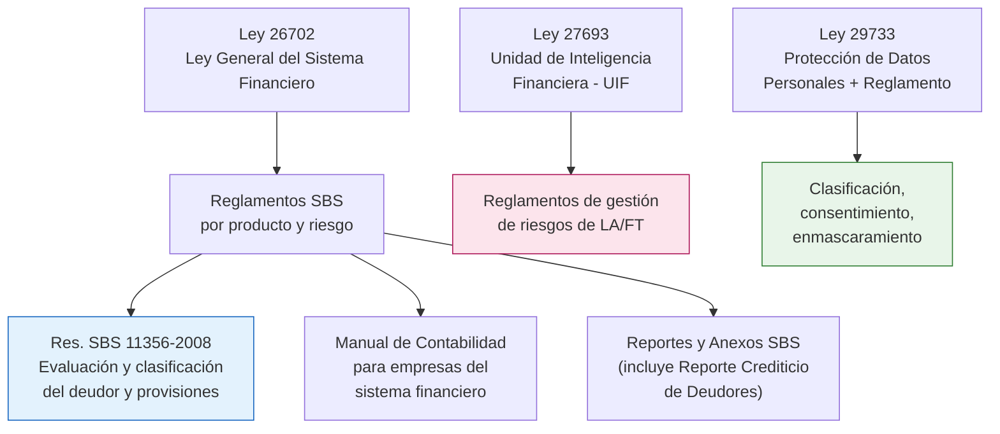

# Normativa peruana que condiciona el modelo de datos

> En banca, **parte del modelo de datos no se negocia con el usuario: la impone la norma.**
> Este documento resume qué exige cada norma y **qué consecuencia concreta tiene sobre las tablas**.
>
> ⚠️ **Advertencia de vigencia:** las normas de la SBS se modifican con frecuencia mediante
> resoluciones posteriores. Los números y plazos citados aquí son referenciales para fines
> **educativos**. Antes de usarlos en un proyecto real, **verifica el texto vigente** en
> <https://www.sbs.gob.pe/normativa> y consulta al área de Cumplimiento de tu entidad.
> Este documento **no es asesoría legal**.

---

## 1. Mapa de normas relevantes

---

## 2. Ley N.º 26702 — Ley General del Sistema Financiero y del Sistema de Seguros

**Qué es:** la ley marco del sistema financiero peruano y de la SBS como supervisor.

**Impacto en el modelo:**

| Exigencia | Consecuencia de diseño |
|---|---|
| **Secreto bancario** (art. 140 y ss.): las operaciones pasivas son confidenciales | Clasificación de sensibilidad obligatoria; control de acceso por rol; enmascaramiento fuera de producción |
| Obligación de conservar información y ponerla a disposición del supervisor | Retención larga (años), borrado **lógico** y no físico, bitácoras de auditoría |
| Régimen de encaje, provisiones y límites | El modelo debe soportar cálculos regulatorios con corte a fecha |

---

## 3. Resolución SBS N.º 11356-2008 — Evaluación y Clasificación del Deudor

**Qué es:** define cómo se clasifica a cada deudor y qué provisiones corresponden. Es **la norma que
más marca el modelo de datos de crédito en el Perú**.

**Texto de referencia:**
<https://www.sbs.gob.pe/portals/0/jer/pfrpv_normatividad/20160719_res-11356-2008.pdf>

### 3.1 Categorías de clasificación del deudor

| Código | Categoría |
|---|---|
| 0 | **Normal** |
| 1 | **Con Problemas Potenciales (CPP)** |
| 2 | **Deficiente** |
| 3 | **Dudoso** |
| 4 | **Pérdida** |

### 3.2 Criterio por días de atraso (créditos minoristas: MES, pequeña empresa, consumo, hipotecario)

| Categoría | Días de atraso (referencial) |
|---|---|
| Normal | Al día o hasta 8 días |
| CPP | 9 a 30 días *(consumo/MES)* · 31 a 60 días *(otros segmentos)* |
| Deficiente | 31 a 60 días *(consumo/MES)* · 61 a 120 días |
| Dudoso | 61 a 120 días *(consumo/MES)* · 121 a 365 días |
| Pérdida | Más de 120 días *(consumo/MES)* · más de 365 días |

> Los tramos exactos difieren según el **tipo de crédito** y han sido modificados por resoluciones
> posteriores. En los casos de este repositorio se usa una **tabla paramétrica** (`cat_clasificacion_dias`)
> justamente para que el cambio normativo sea un `UPDATE` de parámetros y no un cambio de modelo.
> **Ese es el patrón de diseño que se debe aprender.**

### 3.3 Tipos de crédito

La norma establece ocho tipos de crédito. Modelarlos como catálogo cerrado es obligatorio:

| Código | Tipo de crédito |
|---|---|
| 1 | Corporativo |
| 2 | Grandes empresas |
| 3 | Medianas empresas |
| 4 | Pequeñas empresas |
| 5 | Microempresas (MES) |
| 6 | Consumo revolvente |
| 7 | Consumo no revolvente |
| 8 | Hipotecario para vivienda |

### 3.4 Consecuencias de diseño (lo importante)

| Exigencia normativa | Decisión de modelado |
|---|---|
| Dominios cerrados de clasificación y tipo de crédito | **Tablas catálogo + FK + `CHECK`**, nunca texto libre |
| La clasificación cambia mes a mes y debe reconstruirse | **SCD2** o tabla *snapshot* mensual de deudor |
| El deudor se clasifica considerando **toda su deuda en el sistema** | Modelo a nivel **deudor**, no solo a nivel operación |
| Provisiones dependen de categoría, tipo de crédito y garantía | Entidad `GARANTIA` con tipo y valor; tabla de tasas de provisión parametrizada |
| Alineamiento entre operaciones del mismo deudor | Necesidad de identificar unívocamente al deudor → refuerza el caso de **MDM** |

---

## 4. Manual de Contabilidad para las empresas del sistema financiero (SBS)

**Qué es:** el plan contable obligatorio del sistema financiero peruano.

**Impacto en el modelo:**

- Todo movimiento operativo debe poder **cuadrar con un asiento contable**.
- El modelo de movimientos necesita un campo de **cuenta contable** o un mapeo a ella.
- Las validaciones de calidad deben incluir **cuadres** (suma de movimientos = variación de saldos =
  movimiento contable del día).

---

## 5. Reportes y anexos regulatorios SBS

Las entidades reportan periódicamente a la SBS. El más relevante para modelado de crédito es el
**Reporte Crediticio de Deudores (RCD)**, que alimenta la **Central de Riesgos** y, consolidado con
otras fuentes, el **Reporte Crediticio Consolidado (RCC)** que las entidades consultan.

**Impacto en el modelo:**

| Exigencia | Decisión de modelado |
|---|---|
| Reporte mensual con corte a fin de mes | Tabla de hechos **snapshot mensual** por deudor y operación |
| Debe poder reprocesarse y explicarse ante el supervisor | **Linaje campo a campo** y conservación de la versión enviada |
| Identificación del deudor por tipo y número de documento | Dominio de tipo de documento (DNI, CE, RUC, pasaporte) obligatorio |
| Saldos por moneda | Moneda explícita + tipo de cambio de la fecha de corte |

→ Este es exactamente el **caso 10** del repositorio.

---

## 6. Prevención del Lavado de Activos y Financiamiento del Terrorismo (PLAFT)

**Marco:** Ley N.º 27693 (creación de la UIF-Perú), su incorporación a la SBS, y los reglamentos de
gestión de riesgos de LA/FT emitidos por la SBS para el sistema financiero.

**Obligaciones que impactan el modelo:**

| Obligación | Decisión de modelado |
|---|---|
| **Registro de Operaciones (RO)**: operaciones que superan umbrales definidos | Marca de "sujeta a registro" y umbral parametrizado por norma vigente |
| Detección de **operaciones inusuales** y evaluación de **operaciones sospechosas** | Entidades `ALERTA`, `REGLA`, `CASO`, `DISPOSICION`; agregados móviles por cliente |
| **Reporte de Operaciones Sospechosas (ROS)** con reserva estricta | Tabla con acceso restringido, **prohibido avisar al cliente** (deber de reserva) |
| Conocimiento del cliente (KYC) y debida diligencia | Perfil del cliente, actividad económica, PEP, país de riesgo |
| **Fraccionamiento** de operaciones para evadir umbrales | Agregación por ventana temporal (día, semana, mes) — no basta evaluar operación por operación |
| Trazabilidad y conservación por plazos largos | Retención extendida, inmutabilidad, bitácora |

> **Los umbrales monetarios cambian por norma.** Modelarlos como **parámetro vigente por fecha**
> (tabla `parametro_umbral` con `vigente_desde`/`vigente_hasta`) y no como constante en el código.
> Ese patrón se implementa en el **caso 07**.

---

## 7. Ley N.º 29733 — Protección de Datos Personales (y su Reglamento)

**Autoridad:** Autoridad Nacional de Protección de Datos Personales (ANPDP), del Ministerio de
Justicia y Derechos Humanos.

**Texto:** <https://www.gob.pe/institucion/congreso-de-la-republica/normas-legales/243470-29733>

### 7.1 Conceptos que el modelador debe manejar

| Concepto | Definición práctica |
|---|---|
| **Dato personal** | Información sobre persona natural identificada o identificable (DNI, nombre, dirección, correo, teléfono) |
| **Dato sensible** | Datos biométricos, de salud, origen racial/étnico, ingresos económicos, opiniones políticas, religión, vida sexual — régimen reforzado |
| **Banco de datos personales** | Conjunto organizado de datos personales; debe inscribirse ante la autoridad |
| **Titular** | La persona a la que pertenecen los datos |
| **Finalidad** | Los datos solo pueden usarse para el fin informado y consentido |
| **Derechos ARCO** | Acceso, Rectificación, Cancelación y Oposición |

### 7.2 Régimen sancionador (referencial, en UIT)

| Gravedad | Rango de multa |
|---|---|
| Leve | 0.5 a 5 UIT |
| Grave | 5 a 50 UIT |
| Muy grave | 50 a 100 UIT |

El sector financiero está entre los más fiscalizados.

### 7.3 Consecuencias de diseño (obligatorias en este repositorio)

| Exigencia | Decisión de modelado |
|---|---|
| Clasificar cada campo | Columna de **clasificación de sensibilidad** en el diccionario de datos de cada caso |
| Minimización | No modelar campos "por si acaso": cada atributo justifica su finalidad |
| Enmascaramiento fuera de producción | Vistas enmascaradas / funciones de ofuscación para ambientes no productivos |
| Derecho de cancelación | Borrado **lógico** + procedimiento de anonimización; imposible si la PK es el DNI |
| Trazabilidad de acceso | Bitácora de consultas sobre datos personales |
| Retención limitada a la finalidad | Política de retención por tabla, documentada en el modelo |

> **Regla práctica del repositorio:** ningún caso usa datos personales reales. Todos los documentos
> de identidad se generan **por secuencia dentro de un rango sintético reservado**, no fueron
> validados contra ningún registro oficial y no representan a ninguna persona.

---

## 8. Checklist normativo para revisar cualquier modelo bancario peruano

Antes de dar por cerrado un modelo, el Data Modeler responde:

- [ ] ¿Todo dominio regulado está en catálogo con FK, y no en texto libre?
- [ ] ¿Puedo reconstruir la clasificación del deudor de cualquier mes pasado?
- [ ] ¿Todo saldo tiene moneda y puedo convertirlo con el tipo de cambio de la fecha correcta?
- [ ] ¿Puedo producir el reporte regulatorio sin transformaciones no documentadas?
- [ ] ¿Cada campo tiene clasificación de sensibilidad asignada?
- [ ] ¿Existe política de retención y borrado lógico?
- [ ] ¿Los umbrales y parámetros normativos están parametrizados por fecha de vigencia?
- [ ] ¿Existe linaje campo a campo hasta el sistema origen?
- [ ] ¿Hay bitácora de acceso a datos personales?
- [ ] ¿El ambiente de desarrollo tiene datos enmascarados?

---

## Fuentes

- SBS — Normativa: <https://www.sbs.gob.pe/normativa>
- Resolución SBS N.º 11356-2008: <https://www.sbs.gob.pe/portals/0/jer/pfrpv_normatividad/20160719_res-11356-2008.pdf>
- Ley N.º 29733, Ley de Protección de Datos Personales: <https://www.gob.pe/institucion/congreso-de-la-republica/normas-legales/243470-29733>
- Diario Oficial El Peruano: <https://diariooficial.elperuano.pe/Normas>
- Plataforma del Estado Peruano: <https://www.gob.pe/>
