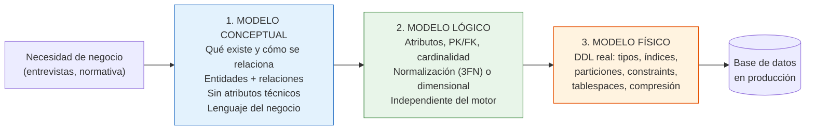
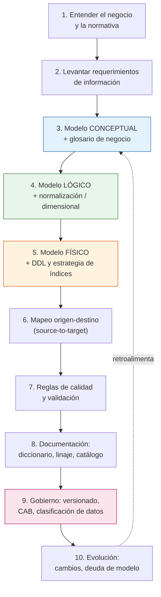
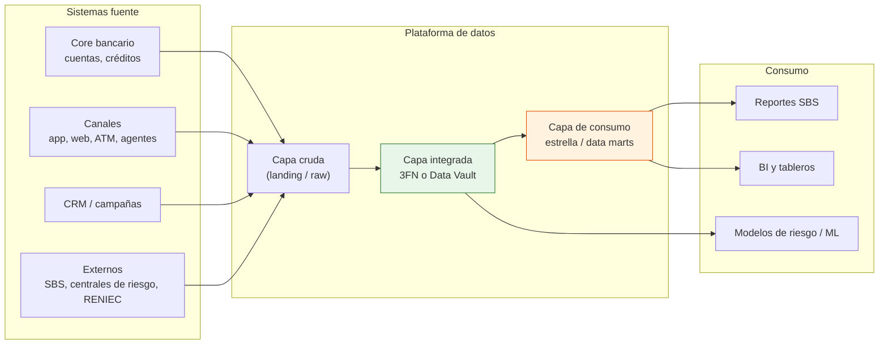

# Data Modeler en Banca Peruana — Programa práctico orientado al BCP

Repositorio de formación **end-to-end** para el rol de **Data Modeler (Modelador de Datos)** en el
sector financiero peruano, con el Banco de Crédito del Perú (BCP) como caso de referencia.

Contiene **10 casos reales desarrollables de principio a fin**, cada uno con su enunciado, su guía
paso a paso, sus datos y su solución de referencia (modelo conceptual → lógico → entidad-relación →
físico → consultas → validación de calidad).

> ### ✅ Validado de punta a punta
>
> Los 10 casos se ejecutaron completos contra **PostgreSQL 16**: modelo físico → carga de datos →
> consultas de negocio → reglas de calidad.
>
> | Casos válidos | Reglas de calidad en `OK` | Reglas en `FALLA` | Cifras verificadas | Filas cargadas |
> |:-:|:-:|:-:|:-:|:-:|
> | **10 / 10** | **136** | **0** | **66** | **854 701** |
>
> Las *cifras verificadas* son las que los READMEs prometen ("900 deudores, 195 duplicados
> resueltos…"): el validador comprueba que la base las cumpla, no solo que los scripts corran.
>
> Reprodúcelo con `./validacion/validar.sh`. Detalle en
> [`validacion/REPORTE-VALIDACION.md`](validacion/REPORTE-VALIDACION.md).

---

## 1. ¿Qué es un Data Modeler?

Un **Data Modeler** es el profesional que traduce **reglas de negocio** en **estructuras de datos
correctas, estables y gobernadas**. No es quien "hace tablas": es quien define *qué significa cada
dato*, *cómo se relaciona con los demás*, *qué reglas no pueden violarse nunca* y *cómo debe
almacenarse* para que el negocio pueda operar y analizar sin ambigüedad.

En una frase: **el Data Modeler es el arquitecto del significado de los datos.**

### Diferencia con roles vecinos

| Rol | Pregunta que responde | Entregable típico |
|---|---|---|
| **Data Modeler** | ¿Qué es un "cliente"? ¿Qué reglas lo gobiernan? ¿Cómo se estructura? | Modelo conceptual, lógico y físico; diccionario de datos; estándares |
| Data Engineer | ¿Cómo muevo y transformo ese dato a escala? | Pipelines ETL/ELT, orquestación, ingesta |
| Data Architect | ¿Qué plataformas y capas usamos como organización? | Arquitectura de referencia, roadmap, estándares tecnológicos |
| DBA | ¿Cómo mantengo la BD viva, rápida y segura? | Tuning, backups, alta disponibilidad, seguridad |
| Data Analyst / Scientist | ¿Qué dice el dato? | Reportes, dashboards, modelos predictivos |
| Data Steward | ¿Este dato es confiable y quién responde por él? | Reglas de calidad, propiedad del dato, catálogo |

> El Data Modeler es **el único rol cuyo producto principal es una decisión de diseño**, no un
> artefacto operativo. Un error de modelado sobrevive años y se paga en cada pipeline, cada reporte
> y cada reproceso regulatorio.

### Los tres niveles de modelado (el núcleo del oficio)



| Nivel | Audiencia | Pregunta | Ejemplo bancario |
|---|---|---|---|
| **Conceptual** | Negocio, gerencia | ¿Qué cosas del mundo real gestionamos? | "Un CLIENTE tiene una o más CUENTAS; una CUENTA registra MOVIMIENTOS" |
| **Lógico** | Analistas, arquitectos | ¿Qué atributos, llaves y reglas tiene cada cosa? | `CUENTA(cuenta_id PK, cliente_id FK, moneda, saldo_disponible, estado)` |
| **Físico** | Ingeniería, DBA | ¿Cómo se implementa en este motor concreto? | `NUMERIC(18,2)`, índice `BRIN` por fecha, partición mensual por `fecha_movimiento` |

**Modelo Entidad-Relación (E-R):** es la *notación* con la que se dibujan los niveles conceptual y
lógico (Chen, Crow's Foot / IE, IDEF1X). En este repositorio se usa **Crow's Foot en Mermaid**,
porque se renderiza directo en GitHub y se versiona como texto.

---

## 2. El rol de comienzo a fin: las 10 fases del ciclo

Este es el ciclo completo que ejecuta un Data Modeler en un banco. Cada caso del repositorio
recorre estas fases.



| # | Fase | Qué hace concretamente | Entregable |
|---|---|---|---|
| 1 | **Entender negocio y normativa** | Lee el reglamento SBS aplicable, los manuales de producto, el tarifario. En banca peruana el modelo **nace de la norma**, no solo del usuario. | Resumen normativo, supuestos |
| 2 | **Requerimientos de información** | Entrevistas con usuarios, análisis de reportes existentes, definición de granularidad y de preguntas de negocio. | Documento de requerimientos, lista de preguntas de negocio |
| 3 | **Modelo conceptual** | Identifica entidades, relaciones, cardinalidades y reglas de negocio. Acuerda el **glosario**. | Diagrama conceptual + glosario |
| 4 | **Modelo lógico** | Atributos, dominios, PK/FK, normalización a 3FN (OLTP) o estrella/copo/Data Vault (analítico). Resuelve históricos (SCD). | Diagrama lógico + diccionario preliminar |
| 5 | **Modelo físico** | Tipos de dato del motor, índices, particionamiento, constraints, nomenclatura, estrategia de carga. | Script DDL versionado |
| 6 | **Mapeo origen-destino** | Documenta de qué sistema origen viene cada campo y qué transformación sufre. Es el contrato con el Data Engineer. | Matriz source-to-target |
| 7 | **Reglas de calidad** | Define reglas verificables: unicidad, integridad referencial, rangos, cuadres contables, completitud. | Suite de validaciones SQL |
| 8 | **Documentación** | Diccionario de datos, linaje, clasificación de sensibilidad (Ley 29733). | Diccionario + linaje |
| 9 | **Gobierno** | Versiona el modelo en Git, pasa por comité de cambios, define retención y enmascaramiento. | Modelo aprobado y versionado |
| 10 | **Evolución** | Gestiona cambios sin romper lo existente, mide deuda de modelo, deprecia estructuras. | Registro de cambios (ADR) |

### Entregables que se le exigen a un Data Modeler

1. Diagramas conceptual, lógico y físico versionados.
2. **Diccionario de datos** (cada campo: nombre, tipo, dominio, obligatoriedad, origen, sensibilidad).
3. **Matriz source-to-target** (el contrato con ingeniería).
4. **Estándares de nomenclatura** (prefijos, sufijos, idioma, abreviaturas permitidas).
5. **Reglas de calidad ejecutables**.
6. **Clasificación de datos** (público / interno / confidencial / dato personal / dato sensible).
7. **Registro de decisiones de diseño** (por qué esta llave, por qué esta desnormalización).

---

## 3. Cómo trabaja un Data Modeler en el Perú (y en el BCP)

### 3.1 Lo que hace particular al mercado peruano

En el Perú, un modelador de datos bancario trabaja **encajado entre tres fuerzas**: el negocio, la
**SBS** (Superintendencia de Banca, Seguros y AFP) y la **ANPDP** (Autoridad Nacional de Protección
de Datos Personales del MINJUSDH). Esto tiene consecuencias directas sobre el modelo:

| Fuerza | Impacto concreto en el modelo de datos |
|---|---|
| **SBS** — reportes y anexos regulatorios | El modelo debe poder producir el **Reporte Crediticio de Deudores (RCD/RCC)** y los anexos mensuales. Obliga a guardar clasificación del deudor, días de atraso, tipo de crédito, garantías y provisiones con historia. |
| **SBS — Res. 11356-2008** (evaluación y clasificación del deudor) | Impone dominios cerrados: categorías Normal, CPP, Deficiente, Dudoso, Pérdida, y tipos de crédito (corporativo, gran/mediana/pequeña/micro empresa, consumo revolvente y no revolvente, hipotecario). |
| **SBS — PLAFT / UIF-Perú** | Obliga a **Registro de Operaciones** con umbrales y a trazabilidad de operaciones inusuales y sospechosas. El modelo necesita retención larga y linaje. |
| **Ley N.º 29733 — Protección de Datos Personales** y su reglamento | Obliga a clasificar datos personales y **datos sensibles**, registrar el banco de datos, limitar finalidad, y en la práctica: enmascaramiento en ambientes no productivos. |
| **Manual de Contabilidad para empresas del sistema financiero (SBS)** | El plan de cuentas contable condiciona el modelo: cada movimiento debe poder cuadrar con contabilidad. |
| **Multimoneda estructural (PEN/USD)** | Casi ningún modelo bancario peruano es monomoneda. Todo saldo tiene moneda, y todo reporte consolidado exige tipo de cambio con fecha. |
| **Realidad de inclusión financiera** | Alto volumen de clientes con productos pequeños y transacciones micro (billeteras digitales), lo que empuja modelos preparados para volumen y particionamiento. |

### 3.2 Cómo se organiza el trabajo en un banco grande como el BCP

> **Aviso importante y honesto:** los modelos de datos internos del BCP son **confidenciales** y no
> son públicos. Este repositorio **no** reproduce modelos internos del banco. Lo que hace es
> **reconstruir escenarios equivalentes** a partir de: (a) normativa pública de la SBS, (b) datos
> abiertos y estadísticas públicas, (c) información pública del propio grupo Credicorp (memorias,
> reportes trimestrales, notas de prensa) y (d) datasets académicos con licencia libre. Todo lo
> afirmado sobre el BCP en este repositorio proviene de fuentes públicas citadas.

Hechos públicos útiles para contextualizar la escala del problema:

- El BCP es el banco más grande del Perú y forma parte del grupo **Credicorp**, que reporta
  resultados públicamente (NYSE: BAP).
- **Yape**, la billetera digital del BCP, superó los **16 millones de usuarios activos mensuales**,
  con decenas de transacciones por usuario al mes según los reportes trimestrales públicos de
  Credicorp. Eso implica **miles de millones de transacciones al año** — un problema de modelado de
  alto volumen real, no teórico.
- BCP ha declarado públicamente el uso de **Microsoft Azure** para sus canales digitales
  (banca móvil, Yape, portal de negocios) como parte de su transformación digital.

En un banco de ese tamaño, el Data Modeler típicamente se ubica en un equipo de **Arquitectura de
Datos / Gobierno de Datos**, y su día a día se ve así:



**Un día típico del Data Modeler bancario:**

| Momento | Actividad |
|---|---|
| Inicio del día | Revisión de incidencias de calidad de datos de la carga nocturna (cuadres que no cierran) |
| Media mañana | Refinamiento con negocio: un producto nuevo exige entidades nuevas (ej. un nuevo tipo de crédito) |
| Mediodía | Diseño: actualizar el modelo lógico, evaluar impacto en downstream |
| Tarde | Revisión de cambios de esquema propuestos por otros equipos (control de cambios) |
| Tarde | Documentar: diccionario, linaje, clasificación de datos personales |
| Cierre de mes | Soporte al reporte regulatorio SBS: trazar campo por campo del anexo hasta el origen |

### 3.3 Competencias que se exigen en el mercado peruano

- **SQL avanzado** (el 100% del trabajo lo toca): ventanas, CTE recursivas, planes de ejecución.
- **Normalización** (1FN→3FN/BCNF) y **modelado dimensional** (Kimball) — ambos, no uno.
- **Data Vault 2.0** para capas integradas con alta trazabilidad (cada vez más pedido en banca).
- **Manejo de historia**: SCD tipo 1/2/3, tablas de hechos *snapshot* vs *transaccional*.
- **Normativa SBS** básica y protección de datos personales (Ley 29733).
- **Herramientas**: al menos un modelador visual (Erwin, PowerDesigner, Oracle SQL Developer Data
  Modeler, pgModeler) y un cliente SQL (DBeaver).
- **Inglés técnico** y comunicación con negocio (se documenta y se sustenta en comité).

---

## 4. Herramientas del día a día

Listado completo, con alternativas **gratuitas** y **online**, en
[`00-fundamentos/02-herramientas.md`](00-fundamentos/02-herramientas.md).

Resumen del *stack mínimo gratuito* que usa este repositorio:

| Necesidad | Herramienta gratuita recomendada | Tipo |
|---|---|---|
| Motor de base de datos | **PostgreSQL** | Escritorio / servidor |
| Cliente SQL | **DBeaver Community** | Escritorio |
| Modelado visual E-R | **pgModeler**, **Oracle SQL Developer Data Modeler** | Escritorio |
| Diagramas E-R online | **dbdiagram.io**, **ERDPlus**, **draw.io** | Web, sin instalar |
| Diagramas versionables | **Mermaid** (nativo en GitHub) | Texto |
| Versionado de modelo | **Git + GitHub** | Texto |
| Migraciones de esquema | **Flyway Community**, **Liquibase OSS** | Escritorio |
| Transformación analítica | **dbt Core** | Escritorio |
| Visualización / BI | **Metabase OSS**, **Apache Superset** | Escritorio |

---

## 5. Estructura del repositorio

```
data-modeler-bcp-peru/
├── README.md                          ← estás aquí
├── 00-fundamentos/
│   ├── 01-rol-data-modeler.md         Rol end-to-end, fases, entregables, carrera
│   ├── 02-herramientas.md             Herramientas gratuitas, online y empresariales
│   ├── 03-fuentes-datos-peru.md       Fuentes legales, verificadas y gratuitas
│   ├── 04-normativa-peru.md           SBS, UIF, Ley 29733 y su impacto en el modelo
│   ├── 05-estandares-modelado.md      Nomenclatura, tipos, patrones, antipatrones
│   └── 06-glosario.md                 Glosario bancario y de modelado
├── casos/
│   ├── caso-01-core-cuentas-ahorro/
│   ├── caso-02-originacion-creditos/
│   ├── caso-03-tarjetas-credito/
│   ├── caso-04-billetera-digital-p2p/
│   ├── caso-05-dwh-colocaciones/
│   ├── caso-06-tipo-cambio-posicion-me/
│   ├── caso-07-plaft-monitoreo/
│   ├── caso-08-cliente-360-mdm/
│   ├── caso-09-data-vault-inclusion/
│   └── caso-10-reporte-regulatorio-sbs/
│        ├── README.md                 ← guía PASO A PASO de comienzo a fin
│        ├── enunciado.md              Caso de negocio y criterios de aceptación
│        └── datos/
│            ├── FUENTES.md            Fuentes reales, licencia y fecha de acceso
│            └── carga_datos.sql       Datos determinísticos listos para ejecutar
├── soluciones/                        ← AQUÍ SE GUARDA LA RESOLUCIÓN
│   └── caso-XX-.../
│       ├── README.md                  Decisiones de diseño
│       ├── 01-modelo-conceptual.md    Diagrama conceptual
│       ├── 02-modelo-logico.md        Diagrama E-R lógico + diccionario
│       ├── 03-modelo-fisico.sql       DDL ejecutable
│       ├── 04-consultas-negocio.sql   Preguntas de negocio resueltas
│       ├── 05-calidad-datos.sql       Reglas de calidad ejecutables
│       └── mi-solucion/               Espacio para TU propia resolución
└── validacion/
    ├── validar.sh                     Ejecuta los 10 casos contra PostgreSQL
    ├── cifras-documentadas.sql        Verifica que los READMEs digan la verdad
    ├── REPORTE-VALIDACION.md          Resultado de la última ejecución
    └── salida/                        Registros de cada ejecución (no versionados)
```

---

## 6. Los 10 casos

Van de menor a mayor dificultad y cubren todo el ciclo: OLTP → analítico → gobierno y regulación.

| # | Caso | Tipo de modelo | Técnica principal | Dificultad |
|---|---|---|---|---|
| 01 | [Core de cuentas de ahorro](casos/caso-01-core-cuentas-ahorro/) | OLTP | Normalización 3FN, integridad transaccional | ★☆☆☆☆ |
| 02 | [Originación de créditos de consumo](casos/caso-02-originacion-creditos/) | OLTP | Dominios regulatorios SBS, máquina de estados | ★★☆☆☆ |
| 03 | [Tarjetas de crédito: facturación y mora](casos/caso-03-tarjetas-credito/) | OLTP | Ciclos de facturación, historia de saldos | ★★☆☆☆ |
| 04 | [Billetera digital P2P (tipo Yape)](casos/caso-04-billetera-digital-p2p/) | OLTP alto volumen | Particionamiento, idempotencia, eventos | ★★★☆☆ |
| 05 | [DWH de colocaciones y captaciones](casos/caso-05-dwh-colocaciones/) | Analítico | Modelo estrella (Kimball), SCD2 | ★★★☆☆ |
| 06 | [Tipo de cambio y posición en ME](casos/caso-06-tipo-cambio-posicion-me/) | Analítico | Series temporales, conversión multimoneda | ★★★☆☆ |
| 07 | [PLAFT: monitoreo de operaciones](casos/caso-07-plaft-monitoreo/) | Híbrido | Motor de reglas, alertas, agregados móviles | ★★★★☆ |
| 08 | [Cliente 360 / MDM](casos/caso-08-cliente-360-mdm/) | MDM | Golden record, *matching*, supervivencia | ★★★★☆ |
| 09 | [Data Vault de inclusión financiera](casos/caso-09-data-vault-inclusion/) | Analítico | Data Vault 2.0 (Hub/Link/Satélite) | ★★★★★ |
| 10 | [Reporte regulatorio SBS (RCD)](casos/caso-10-reporte-regulatorio-sbs/) | Regulatorio | Linaje, trazabilidad, cuadres | ★★★★★ |

---

## 7. Cómo empezar

### Requisitos (todos gratuitos)

```bash
# 1. PostgreSQL 14 o superior
#    Linux:   sudo apt install postgresql
#    macOS:   brew install postgresql@16
#    Windows: https://www.postgresql.org/download/windows/

# 2. Cliente SQL DBeaver Community: https://dbeaver.io/download/
# 3. Git: https://git-scm.com/downloads
```

### Ejecutar tu primer caso

```bash
git clone <este-repositorio>
cd data-modeler-bcp-peru

# Crear la base de trabajo
createdb bcp_lab

# Levantar el caso 01 completo (esquema + datos + consultas)
psql -d bcp_lab -f soluciones/caso-01-core-cuentas-ahorro/03-modelo-fisico.sql
psql -d bcp_lab -f casos/caso-01-core-cuentas-ahorro/datos/carga_datos.sql
psql -d bcp_lab -f soluciones/caso-01-core-cuentas-ahorro/04-consultas-negocio.sql
```

### Validar los 10 casos de una sola vez

```bash
./validacion/validar.sh            # los 10 casos, en orden de dependencia
./validacion/validar.sh caso10     # un solo caso; resuelve sus prerrequisitos solo
```

El script devuelve **código de salida 0** si todos los modelos se crean, todos los datos cargan,
todas las consultas responden, **todas las reglas de calidad quedan en `OK`** y **las 66 cifras que
los READMEs prometen coinciden con la base**. Si algo falla, imprime la regla exacta y deja el
registro en `validacion/salida/`.

### Ruta recomendada

1. Lee [`00-fundamentos/01-rol-data-modeler.md`](00-fundamentos/01-rol-data-modeler.md).
2. Haz los casos **01 → 10 en orden**: cada uno asume lo aprendido en el anterior.
3. En cada caso: **primero resuelve tú** en `soluciones/caso-XX/mi-solucion/`, y **después**
   compara con la solución de referencia.

---

## 8. Aviso legal y de uso de datos

- Este material es **educativo**. No está afiliado, patrocinado ni avalado por el Banco de Crédito
  del Perú, Credicorp, la SBS, el BCRP, el INEI ni la SUNAT.
- **No contiene datos personales reales ni información confidencial de ninguna entidad.** Todos los
  registros de los casos son **sintéticos y generados determinísticamente por script**.
- Las fuentes externas citadas son **públicas, gratuitas y de acceso legal**; cada caso documenta su
  licencia y condiciones en su archivo `datos/FUENTES.md`.
- Los nombres de productos (Yape, BCP) se usan de forma **nominativa y descriptiva** para dar
  contexto realista; los modelos son reconstrucciones propias a partir de información pública.

---

## 9. Fuentes principales consultadas

- Superintendencia de Banca, Seguros y AFP del Perú — <https://www.sbs.gob.pe/>
- Resolución SBS N.º 11356-2008, Reglamento para la Evaluación y Clasificación del Deudor —
  <https://www.sbs.gob.pe/portals/0/jer/pfrpv_normatividad/20160719_res-11356-2008.pdf>
- BCRPData, Banco Central de Reserva del Perú — <https://estadisticas.bcrp.gob.pe/estadisticas/series/>
- Plataforma Nacional de Datos Abiertos — <https://www.datosabiertos.gob.pe/>
- Padrón Reducido del RUC, SUNAT — <https://www.sunat.gob.pe/descargaPRR/mrc137_padron_reducido.html>
- Microdatos INEI (ENAHO) — <https://proyectos.inei.gob.pe/microdatos/>
- Ley N.º 29733, Ley de Protección de Datos Personales — <https://www.gob.pe/institucion/congreso-de-la-republica/normas-legales/243470-29733>
- Sala de prensa e informes de Credicorp — <https://grupocredicorp.com/>
- UCI Machine Learning Repository (datasets con licencia CC BY 4.0) — <https://archive.ics.uci.edu/>
