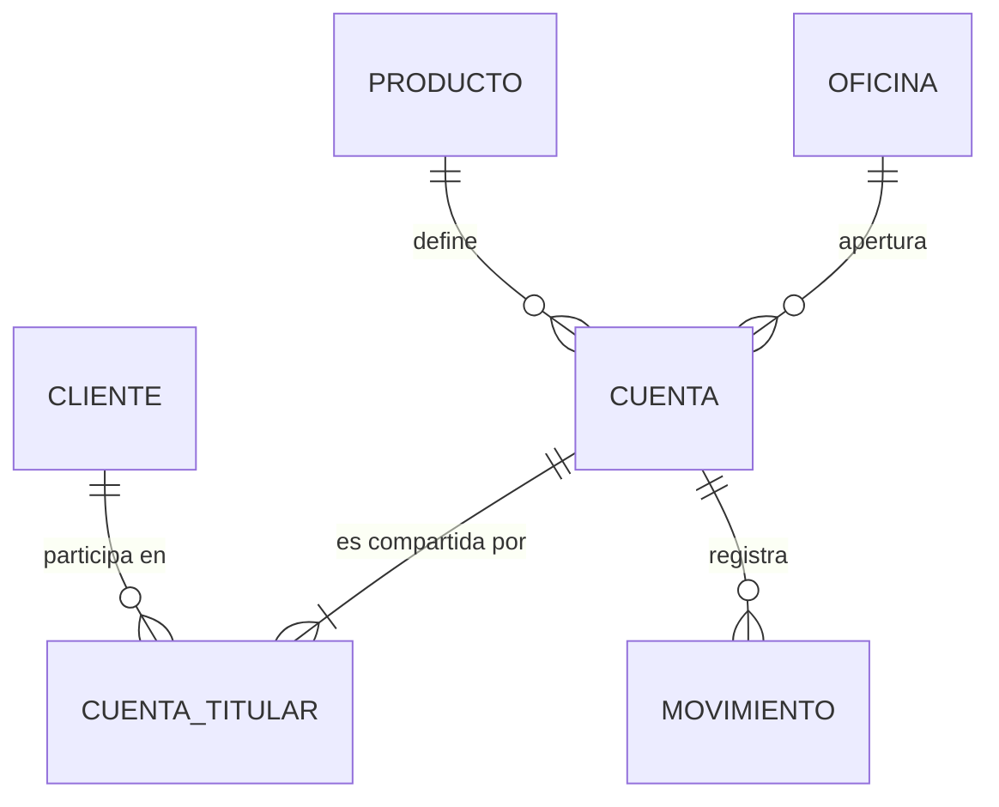

# Caso 01 — Guía paso a paso: núcleo de captaciones

> **Cómo usar esta guía.** Cada paso indica *qué hacer*, *con qué herramienta* y *cómo verificar que
> lo hiciste bien*. Resuelve tú primero y guarda tu trabajo en
> [`soluciones/caso-01-core-cuentas-ahorro/mi-solucion/`](../../soluciones/caso-01-core-cuentas-ahorro/mi-solucion/).
> La solución de referencia está en la carpeta padre de esa ruta.

📄 Lee primero el [enunciado](enunciado.md).

---

## Herramientas necesarias (todas gratuitas)

| Herramienta | Para qué | Instalación |
|---|---|---|
| **PostgreSQL 14+** | Motor de base de datos | <https://www.postgresql.org/download/> |
| **DBeaver Community** | Cliente SQL y diagramas | <https://dbeaver.io/download/> |
| **dbdiagram.io** o **draw.io** | Diagrama E-R visual | Navegador, sin instalar |
| **Mermaid Live** | Diagrama versionable | <https://mermaid.live/> |

**¿Sin permisos para instalar?** Usa <https://www.db-fiddle.com/> con PostgreSQL 14+; todos los
scripts de este caso funcionan ahí.

### Preparación del entorno (5 minutos)

```bash
# Crear la base de trabajo (una sola vez para todo el programa)
createdb bcp_lab

# Verificar conexión
psql -d bcp_lab -c "SELECT version();"
```

---

## PASO 1 — Entender el negocio y la normativa

**Objetivo:** saber qué te obliga la norma antes de dibujar nada.

**Qué hacer:**

1. Lee las 15 reglas de negocio del [enunciado](enunciado.md#2-reglas-de-negocio-levantadas).
2. Lee la sección de normativa en [`00-fundamentos/04-normativa-peru.md`](../../00-fundamentos/04-normativa-peru.md).
3. Completa esta tabla de supuestos en tu carpeta `mi-solucion/00-supuestos.md`:

| Pregunta | Tu respuesta |
|---|---|
| ¿Qué datos de este modelo son datos personales? | |
| ¿Puedo usar el DNI como llave primaria? ¿Por qué? | |
| ¿Cuánto tiempo debo conservar los movimientos? | |
| ¿Qué pasa si el cliente ejerce su derecho de cancelación? | |

**Verificación:** si tu respuesta a "¿puedo usar el DNI como PK?" es "sí", vuelve a leer la Ley 29733.

---

## PASO 2 — Definir granularidad y preguntas de negocio

**Objetivo:** fijar qué representa una fila en cada tabla. Es la decisión más cara de revertir.

**Qué hacer:** para cada una de las 8 preguntas de negocio del enunciado, escribe la granularidad
mínima que necesitas.

| Pregunta | Granularidad necesaria | ¿Requiere historia? |
|---|---|---|
| PN-01 Saldo por producto y moneda | cuenta | No (foto actual) |
| PN-03 Movimientos por canal y mes | **movimiento individual** | Sí (todos los movimientos) |
| PN-05 Saldo promedio mensual | movimiento + saldo posterior por día | Sí |

**Regla:** la tabla de movimientos debe estar al **grano del evento individual**. Si guardas
totales diarios, PN-03 y PN-08 se vuelven imposibles.

**Verificación:** ninguna pregunta del enunciado queda sin granularidad asignada.

---

## PASO 3 — Modelo conceptual

**Objetivo:** acordar con negocio *qué existe*, sin tecnicismos.

**Qué hacer:**

1. Subraya los **sustantivos** de las 15 reglas de negocio. Candidatos: cliente, cuenta, producto,
   movimiento, canal, oficina, moneda, estado, tipo de movimiento, ubigeo.
2. Decide cuáles son **entidades** (tienen identidad y ciclo de vida propios) y cuáles son
   **catálogos** (listas de valores estables).
3. Dibuja el diagrama con cardinalidad y verbo en cada relación.

**Herramienta:** empieza en papel; pásalo a Mermaid o dbdiagram.io.

Plantilla Mermaid para que arranques:



**Preguntas que debes poder responder con tu diagrama:**
- ¿Cómo represento una cuenta mancomunada? *(pista: relación N:M con atributos)*
- ¿`ESTADO` es una entidad o un atributo? *(pista: ¿tiene atributos propios y ciclo de vida?)*

**Verificación:** muéstraselo a alguien sin conocimientos técnicos. Si no lo entiende, no es un
modelo conceptual.

**Entregable:** `mi-solucion/01-modelo-conceptual.md`

---

## PASO 4 — Modelo lógico y normalización

**Objetivo:** llegar a 3FN con llaves y dominios definidos.

**Qué hacer paso a paso:**

### 4.1 Lista los atributos de cada entidad

Para `CLIENTE`: tipo de documento, número de documento, apellidos, nombres, fecha de nacimiento,
ubigeo, fecha de alta, estado.

### 4.2 Aplica las formas normales

Verifica una por una y anota el hallazgo:

| Forma | Qué revisar en este caso | Hallazgo típico |
|---|---|---|
| **1FN** | ¿Algún campo guarda lista de valores? | "titulares" separados por coma → se rompe en tabla propia |
| **2FN** | En `CUENTA_TITULAR (cuenta_id, cliente_id)`, ¿hay atributos que dependan solo de una parte? | `nombre_cliente` no pertenece aquí |
| **3FN** | ¿Hay atributos deducibles de otros no clave? | `departamento` y `provincia` se deducen del `ubigeo` → tabla `cat_ubigeo` |

### 4.3 Define llaves

| Entidad | Llave natural | Llave elegida | Motivo |
|---|---|---|---|
| `cliente` | (tipo_doc, num_doc) | sustituta `cliente_id` | El documento es dato personal y puede corregirse |
| `cuenta` | `num_cuenta` | sustituta `cuenta_id` | El número de cuenta puede cambiar de formato |
| `cat_ubigeo` | `ubigeo` | **natural** | Código oficial, estable |

### 4.4 Define dominios

| Atributo | Dominio |
|---|---|
| `moneda_cod` | `PEN`, `USD` (ISO 4217) |
| `estado_cta_cod` | `ACT`, `INA`, `BLQ`, `CER` |
| `rol_cod` | `TITULAR`, `MANCOMUNADO`, `APODERADO` |

### 4.5 Decide dónde vive cada regla de negocio

Esta tabla es el corazón del paso. **Una regla que no vive en el modelo se incumple tarde o temprano.**

| Regla | ¿Dónde se implementa? |
|---|---|
| RN-01 documento único | `UNIQUE (tipo_doc_cod, num_doc)` |
| RN-03 un solo titular principal | Índice único parcial |
| RN-09 signo del movimiento | Columna `signo` en el catálogo de tipos |
| RN-10 saldo = suma de movimientos | Regla de calidad + proceso de actualización |
| RN-11 saldo disponible derivado | **Columna generada** |
| RN-12 extorno sin borrado | FK autorreferenciada + flag |
| RN-13 operación única | `UNIQUE (num_operacion)` |

**Entregable:** `mi-solucion/02-modelo-logico.md` con el diagrama E-R y el diccionario de datos.

---

## PASO 5 — Modelo físico (DDL)

**Objetivo:** DDL ejecutable, con las reglas declaradas en la base.

**Qué hacer:**

1. Crea el esquema y hazlo reejecutable:

```sql
DROP SCHEMA IF EXISTS caso01 CASCADE;
CREATE SCHEMA caso01;
SET search_path TO caso01;
```

2. Crea **primero los catálogos**, luego las entidades, luego las tablas de movimiento (orden de
   dependencias de FK).

3. Aplica los estándares de [`05-estandares-modelado.md`](../../00-fundamentos/05-estandares-modelado.md):
   - Dinero en `NUMERIC(18,2)`, **nunca** `FLOAT`.
   - Ubigeo en `CHAR(6)`, **nunca** `INTEGER`.
   - Documento en `VARCHAR(20)`, **nunca** numérico.
   - Toda tabla con PK; toda FK declarada; nombres de constraint según convención.

4. Dos construcciones de PostgreSQL que este caso te enseña:

**a) Columna generada** (para RN-11, saldo disponible derivado):

```sql
saldo_disponible NUMERIC(18,2)
    GENERATED ALWAYS AS (saldo_contable - saldo_retenido) STORED
```

**b) Índice único parcial** (para RN-03, un solo titular principal vigente):

```sql
CREATE UNIQUE INDEX uq_cuenta_titular_principal
    ON cuenta_titular (cuenta_id)
    WHERE rol_cod = 'TITULAR' AND fecha_hasta IS NULL;
```

5. Documenta las tablas en la propia base:

```sql
COMMENT ON TABLE cuenta IS 'Cuenta de captación de un cliente en una moneda.';
COMMENT ON COLUMN cliente.num_doc IS 'Número de documento. DATO PERSONAL (Ley 29733).';
```

**Verificación:**

```bash
psql -d bcp_lab -f mi-solucion/03-modelo-fisico.sql   # sin errores
psql -d bcp_lab -f mi-solucion/03-modelo-fisico.sql   # dos veces: debe volver a funcionar
```

**Entregable:** `mi-solucion/03-modelo-fisico.sql`

---

## PASO 6 — Cargar datos y probar que las reglas se cumplen

**Objetivo:** demostrar que el modelo **impide** guardar datos incorrectos.

```bash
# Carga de datos sintéticos (500 clientes, ~800 cuentas, ~24 000 movimientos)
psql -d bcp_lab -f casos/caso-01-core-cuentas-ahorro/datos/carga_datos.sql
```

Ahora **intenta romper el modelo a propósito**. Cada uno de estos comandos **debe fallar**:

```sql
SET search_path TO caso01;

-- 1) Documento duplicado → debe violar uq_cliente_doc
INSERT INTO cliente (tipo_doc_cod, num_doc, ape_paterno, nombres, fecha_alta)
SELECT tipo_doc_cod, num_doc, 'PRUEBA', 'DUPLICADO', CURRENT_DATE FROM cliente LIMIT 1;

-- 2) Monto cero → debe violar ck_movimiento_monto_positivo
INSERT INTO movimiento (cuenta_id, fecha_operacion, fecha_contable, tipo_mov_cod,
                        canal_cod, moneda_cod, monto, monto_con_signo, saldo_posterior, num_operacion)
VALUES (1, CURRENT_TIMESTAMP, CURRENT_DATE, 'DEP', 'APP', 'PEN', 0, 0, 0, 'PRUEBA-0');

-- 3) Segundo titular principal → debe violar uq_cuenta_titular_principal
INSERT INTO cuenta_titular (cuenta_id, cliente_id, rol_cod, fecha_desde)
VALUES (1, 2, 'TITULAR', CURRENT_DATE);

-- 4) Número de operación repetido → debe violar uq_movimiento_operacion
INSERT INTO movimiento (cuenta_id, fecha_operacion, fecha_contable, tipo_mov_cod,
                        canal_cod, moneda_cod, monto, monto_con_signo, saldo_posterior, num_operacion)
SELECT cuenta_id, fecha_operacion, fecha_contable, tipo_mov_cod, canal_cod, moneda_cod,
       monto, monto_con_signo, saldo_posterior, num_operacion
FROM movimiento LIMIT 1;
```

> **Si alguno de los cuatro NO falla, tu modelo tiene un hueco.** Este paso es el que separa a un
> modelador de alguien que solo escribe `CREATE TABLE`.

**Entregable:** `mi-solucion/06-pruebas-negativas.sql` con las 4 pruebas y su resultado.

---

## PASO 7 — Responder las preguntas de negocio

Escribe una consulta por cada pregunta PN-01 a PN-08.

Pistas para las tres más difíciles:

- **PN-04 (cuentas sin movimiento del cliente en 90 días):** cuidado, los abonos de interés y las
  comisiones son movimientos del **banco**, no del cliente. Filtra por canal o por tipo de
  movimiento; si no lo haces, ninguna cuenta aparecerá inactiva.
- **PN-05 (saldo promedio mensual):** necesitas el saldo **de cada día**, no el promedio de los
  movimientos. Usa `generate_series` de días y arrastra el último saldo conocido con una función de
  ventana.
- **PN-07 (cuadre):** compara `cuenta.saldo_contable` contra `SUM(monto_con_signo)` agrupado por
  cuenta, y muestra solo las diferencias.

**Entregable:** `mi-solucion/04-consultas-negocio.sql`

---

## PASO 8 — Reglas de calidad de datos

Escribe validaciones que devuelvan **0 filas cuando todo está bien**. Mínimo estas seis:

| ID | Regla | Familia |
|---|---|---|
| CAL-01 | No hay clientes duplicados por documento | Unicidad |
| CAL-02 | Toda cuenta tiene exactamente un titular principal vigente | Consistencia |
| CAL-03 | Todo movimiento apunta a una cuenta existente | Integridad referencial |
| CAL-04 | `saldo_contable` = suma de `monto_con_signo` por cuenta | **Cuadre** |
| CAL-05 | Ninguna cuenta de ahorro tiene saldo negativo | Dominio |
| CAL-06 | Ningún movimiento tiene fecha contable anterior a la de operación | Consistencia |

**Entregable:** `mi-solucion/05-calidad-datos.sql`

---

## PASO 9 — Documentar

1. **Diccionario de datos** con la plantilla de los estándares, incluyendo la columna
   **Sensibilidad** (Ley 29733).
2. **Matriz source-to-target**: de qué sistema origen vendría cada campo en la vida real.
3. **Tres ADR** como mínimo. Sugerencias de temas:
   - ADR-01: llave sustituta vs. documento como PK.
   - ADR-02: `saldo_disponible` como columna generada.
   - ADR-03: signo del movimiento en el catálogo, no en el monto.

**Entregable:** `mi-solucion/07-diccionario-y-adr.md`

---

## PASO 10 — Revisión final

Recorre los criterios de aceptación del enunciado y marca cada uno. Luego compara con la
**solución de referencia**:

```
soluciones/caso-01-core-cuentas-ahorro/
├── README.md                  Decisiones de diseño explicadas
├── 01-modelo-conceptual.md
├── 02-modelo-logico.md        Diagrama E-R + diccionario completo
├── 03-modelo-fisico.sql       DDL ejecutable
├── 04-consultas-negocio.sql   PN-01 a PN-08 resueltas
└── 05-calidad-datos.sql       CAL-01 a CAL-06
```

**No compares antes de intentarlo.** El valor del caso está en las decisiones que tomes tú.

---

## Verificación automática

Desde la raíz del proyecto:

```bash
./validacion/validar.sh caso01
```

Debe reportar `OK` en modelo físico, carga de datos, consultas y calidad.

---

## Para profundizar

- ¿Cómo cambiaría el modelo si el banco lanza **cuentas multimoneda**? *(pista: la moneda deja de
  ser atributo de la cuenta y pasa a ser atributo del saldo → nace la entidad `SALDO_CUENTA`)*
- ¿Cómo soportarías **20 millones de movimientos al mes**? → eso es el **caso 04**.
- ¿Cómo se convierte este modelo OLTP en un modelo analítico? → eso es el **caso 05**.
