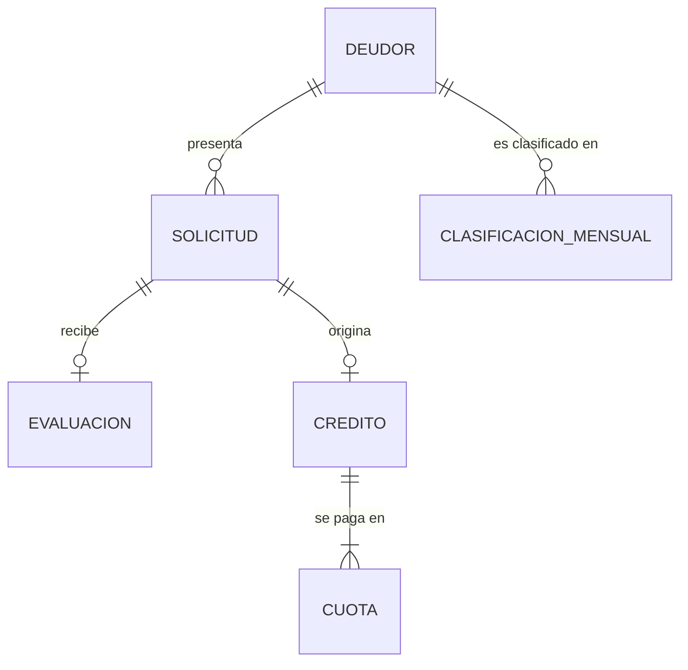

# Caso 02 — Guía paso a paso: originación de créditos y clasificación SBS

📄 Lee primero el [enunciado](enunciado.md).
💾 Guarda tu trabajo en [`soluciones/caso-02-originacion-creditos/mi-solucion/`](../../soluciones/caso-02-originacion-creditos/mi-solucion/).
⏱️ **Tiempo estimado:** 6 a 8 horas.
📚 Si te atascas: [glosario](../../00-fundamentos/06-glosario.md) ·
[estándares de modelado](../../00-fundamentos/05-estandares-modelado.md) ·
[normativa peruana](../../00-fundamentos/04-normativa-peru.md) ·
[problemas comunes](../../00-fundamentos/07-problemas-comunes.md) ·
[trazabilidad de reglas](../../00-fundamentos/08-trazabilidad-reglas.md)

## Herramientas

| Herramienta | Para qué |
|---|---|
| **PostgreSQL 14+** | Motor (usa funciones SQL: `CREATE FUNCTION ... LANGUAGE sql`) |
| **DBeaver Community** | Cliente SQL |
| **dbdiagram.io** / **Mermaid** | Diagramas E-R |
| **Navegador** | Consultar la Res. SBS 11356-2008 en <https://www.sbs.gob.pe/normativa> |

Requisito: haber completado el **caso 01** (catálogos, llaves sustitutas, cuadres).

---

## PASO 1 — Leer la norma antes de modelar

**Esto es lo que diferencia al modelador bancario peruano.**

1. Abre la Resolución SBS N.º 11356-2008
   ([PDF oficial](https://www.sbs.gob.pe/portals/0/jer/pfrpv_normatividad/20160719_res-11356-2008.pdf)).
2. Ubica y anota:
   - Los **ocho tipos de crédito**.
   - Las **cinco categorías** de clasificación del deudor.
   - El criterio de **días de atraso**, y cómo **difiere** entre créditos minoristas y no minoristas.
   - La regla de **alineamiento**.
3. Responde en `mi-solucion/00-supuestos.md`:

| Pregunta | Tu respuesta |
|---|---|
| ¿La clasificación es de la operación o del deudor? | |
| ¿Qué pasa si un deudor tiene créditos de dos tipos distintos? | |
| ¿Cada cuánto debe existir una foto del deudor? | |
| ¿Qué partes de la norma pueden cambiar el año que viene? | |

> La última pregunta es la más importante del caso: **todo lo que pueda cambiar por norma tiene que
> ser dato, no código.**


**Entregable:** `mi-solucion/00-lectura-normativa.md` con los 8 tipos de crédito y las 5 categorías, citando la resolución.

**Verificación:** puedes explicar, sin mirar, qué distingue a un crédito de consumo revolvente de uno no revolvente.

---

## PASO 2 — Separar lo estable de lo variable

Clasifica cada elemento en una de tres cajas:

| Caja | Qué va aquí | Cómo se modela |
|---|---|---|
| **Estructura** (rara vez cambia) | Existen deudores, solicitudes, créditos, cuotas | Tablas |
| **Dominio** (cambia por norma, con poca frecuencia) | Los 8 tipos de crédito, las 5 categorías | **Catálogos** con FK |
| **Parámetro** (cambia por norma, con fecha de vigencia) | Tramos de días, tasas de provisión, umbrales | **Tablas `par_` con `fecha_desde`/`fecha_hasta`** |

**Ejercicio:** clasifica estos ocho elementos antes de continuar.

| Elemento | ¿Caja? |
|---|---|
| "Consumo no revolvente" | |
| "CPP va de 9 a 30 días" | |
| "Todo crédito tiene cronograma" | |
| "La provisión de Dudoso sin garantía es 60 %" | |
| "El score va de 0 a 1000" | |
| "El ratio cuota/ingreso máximo es 40 %" | |
| "Un crédito nace de una solicitud" | |
| "Categorías: Normal, CPP, Deficiente, Dudoso, Pérdida" | |


**Entregable:** `mi-solucion/00-lectura-normativa.md` ampliado: qué es estable y qué cambia por resolución.

**Verificación:** cada cosa que hayas marcado como *variable* tiene una fecha de vigencia asociada. Si no la tiene, no es variable: es una constante disfrazada.

---

## PASO 3 — Modelo conceptual

Entidades candidatas: DEUDOR, SOLICITUD, EVALUACIÓN, CRÉDITO, CUOTA, CLASIFICACIÓN MENSUAL, GARANTÍA.



**Decide y sustenta:**
- ¿`EVALUACION` es entidad propia o atributos de `SOLICITUD`? *(pista: ¿puede haber más de una? ¿tiene fecha propia?)*
- ¿`CLASIFICACION_MENSUAL` cuelga del crédito o del deudor? *(pista: relee el alineamiento)*
- ¿La historia de estados es una entidad o un atributo? *(RN-03)*

**Entregable:** `mi-solucion/01-modelo-conceptual.md`


**Verificación:** tu diagrama contesta sin ambigüedad de qué cuelga la clasificación mensual. Si dudaste, relee el alineamiento.

---

## PASO 4 — Modelo lógico: el patrón de parámetro vigente

Este es el **corazón del caso**. Diseña así la tabla de tramos:

```
par_clasificacion_dias (
    tipo_credito_cod,     -- el tramo DEPENDE del tipo de crédito
    clasificacion_cod,
    dias_desde,
    dias_hasta,
    fecha_desde,          -- desde cuándo rige este tramo
    fecha_hasta,          -- hasta cuándo (9999-12-31 = vigente)
    base_legal            -- trazabilidad: qué resolución lo dispuso
)
PK (tipo_credito_cod, clasificacion_cod, fecha_desde)
```

**Por qué cada columna existe:**

| Columna | Sin ella… |
|---|---|
| `tipo_credito_cod` | No podrías tener tramos distintos para consumo y para corporativo |
| `fecha_desde` / `fecha_hasta` | No podrías reclasificar un mes pasado con la norma que regía entonces |
| `base_legal` | El auditor de la SBS te pregunta "¿por qué 30 días?" y no tienes respuesta |

**Ahora el mismo patrón para las provisiones:**

```
par_provision (clasificacion_cod, tiene_garantia, tasa_provision, fecha_desde, fecha_hasta, base_legal)
```

**Pregunta de diseño:** ¿por qué `tiene_garantia` está en la **llave primaria** y no es un simple
atributo? *(pista: ¿cuántas tasas distintas existen para la categoría Dudoso?)*

**Entregable:** `mi-solucion/02-modelo-logico.md`


**Verificación:** busca en tu modelo cualquier número de la norma escrito a mano. Si encuentras uno, no aplicaste el patrón.

---

## PASO 5 — Modelo físico y la función de clasificación

1. Crea el esquema `caso02` de forma idempotente.
2. Declara los catálogos y los parámetros.
3. Crea la función que **lee** el parámetro en lugar de codificar la regla:

```sql
CREATE FUNCTION fn_clasificar(p_tipo_credito CHAR(1), p_dias INTEGER, p_fecha DATE)
RETURNS CHAR(1)
LANGUAGE sql STABLE AS $$
    SELECT p.clasificacion_cod
    FROM   par_clasificacion_dias p
    WHERE  p.tipo_credito_cod = p_tipo_credito
      AND  p_dias BETWEEN p.dias_desde AND p.dias_hasta
      AND  p_fecha BETWEEN p.fecha_desde AND p.fecha_hasta
    LIMIT 1;
$$;
```

> **Comprueba que entendiste el caso:** si tu solución tiene un `CASE WHEN dias BETWEEN 9 AND 30`,
> bórralo y vuelve al paso 4.

4. Constraints que no pueden faltar:

```sql
-- Un rechazo SIEMPRE lleva motivo; una aprobación NUNCA lo lleva
CONSTRAINT ck_solicitud_motivo_coherente CHECK (
    (estado_sol_cod = 'RECHAZADA' AND motivo_cod IS NOT NULL)
 OR (estado_sol_cod <> 'RECHAZADA' AND motivo_cod IS NULL))

-- La cuota cuadra por construcción
CONSTRAINT ck_cronograma_cuota CHECK (monto_cuota = monto_capital + monto_interes + monto_seguro)

-- Una solicitud genera como máximo un crédito
CONSTRAINT uq_credito_sol UNIQUE (solicitud_id)
```

**Entregable:** `mi-solucion/03-modelo-fisico.sql`


**Verificación:** invoca tu función **desde otro esquema**. Si falla, no calificaste las tablas y solo funciona desde su casa.

---

## PASO 6 — El problema del centavo perdido

Un crédito de **S/ 10 000** a **7 cuotas**: `10000 / 7 = 1428.5714…`

Si repartes `ROUND(10000/7, 2) = 1428.57` en las 7 cuotas, la suma es **9 999.99**. Falta un centavo.
En una cartera de 700 créditos, eso son descuadres que Contabilidad reporta todos los meses.

**Solución (impleméntala):**

```sql
CASE WHEN num_cuota < plazo_meses
     THEN ROUND(monto / plazo_meses, 2)                              -- cuotas 1..n-1
     ELSE monto - ROUND(monto / plazo_meses, 2) * (plazo_meses - 1)  -- la última absorbe
END
```

**Verifica:**

```sql
SELECT c.credito_id, c.monto_desembolsado, SUM(cu.monto_capital)
FROM   credito c JOIN cronograma_cuota cu USING (credito_id)
GROUP  BY 1, 2
HAVING SUM(cu.monto_capital) <> c.monto_desembolsado;   -- debe devolver 0 filas
```

> Este paso, por sí solo, aparece en entrevistas de banca con más frecuencia que cualquier pregunta
> teórica sobre formas normales.


**Entregable:** `mi-solucion/03-modelo-fisico.sql` con la restricción de cuadre de la cuota.

**Verificación:** intenta insertar una cuota cuyo total no sea la suma de sus partes. Debe fallar.

---

## PASO 7 — Cargar datos y verificar coherencia regulatoria

```bash
psql -d bcp_lab -f soluciones/caso-02-originacion-creditos/03-modelo-fisico.sql
psql -d bcp_lab -f casos/caso-02-originacion-creditos/datos/carga_datos.sql
```

La carga **deriva** la clasificación con `fn_clasificar()` y la provisión desde `par_provision`.
Nada se inventa: todo se calcula desde los parámetros. Esa es la lección.

**Prueba el poder del modelo parametrizado.** Simula un cambio normativo:

```sql
SET search_path TO caso02;

-- 1) Cerrar la vigencia del tramo actual de CPP para consumo no revolvente
UPDATE par_clasificacion_dias
SET    fecha_hasta = DATE '2026-06-30'
WHERE  tipo_credito_cod = '7' AND clasificacion_cod IN ('0','1');

-- 2) Insertar los tramos nuevos (CPP ahora desde 5 días)
INSERT INTO par_clasificacion_dias
    (tipo_credito_cod, clasificacion_cod, dias_desde, dias_hasta, fecha_desde, base_legal)
VALUES
    ('7', '0', 0, 4,  DATE '2026-07-01', 'Resolucion hipotetica 2026'),
    ('7', '1', 5, 30, DATE '2026-07-01', 'Resolucion hipotetica 2026');

-- 3) Reclasificar SIN tocar el modelo ni el codigo
SELECT periodo,
       COUNT(*) FILTER (WHERE clasificacion_cod = '0')                              AS normal_antes,
       COUNT(*) FILTER (WHERE fn_clasificar(tipo_credito_cod, dias_atraso, fecha_corte) = '0') AS normal_despues
FROM   deudor_clasificacion_mes
GROUP  BY periodo ORDER BY periodo;

ROLLBACK;  -- (ejecútalo dentro de una transacción para no alterar los datos del caso)
```

**Eso es lo que te van a pedir en un banco real.** Si el modelo está bien hecho, toma 5 minutos; si
está mal hecho, toma 6 semanas de desarrollo.


**Entregable:** Salida de tu carga y del resumen de coherencia.

**Verificación:** el número de clasificaciones mensuales coincide con deudores × periodos con crédito vivo, no con deudores a secas.

---

### Resultado esperado

Los datos son **deterministas**: sin `random()`, así que tu ejecución debe dar estas mismas cifras.

| Qué | Cuánto |
|---|---:|
| Deudores | 900 |
| Solicitudes | 1 400 |
| Créditos | 700 |
| Cuotas | 20 400 |
| Filas de snapshot mensual | 2 795 |
| De ellas, empeoradas por alineamiento | 172 |
| Reglas de calidad en `OK` | 14 |
| Pruebas negativas rechazadas | 7 |

**Si no coinciden**, en orden de probabilidad: cargaste dos veces sin recrear el esquema · editaste
el generador y olvidaste revertirlo · te saltaste un prerrequisito. Compruébalo de golpe con
`psql -d bcp_lab -f validacion/cifras-documentadas.sql`, que te dice la diferencia cifra por cifra.
Ver también [problemas comunes](../../00-fundamentos/07-problemas-comunes.md).

## PASO 8 — Preguntas de negocio

Resuelve PN-01 a PN-10. Las tres difíciles:

- **PN-06 matriz de transición:** auto-join del snapshot mensual contra sí mismo con dos periodos
  distintos, agrupando por (clasificación anterior, clasificación actual).
- **PN-08 análisis de cosecha:** agrupa por mes de desembolso y calcula el % de créditos con al
  menos una cuota vencida. Cuidado con contar cuotas en vez de créditos.
- **PN-09 tiempo de ciclo:** necesitas **dos filas de la historia de estados** para el mismo
  trámite. Si guardaste solo el estado actual, esta pregunta es imposible — por eso existe RN-03.


**Entregable:** `mi-solucion/04-consultas-negocio.sql` con PN-01 a PN-10.

**Verificación:** ninguna consulta devuelve vacío salvo las que declaran que deben hacerlo.

---

## PASO 9 — Reglas de calidad

Mínimo estas, además de las del caso 01:

| ID | Regla | Por qué importa |
|---|---|---|
| CAL-03 | Toda clasificación registrada = `fn_clasificar(...)` | Si falla, el reporte a la SBS sale mal |
| CAL-04 | Provisión = saldo × tasa vigente | Impacto directo en el estado de resultados |
| CAL-07 | Σ capital del cronograma = monto desembolsado | El centavo perdido |
| CAL-08 | **Los tramos no se solapan ni dejan huecos** | Un hueco deja deudores sin clasificar |
| CAL-09 | El estado actual = último de la historia | Detecta procesos que actualizan una tabla y no la otra |

> **CAL-08 es la regla que casi nadie escribe.** Un parámetro mal cargado (por ejemplo,
> CPP 9-30 y Deficiente 32-60) deja **sin clasificación** a los deudores con 31 días de atraso, y el
> error aparece recién cuando la SBS observa el reporte.


**Entregable:** `mi-solucion/05-calidad-datos.sql`

**Verificación:** corre `06-pruebas-negativas.sql` contra **tu** esquema. Las 7 deben quedar en `OK`.

---

## PASO 10 — Documentar y comparar

1. Diccionario de datos con sensibilidad (**el ingreso es dato sensible** bajo la Ley 29733).
2. ADR de al menos: snapshot vs. SCD2, parámetro vs. constante, granularidad de la clasificación.
3. Compara con [`soluciones/caso-02-originacion-creditos/`](../../soluciones/caso-02-originacion-creditos/).

```bash
./validacion/validar.sh caso02
```

---

## Para profundizar

- **Sistema francés vs. alemán.** La solución usa capital constante (sistema alemán) por claridad.
  El sistema francés (cuota fija) requiere `monto_cuota = P·i / (1-(1+i)^-n)` y una CTE recursiva
  para el saldo. Impleméntalo como ejercicio: el modelo **no cambia**, solo el cálculo de la carga.
- **Refinanciamiento**: un crédito que se refinancia genera otro crédito. ¿Cómo modelas la cadena
  sin perder la trazabilidad del original?
- **Garantías**: modela `GARANTIA` (hipotecaria, mobiliaria, fianza) con valor y fecha de tasación,
  y haz que la tasa de provisión dependa del tipo de garantía preferida.

**Entregable:** `mi-solucion/07-adr.md` con tus decisiones.

**Verificación:** `./validacion/validar.sh --mi-solucion caso02` termina sin fallos.
