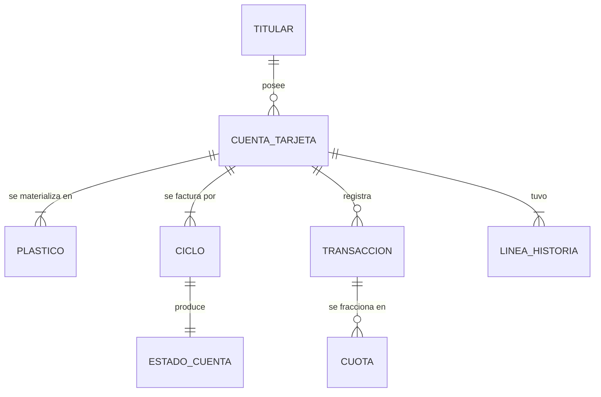

# Caso 03 — Guía paso a paso: tarjetas de crédito

📄 Lee primero el [enunciado](enunciado.md).
💾 Tu trabajo va en [`soluciones/caso-03-tarjetas-credito/mi-solucion/`](../../soluciones/caso-03-tarjetas-credito/mi-solucion/).
⏱️ **Tiempo estimado:** 6 a 8 horas.
📚 Si te atascas: [glosario](../../00-fundamentos/06-glosario.md) ·
[estándares de modelado](../../00-fundamentos/05-estandares-modelado.md) ·
[normativa peruana](../../00-fundamentos/04-normativa-peru.md) ·
[problemas comunes](../../00-fundamentos/07-problemas-comunes.md)

## Herramientas

| Herramienta | Para qué |
|---|---|
| **PostgreSQL 14+** | Motor. Este caso usa **CTE recursivas** y `MAKE_DATE()` |
| **DBeaver Community** | Cliente SQL |
| **Mermaid / dbdiagram.io** | Diagramas |

Requisito: casos 01 y 02 completados.

---

## PASO 1 — Entender el ciclo de facturación

**El error número uno en tarjetas de crédito: confundir el ciclo con el mes.**

Dibuja en papel esta línea de tiempo para una cuenta con día de facturación **15**:

```
       ciclo 202608                  ciclo 202609
|--------------------------|--------------------------|
16-jul              15-ago  16-ago             15-set
                      ▲                          ▲
                   cierre                     cierre
                      │                          │
                 vence 2-set                vence 3-oct
```

**Preguntas que debes responder:**
- Una compra del **16 de agosto**, ¿a qué ciclo pertenece? *(al 202609)*
- Una compra del **14 de agosto**, ¿a qué ciclo? *(al 202608)*
- Si el día de facturación fuera 31, ¿qué pasa en febrero? *(por eso RN-15 lo limita a 28)*

**Decisión de modelado:** `transaccion.periodo_cargo` se almacena **explícitamente**. No se deduce
de la fecha en cada consulta, porque la regla de corte puede tener excepciones (feriados, procesos
retroactivos) y porque deducirla en cada consulta es lento y propenso a error.

**Entregable:** `mi-solucion/00-supuestos.md` con la línea de tiempo y tus respuestas.


**Verificación:** sabes decir en qué ciclo cae una compra hecha el día del cierre. Si dudas, tu definición tiene un hueco.

---

## PASO 2 — Modelo conceptual

Entidades: TITULAR, CUENTA_TARJETA, PLÁSTICO, CICLO, TRANSACCIÓN, PLAN DE CUOTAS, ESTADO DE CUENTA,
LÍNEA DE CRÉDITO (historia).



**Decide:**
- ¿`PLÁSTICO` es entidad o atributo de la cuenta? *(pista: tiene número propio, fecha de emisión,
  fecha de expiración y puede haber varios)*
- ¿`ESTADO_CUENTA` y `CICLO` son la misma entidad? *(pista: el ciclo define **cuándo**; el estado de
  cuenta guarda **cuánto**. Se pueden fusionar, pero separarlos permite tener el ciclo abierto antes
  de emitir el estado)*


**Entregable:** `mi-solucion/01-modelo-conceptual.md`

**Verificación:** tu diagrama distingue *transacción* de *cuota de transacción*. Si son la misma entidad, vuelve atrás.

---

## PASO 3 — El cuadre como constraint, no como proceso

Esta es **la lección central del caso**.

Tienes dos formas de garantizar RN-06:

| Enfoque | Cómo | Qué pasa cuando falla |
|---|---|---|
| ❌ Proceso de reconciliación nocturno | Un job compara y alerta | El cliente ya recibió el estado de cuenta incorrecto |
| ✅ **`CHECK` en la tabla** | La base **rechaza** la fila que no cuadra | El error se detecta al escribir, no al día siguiente |

```sql
CONSTRAINT ck_estado_cuenta_cuadre CHECK (
    saldo_actual = saldo_anterior + total_consumos + total_cargos - total_pagos)
```

> **Un estado de cuenta que no cuadra no debe poder existir.** Si tu proceso de carga falla contra
> este `CHECK`, el proceso está mal — y eso es exactamente lo que quieres descubrir.

**Constraints adicionales obligatorias:**

```sql
-- El pago mínimo nunca excede lo facturado
CHECK (pago_minimo >= 0 AND pago_minimo <= GREATEST(saldo_actual, 0))

-- Un solo plástico titular activo por cuenta (índice único parcial)
CREATE UNIQUE INDEX uq_plastico_titular_activo ON plastico (cuenta_tj_id)
    WHERE tipo_plastico = 'TITULAR' AND esta_activo;

-- Las cuotas cuadran por construcción
CHECK (monto_cuota = monto_capital + monto_interes)

-- El día de facturación no genera fechas imposibles
CHECK (dia_facturacion BETWEEN 1 AND 28)
```


**Entregable:** `mi-solucion/02-modelo-logico.md` con la restricción de cuadre declarada.

**Verificación:** sabes explicar qué descuadre **no** cubre ese `CHECK`. Si crees que los cubre todos, relee el ADR-01.

---

## PASO 4 — Modelo físico y protección del PAN

**RN-14 es una regla de seguridad, y se implementa en el modelo:**

```sql
num_plastico_enmasc CHAR(19) NOT NULL   -- '411111******1234'
```

No existe columna para el PAN completo. **Si la columna no existe, nadie puede guardarlo ahí.**
Es la forma más fuerte de cumplir una regla de seguridad: hacerla estructuralmente imposible de
violar.

Y se verifica:

```sql
-- CAL-11: ningún número sin enmascarar
SELECT COUNT(*) FROM plastico WHERE num_plastico_enmasc !~ '\*';
```

**Entregable:** `mi-solucion/03-modelo-fisico.sql`


**Verificación:** busca en tu DDL una columna de 16 o más caracteres para el número de tarjeta. No debería existir.

---

## PASO 5 — Generar los estados de cuenta con una CTE recursiva

El saldo de un ciclo **depende del ciclo anterior**. Eso es una recursión, y SQL la expresa así:

```sql
WITH RECURSIVE cadena AS (
    -- Caso base: primer ciclo, sin saldo anterior
    SELECT cuenta_tj_id, 1 AS idx, '202604' AS periodo,
           0.00::NUMERIC(18,2) AS saldo_anterior,
           consumos, 0.00 AS cargos, 0.00 AS pagos,
           consumos AS saldo_actual
    FROM   ...
    UNION ALL
    -- Paso recursivo: el saldo actual del anterior es el saldo anterior de este
    SELECT ch.cuenta_tj_id, p.idx, p.periodo,
           ch.saldo_actual,                              -- ← el encadenamiento
           consumos, cargos, pagos,
           ch.saldo_actual + consumos + cargos - pagos   -- ← RN-06 por construcción
    FROM   cadena ch
    JOIN   periodos p ON p.idx = ch.idx + 1
    ...
)
```

**Tres detalles técnicos que te harán perder tiempo si no los sabes:**

1. **Los tipos deben coincidir** entre el caso base y el paso recursivo. `0.00` es `numeric`, pero
   `0.00::NUMERIC(18,2)` es `numeric(18,2)`. PostgreSQL rechaza la consulta si difieren.
2. El pago se modela como **fracción del saldo anterior** (`saldo × f`), no como monto fijo. Así el
   saldo **nunca puede volverse negativo**, y CAL-06 se cumple por diseño.
3. Los intereses solo se generan si `f < 1` (el cliente no pagó el total). Esa es RN-10.

**Perfiles de pago a simular:**

| Perfil | % | Fracción pagada | ¿Genera intereses? |
|---|---|---|---|
| Pagador total | 40 % | 1.00 | No |
| Revolvente | 40 % | 0.20 | Sí |
| Paga el mínimo | 10 % | 0.05 | Sí |
| Incumplidor | 10 % | 0 ó 0.10 | Sí |


**Entregable:** `mi-solucion/03-modelo-fisico.sql` o un `.sql` aparte con la CTE recursiva.

**Verificación:** el saldo final de un ciclo es el saldo inicial del siguiente, sin excepción.

---

## PASO 6 — Las compras en cuotas

Lo más característico del mercado peruano de tarjetas.

**Modelo:**
- `transaccion` guarda la compra completa (monto total, `num_cuotas`).
- `transaccion_cuota` guarda **una fila por cuota**, con su `periodo_cargo`.
- El estado de cuenta suma: consumos al contado **+ las cuotas que vencen ese ciclo**.

**El detalle del redondeo (otra vez):**

```sql
CASE WHEN num_cuota < num_cuotas
     THEN ROUND(monto / num_cuotas, 2)
     ELSE monto - ROUND(monto / num_cuotas, 2) * (num_cuotas - 1)
END
```

**Lo que este diseño te permite hacer y que otro no:**

```sql
-- PN-05: deuda ya comprometida pero aún no facturada
SELECT periodo_cargo, SUM(monto_cuota)
FROM   transaccion_cuota
WHERE  periodo_cargo > '202609'
GROUP  BY periodo_cargo;
```

Si hubieras cargado la compra completa en un solo ciclo, esta pregunta —que es la que hace el área
financiera para proyectar ingresos— **no tendría respuesta**.


**Entregable:** Tu modelo de compras en cuotas.

**Verificación:** la suma de las cuotas de una compra es igual al importe de la compra, al céntimo.

---

## PASO 7 — Cargar y verificar

```bash
psql -d bcp_lab -f soluciones/caso-03-tarjetas-credito/03-modelo-fisico.sql
psql -d bcp_lab -f casos/caso-03-tarjetas-credito/datos/carga_datos.sql
```

**Pruebas negativas — cada una debe fallar:**

```sql
SET search_path TO caso03;

-- 1) Estado de cuenta que no cuadra
INSERT INTO estado_cuenta (cuenta_tj_id, periodo, fecha_cierre, fecha_vencimiento,
       saldo_anterior, total_consumos, total_cargos, total_pagos, saldo_actual,
       pago_minimo, linea_aprobada, linea_disponible)
VALUES (1, '202604', DATE '2026-04-01', DATE '2026-04-19', 100, 50, 0, 0, 999, 0, 5000, 5000);

-- 2) Día de facturación 31
UPDATE cuenta_tarjeta SET dia_facturacion = 31 WHERE cuenta_tj_id = 1;

-- 3) Segundo plástico titular activo
INSERT INTO plastico (cuenta_tj_id, num_plastico_enmasc, tipo_plastico, nombre_impreso,
                      fecha_emision, fecha_expiracion)
VALUES (1, '411111******9999   ', 'TITULAR', 'PRUEBA', DATE '2026-01-01', DATE '2030-01-01');

-- 4) Pago mínimo mayor que el saldo
UPDATE estado_cuenta SET pago_minimo = saldo_actual + 1 WHERE cuenta_tj_id = 1;
```


**Entregable:** Salida de la carga.

**Verificación:** las cifras coinciden con el *Resultado esperado* de esta guía.

---

### Resultado esperado

Los datos son **deterministas**: sin `random()`, así que tu ejecución debe dar estas mismas cifras.

| Qué | Cuánto |
|---|---:|
| Titulares | 350 |
| Cuentas de tarjeta | 400 |
| Plásticos | 500 |
| Ciclos | 2 400 |
| Transacciones | 23 872 |
| Cuotas | 12 966 |
| Estados de cuenta | 2 400 |
| Reglas de calidad en `OK` | 13 |
| Pruebas negativas rechazadas | 6 |

**Si no coinciden**, en orden de probabilidad: cargaste dos veces sin recrear el esquema · editaste
el generador y olvidaste revertirlo · te saltaste un prerrequisito. Compruébalo de golpe con
`psql -d bcp_lab -f validacion/cifras-documentadas.sql`, que te dice la diferencia cifra por cifra.
Ver también [problemas comunes](../../00-fundamentos/07-problemas-comunes.md).

## PASO 8 — Consultas y calidad

Resuelve PN-01 a PN-10 y las 13 reglas CAL. Las tres más instructivas:

- **CAL-02 (encadenamiento):** usa `LAG(saldo_actual) OVER (PARTITION BY cuenta ORDER BY periodo)`
  y compara contra `saldo_anterior`.
- **CAL-03 (cuadre contra transacciones):** el `CHECK` garantiza la aritmética **interna** del
  estado de cuenta, pero no que los totales correspondan a transacciones reales. Son dos
  verificaciones distintas y **ambas son necesarias**.
- **CAL-11 (PAN enmascarado):** una regla de **seguridad** verificada como regla de calidad.


**Entregable:** `mi-solucion/04-consultas-negocio.sql` y `05-calidad-datos.sql`.

**Verificación:** PN-08 devuelve **0 filas**: es una consulta de cuadre y el vacío es el aprobado.

---

## PASO 9 — Documentar

Diccionario con sensibilidad, ADR (mínimo: ciclo explícito vs. derivado; cuotas como plan vs. cargo
único; cuadre como `CHECK` vs. proceso) y matriz source-to-target.


**Entregable:** `mi-solucion/08-adr.md`

**Verificación:** cada ADR nombra al menos una alternativa que descartaste y por qué.

---

## PASO 10 — Validar

```bash
./validacion/validar.sh caso03
```

---

## Para profundizar

- **Saldo a favor:** el modelo prohíbe saldo negativo. Extiéndelo para soportar pagos en exceso.
  ¿Necesitas una entidad nueva o basta relajar la restricción? ¿Qué pasa con el pago mínimo?
- **Multimoneda:** las tarjetas con consumos en dólares facturados en soles necesitan el tipo de
  cambio del día del consumo. Eso es el **caso 06**.
- **Extornos y contracargos:** el catálogo ya tiene el tipo `EXT`. Modela el flujo completo de una
  disputa: reclamo → contracargo provisional → resolución.
- **Programa de puntos:** ¿cómo modelarías la acumulación y el canje sin romper el cuadre?

**Verificación:** `./validacion/validar.sh --mi-solucion caso03` termina sin fallos.
