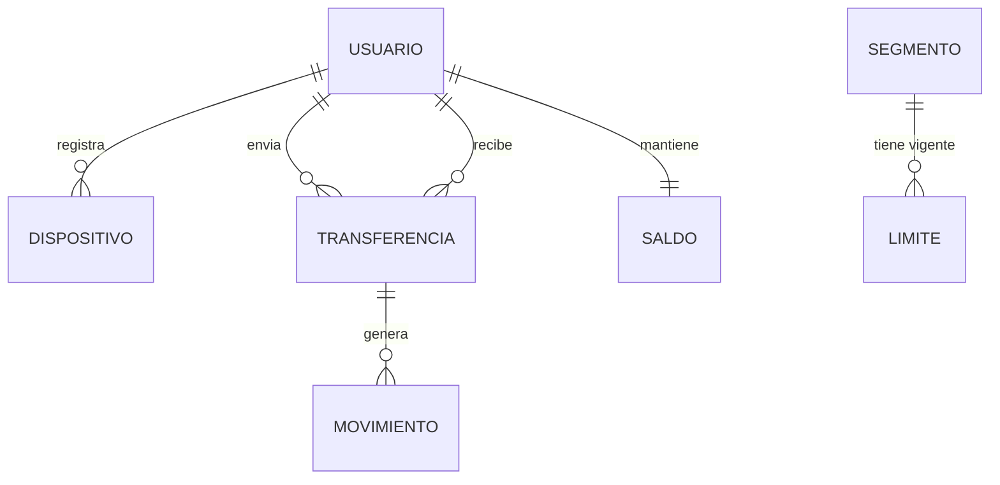
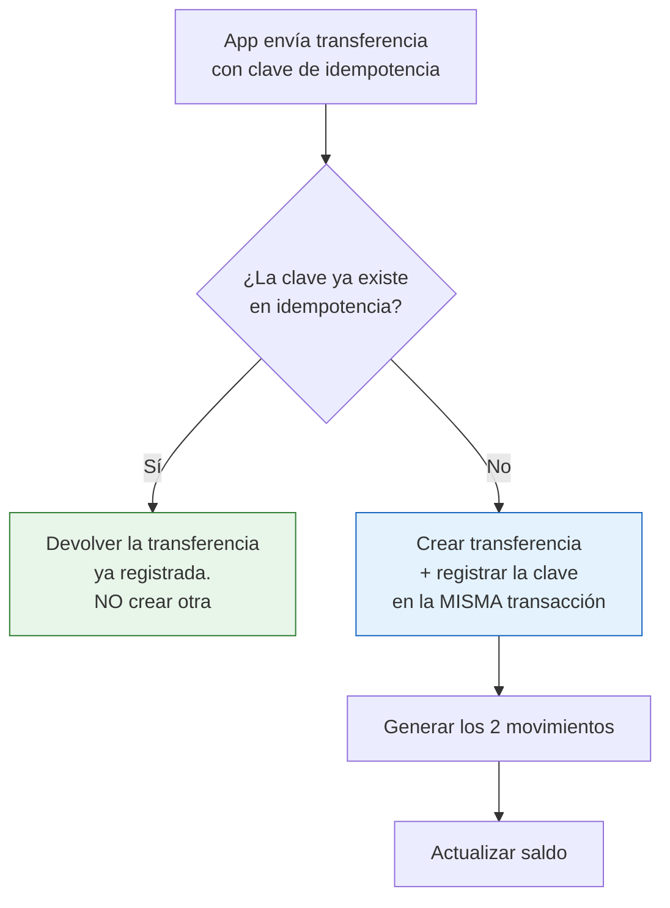

# Caso 04 — Guía paso a paso: billetera digital P2P

📄 Lee primero el [enunciado](enunciado.md).
💾 Tu trabajo va en [`soluciones/caso-04-billetera-digital-p2p/mi-solucion/`](../../soluciones/caso-04-billetera-digital-p2p/mi-solucion/).
⏱️ **Tiempo estimado:** 8 a 10 horas.
📚 Si te atascas: [glosario](../../00-fundamentos/06-glosario.md) ·
[estándares de modelado](../../00-fundamentos/05-estandares-modelado.md) ·
[normativa peruana](../../00-fundamentos/04-normativa-peru.md) ·
[problemas comunes](../../00-fundamentos/07-problemas-comunes.md)

## Herramientas

| Herramienta | Para qué |
|---|---|
| **PostgreSQL 14+** | Este caso **requiere una instancia propia**: usa particionamiento declarativo, que no funciona en editores web como DB Fiddle |
| **DBeaver Community** | Cliente SQL y lectura de planes de ejecución |
| **pgAdmin** (opcional) | Vista gráfica de particiones |

⚠️ **Advertencia de recursos:** la carga genera ~150 000 transferencias y ~294 000 movimientos, y
demora entre 20 y 60 segundos. Si trabajas en una máquina muy limitada, reduce
`generate_series(1, 3000)` a 500 usuarios en `carga_datos.sql`.

---

## PASO 1 — Dimensionar antes de modelar

**Regla del oficio: el volumen se estima *antes* de escribir el DDL, no después.**

Completa esta tabla con tus propios números:

| Variable | Valor estimado |
|---|---|
| Usuarios activos mensuales | |
| Operaciones por usuario al mes | |
| **Operaciones al mes** (producto de ambos) | |
| Operaciones al año | |
| Bytes por fila (estimado) | |
| **Tamaño anual de la tabla** | |

Con 16 millones de usuarios y ~60 operaciones al mes, salen **~11 500 millones de operaciones al
año**. A ~100 bytes por fila son varios terabytes **solo de transferencias**.

**Pregunta que debes responderte:** ¿qué operación cotidiana se vuelve imposible a ese tamaño?

| Operación | Sin particionar | Particionada por mes |
|---|---|---|
| Consultar un día | Recorre toda la historia | Recorre una partición |
| Borrar el año pasado | `DELETE` de miles de millones de filas, bloqueos, `VACUUM` eterno | `DROP TABLE` de la partición: **instantáneo** |
| Reprocesar un mes | Riesgoso | Aislado a esa partición |
| Crear un índice | Horas de bloqueo | Por partición |

**Entregable:** `mi-solucion/00-dimensionamiento.md`


**Verificación:** tu estimación cambia alguna decisión de diseño. Si no cambia ninguna, no era un dimensionamiento: era un número.

---

## PASO 2 — Modelo conceptual



**Decisiones a sustentar:**
- ¿`TRANSFERENCIA` y `MOVIMIENTO` son la misma cosa? *(pista: una transferencia es **un** hecho de
  negocio; genera **dos** asientos contables. Si los fusionas, ¿cómo representas el abono al
  destinatario?)*
- ¿`SALDO` es entidad o se calcula siempre? *(pista: ¿cuánto demora sumar 11 500 millones de filas
  cada vez que el usuario abre la app?)*


**Entregable:** `mi-solucion/01-modelo-conceptual.md` con el glosario que define *usuario activo*.

**Verificación:** dos personas leyendo tu definición cuentan lo mismo.

---

## PASO 3 — Particionamiento declarativo

```sql
CREATE TABLE transferencia (
    transferencia_id BIGINT GENERATED BY DEFAULT AS IDENTITY,
    fecha_operacion  TIMESTAMP NOT NULL,
    ...
    CONSTRAINT pk_transferencia PRIMARY KEY (transferencia_id, fecha_operacion)
) PARTITION BY RANGE (fecha_operacion);

CREATE TABLE transferencia_2026_07 PARTITION OF transferencia
    FOR VALUES FROM ('2026-07-01') TO ('2026-08-01');
...
CREATE TABLE transferencia_default PARTITION OF transferencia DEFAULT;
```

### Las tres reglas que debes memorizar

| Regla | Consecuencia práctica |
|---|---|
| **La PK debe incluir la clave de partición** | `PRIMARY KEY (transferencia_id, fecha_operacion)`, no solo el id |
| **Todo índice único debe incluir la clave de partición** | Un `UNIQUE (clave_idempotencia)` global es **imposible** en la tabla particionada |
| **Las FK hacia tablas normales sí funcionan** (PostgreSQL 12+) | No pierdes integridad referencial al particionar |

### La partición DEFAULT

Recibe las filas que no encajan en ningún rango. Es una **red de seguridad, no una solución**:

```sql
-- CAL-08: si esto devuelve algo distinto de 0, FALTAN PARTICIONES
SELECT COUNT(*) FROM transferencia_default;
```

> En producción, la creación de particiones futuras se automatiza (por ejemplo, con `pg_partman` o
> un job mensual). La partición `DEFAULT` con una alerta encima es lo que evita que un olvido tumbe
> la operación a medianoche del día 1.


**Entregable:** `mi-solucion/03-modelo-fisico.sql` con la tabla particionada y su partición `DEFAULT`.

**Verificación:** sabes decir qué pasa el día 1 del mes que viene si nadie crea la partición.

---

## PASO 4 — Idempotencia: el problema real del canal móvil

**El escenario:** el usuario toca "Enviar". El celular pierde señal antes de recibir la respuesta.
La app reintenta automáticamente. **¿Se envió una vez o dos?**

La solución es que el **cliente** genere una clave única por intención de pago, y que el servidor
la use para deduplicar.

**El conflicto con el particionamiento:**

```sql
-- ❌ Esto NO se puede hacer en una tabla particionada por fecha_operacion:
ALTER TABLE transferencia ADD CONSTRAINT uq UNIQUE (clave_idempotencia);
-- ERROR: unique constraint on partitioned table must include all partitioning columns

-- ❌ Y esto NO sirve: la clave sería única POR MES, no globalmente
UNIQUE (clave_idempotencia, fecha_operacion)
```

**La solución:** una tabla auxiliar **no particionada** cuya PK es la clave.

```sql
CREATE TABLE idempotencia (
    clave_idempotencia VARCHAR(64) NOT NULL,
    usuario_id         BIGINT      NOT NULL,
    transferencia_id   BIGINT      NOT NULL,
    fecha_operacion    TIMESTAMP   NOT NULL,
    CONSTRAINT pk_idempotencia PRIMARY KEY (clave_idempotencia)
);
```

El flujo de la aplicación queda así:



> **Esta es una decisión de modelado, no de programación.** Si la tabla no existe, ningún código de
> aplicación puede garantizar la unicidad ante reintentos concurrentes.


**Entregable:** Tu diseño de idempotencia.

**Verificación:** inserta dos veces la misma clave. La segunda debe fallar, **y no en la tabla particionada**: explica por qué.

---

## PASO 5 — Partida doble en la billetera

Una transferencia P2P confirmada genera **dos** movimientos:

| Usuario | Tipo | Monto con signo |
|---|---|---|
| Origen | `ENVIO` | **−** 25.00 |
| Destino | `RECEPCION` | **+** 25.00 |
| | **Suma** | **0.00** |

Reglas que esto habilita:

```sql
-- CAL-03: exactamente 2 movimientos por transferencia P2P confirmada
-- CAL-04: los 2 movimientos suman exactamente 0
-- CAL-05: una transferencia NO confirmada no genera ningún movimiento
```

Y el saldo deja de ser un número que alguien escribe:

```sql
CONSTRAINT ck_saldo_billetera CHECK (saldo >= 0)   -- no es una línea de crédito
```


**Entregable:** Tu modelo de movimientos.

**Verificación:** toda transferencia P2P confirmada genera exactamente dos movimientos que suman cero.

---

## PASO 6 — Cargar y verificar

```bash
psql -d bcp_lab -f soluciones/caso-04-billetera-digital-p2p/03-modelo-fisico.sql
psql -d bcp_lab -f casos/caso-04-billetera-digital-p2p/datos/carga_datos.sql   # 20-60 s
```

**Pruebas negativas — cada una debe fallar:**

```sql
SET search_path TO caso04;

-- 1) Clave de idempotencia repetida (el reintento de la app)
INSERT INTO idempotencia (clave_idempotencia, usuario_id, transferencia_id, fecha_operacion)
SELECT clave_idempotencia, usuario_id, transferencia_id, fecha_operacion FROM idempotencia LIMIT 1;

-- 2) Autotransferencia
INSERT INTO transferencia (fecha_operacion, usuario_origen_id, usuario_destino_id,
                           tipo_op_cod, moneda_cod, monto, estado_cod, clave_idempotencia)
VALUES (TIMESTAMP '2026-08-05 10:00', 1, 1, 'ENVIO', 'PEN', 10, 'CONFIRMADA', 'X-1');

-- 3) Saldo negativo
UPDATE saldo_billetera SET saldo = -1 WHERE usuario_id = 1;

-- 4) Rechazo sin motivo
INSERT INTO transferencia (fecha_operacion, usuario_origen_id, usuario_destino_id,
                           tipo_op_cod, moneda_cod, monto, estado_cod, clave_idempotencia)
VALUES (TIMESTAMP '2026-08-05 10:00', 1, 2, 'ENVIO', 'PEN', 10, 'RECHAZADA', 'X-2');
```


**Entregable:** Salida de la carga.

**Verificación:** la partición `DEFAULT` está **vacía**, y tienes una regla que lo comprueba.

---

### Resultado esperado

Los datos son **deterministas**: sin `random()`, así que tu ejecución debe dar estas mismas cifras.

| Qué | Cuánto |
|---|---:|
| Usuarios | 3 001 (3 000 personas + la cuenta puente) |
| Transferencias | 151 500 (148 700 confirmadas, 2 800 rechazadas) |
| Movimientos | 297 400 |
| Partición `DEFAULT` | **vacía** |
| Pares con 3+ transferencias | 14 962 |
| Días que exceden el límite diario | 182 |
| Reglas de calidad en `OK` | 17 |
| Pruebas negativas rechazadas | 6 |

**Si no coinciden**, en orden de probabilidad: cargaste dos veces sin recrear el esquema · editaste
el generador y olvidaste revertirlo · te saltaste un prerrequisito. Compruébalo de golpe con
`psql -d bcp_lab -f validacion/cifras-documentadas.sql`, que te dice la diferencia cifra por cifra.
Ver también [problemas comunes](../../00-fundamentos/07-problemas-comunes.md).

## PASO 7 — Demostrar la poda de particiones

**Esto es lo que te van a pedir que demuestres en una revisión de arquitectura:**

```sql
EXPLAIN (COSTS OFF)
SELECT COUNT(*) FROM transferencia
WHERE  fecha_operacion >= TIMESTAMP '2026-08-01' AND fecha_operacion < TIMESTAMP '2026-09-01';
```

Resultado esperado — **una sola partición leída**:

```
Aggregate
  ->  Seq Scan on transferencia_2026_08 transferencia
        Filter: (...)
```

Ahora quita el filtro de fecha y compara: el plan lista **todas** las particiones.

> **Lección:** el particionamiento solo rinde si las consultas **filtran por la clave de partición**.
> Un modelo particionado con consultas que no filtran por fecha es más lento que uno sin particionar.
> El modelador debe **documentar esa expectativa** para quien escriba los reportes.


**Entregable:** `mi-solucion/07-plan-ejecucion.md` con la salida de `EXPLAIN`.

**Verificación:** el plan con filtro de fecha toca **una** partición. Sin filtro, las toca todas: compáralos.

---

## PASO 8 — Consultas de negocio

Resuelve PN-01 a PN-10. Notas sobre las difíciles:

- **PN-02 (MAU):** `COUNT(DISTINCT usuario_origen_id)` por mes. Ojo: un usuario que solo **recibe**
  dinero, ¿es activo? Define el término en tu glosario antes de calcularlo — es exactamente el tipo
  de ambigüedad que hace que dos áreas reporten cifras distintas.
- **PN-06 (pares frecuentes):** agrupa por (origen, destino). Sirve para sugerir contactos y también
  como insumo antifraude (anillos de cuentas que se pasan dinero en círculo).
- **PN-07 (límites):** agrega por usuario y día, y compara contra `par_limite` **vigente a esa
  fecha** — no contra el límite actual.


**Entregable:** `mi-solucion/04-consultas-negocio.sql`

**Verificación:** PN-06 devuelve pares frecuentes y PN-07 devuelve excesos de límite. Si salen vacías, tus datos no reproducen el fenómeno.

---

## PASO 9 — Reglas de calidad (14)

Las específicas de este caso:

| ID | Regla | Por qué |
|---|---|---|
| CAL-03 | 2 movimientos por P2P confirmada | Detecta transferencias que solo cargaron y no abonaron |
| CAL-04 | Los 2 movimientos suman 0 | El dinero no se crea ni se destruye |
| CAL-05 | Rechazada no mueve dinero | Error clásico que descuadra saldos |
| CAL-07 | Idempotencia única global | El control contra el doble cargo |
| CAL-08 | Partición DEFAULT vacía | Alerta temprana de particiones faltantes |
| CAL-12 | Ninguna operación excede el límite vigente | Control PLAFT |


**Entregable:** `mi-solucion/05-calidad-datos.sql`

**Verificación:** corre `06-pruebas-negativas.sql`. Las 6 deben quedar en `OK`.

---

## PASO 10 — Documentar y validar

ADR mínimos: particionar por fecha (y por qué mensual y no diaria); idempotencia en tabla aparte;
saldo materializado con `CHECK`; movimiento separado de transferencia.

```bash
./validacion/validar.sh caso04
```

---

## Para profundizar

- **¿Partición mensual o diaria?** Con 11 500 millones de filas anuales, ¿cuántas filas tendría una
  partición mensual? ¿Conviene diaria? Considera que PostgreSQL degrada con miles de particiones.
- **Particionamiento en dos niveles:** por fecha y luego por hash de usuario. ¿Cuándo vale la pena?
- **Archivado:** ¿cómo mueves particiones antiguas a almacenamiento barato sin perder consultabilidad?
- **Reversas:** modela el flujo de reversión de una transferencia ya confirmada, manteniendo
  CAL-03 y CAL-04.
- **Monitoreo antifraude en tiempo real:** ese es el **caso 07**.

**Entregable:** `mi-solucion/08-adr.md`

**Verificación:** `./validacion/validar.sh --mi-solucion caso04` termina sin fallos.
