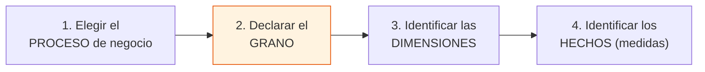

# Caso 05 — Guía paso a paso: data warehouse dimensional

📄 Lee primero el [enunciado](enunciado.md).
💾 Tu trabajo va en [`soluciones/caso-05-dwh-colocaciones/mi-solucion/`](../../soluciones/caso-05-dwh-colocaciones/mi-solucion/).

## Herramientas

| Herramienta | Para qué |
|---|---|
| **PostgreSQL 14+** | Motor del almacén |
| **DBeaver Community** | Cliente SQL |
| **Metabase OSS** o **Apache Superset** (opcional) | Construir un tablero sobre el modelo estrella y comprobar que el usuario puede consultar sin escribir SQL |
| **dbt Core** (opcional) | Versionar y probar las transformaciones del ETL |
| **ERDPlus** | Diagramar el modelo estrella (tiene modo específico para modelos dimensionales) |

### ⚠️ Requisito previo

```bash
# Los casos 01 y 02 DEBEN estar cargados antes de empezar
psql -d bcp_lab -f soluciones/caso-01-core-cuentas-ahorro/03-modelo-fisico.sql
psql -d bcp_lab -f casos/caso-01-core-cuentas-ahorro/datos/carga_datos.sql
psql -d bcp_lab -f soluciones/caso-02-originacion-creditos/03-modelo-fisico.sql
psql -d bcp_lab -f casos/caso-02-originacion-creditos/datos/carga_datos.sql
```

El script de carga **verifica esto y falla con un mensaje claro** si falta algo. Así debe
comportarse todo ETL: no arrancar si sus fuentes no están.

---

## PASO 1 — Elegir el grano (antes que cualquier otra cosa)

**Kimball lo dice en cuatro pasos, en este orden estricto:**



**Si te saltas el paso 2, todo lo demás sale mal.** Completa esta tabla antes de escribir DDL:

| Proceso de negocio | Grano (una fila representa…) | Tipo de hecho |
|---|---|---|
| Movimientos de cuenta | | |
| Saldos de captación | | |
| Situación crediticia del deudor | | |

Respuestas de la solución:

| Proceso | Grano | Tipo de hecho |
|---|---|---|
| Movimientos | **Un movimiento individual** | Transaccional |
| Saldos | **Una cuenta en un mes** | Snapshot periódico |
| Colocaciones | **Un deudor en un mes** | Snapshot periódico |

**Regla:** el grano se declara **en una frase**, empezando por "una fila representa…". Si no puedes
completar esa frase sin usar "o", tu grano está mal definido.

---

## PASO 2 — Los tres tipos de tabla de hechos

| Tipo | Una fila es… | Medidas | Ejemplo aquí |
|---|---|---|---|
| **Transaccional** | Un evento ocurrido | **Aditivas** (se suman en todas las dimensiones) | `fact_movimiento` |
| **Snapshot periódico** | El estado de algo al final de un periodo | A menudo **semiaditivas** | `fact_saldo_captacion_mes` |
| **Snapshot acumulado** | Un proceso con hitos que se van completando | Mixtas | *(no se usa aquí; sería el ciclo de una solicitud)* |

### Aditividad: la propiedad que casi nadie documenta

| Tipo de medida | Se puede sumar… | Ejemplo |
|---|---|---|
| **Aditiva** | En **todas** las dimensiones | `monto` de un movimiento |
| **Semiaditiva** | En todas **menos el tiempo** | `saldo_fin_mes` |
| **No aditiva** | En ninguna | Un porcentaje, una tasa |

> **Ejercicio obligatorio:** en tu diccionario, marca cada medida con su tipo de aditividad. Es la
> documentación que evita que un tablero muestre "el saldo del banco" sumando seis meses del mismo
> dinero — el error de PN-08.

---

## PASO 3 — Dimensiones: claves sustitutas y miembro desconocido

### Regla 1: clave sustituta en toda dimensión

```sql
cliente_sk        BIGINT GENERATED BY DEFAULT AS IDENTITY,  -- clave del DWH
cliente_id_origen BIGINT NOT NULL,                          -- clave del sistema fuente
tipo_doc_cod / num_doc                                      -- clave natural de negocio
```

¿Por qué no usar la clave del origen? Porque el SCD2 necesita **varias filas para el mismo
cliente**, y porque el mismo cliente llega desde **dos sistemas** con ids distintos.

### Regla 2: miembro DESCONOCIDO en toda dimensión

```sql
INSERT INTO dim_cliente (cliente_sk, ..., nombre_completo, segmento_cod, ...)
VALUES (-1, ..., 'CLIENTE DESCONOCIDO', 'DESCONOCIDO', ...);
```

**Por qué importa:** si un movimiento llega con un cliente que no existe en la dimensión y usas
`JOIN` interno, **ese hecho desaparece del almacén**. El total ya no cuadra con el origen y nadie
se da cuenta, porque no hay error: simplemente faltan filas.

Con el miembro desconocido:

```sql
LEFT JOIN dim_cliente dc ON ...
...
COALESCE(dc.cliente_sk, -1)   -- el hecho se conserva y el problema queda VISIBLE
```

Y luego se vigila:

```sql
-- CAL-12: ningún hecho debería quedar en DESCONOCIDO. Si aparecen, hay un problema de datos.
SELECT COUNT(*) FROM fact_movimiento WHERE cliente_sk = -1;
```

---

## PASO 4 — SCD tipo 2 y el error más caro del modelado analítico

`dim_cliente` guarda **una fila por versión**:

| cliente_sk | num_doc | segmento | fecha_desde | fecha_hasta | es_vigente |
|---|---|---|---|---|---|
| 205 | 70000123 | MASIVO | 2019-03-01 | **2026-05-31** | false |
| 1408 | 70000123 | CONSUMO | **2026-06-01** | 9999-12-31 | true |

### El JOIN correcto

```sql
LEFT JOIN dim_cliente dc
       ON dc.tipo_doc_cod = cli.tipo_doc_cod
      AND dc.num_doc      = cli.num_doc
      AND m.fecha_contable BETWEEN dc.fecha_desde AND dc.fecha_hasta   -- ← LA CLAVE
```

Un movimiento de mayo apunta a `cliente_sk = 205` (MASIVO). Uno de junio, a `1408` (CONSUMO).

### El JOIN incorrecto

```sql
AND dc.es_vigente   -- ← reescribe la historia
```

Todos los movimientos, incluso los de 2019, quedarían atribuidos al segmento actual.

**Ejecuta PN-04 en la solución:** muestra las dos versiones lado a lado. La diferencia entre ambas
es exactamente el tamaño del error que estarías cometiendo.

### Las tres reglas del SCD2 que debes verificar

| Regla | Verificación |
|---|---|
| Una sola versión vigente por clave natural | Índice único parcial `WHERE es_vigente` |
| Sin vigencias solapadas | Auto-join comparando rangos (CAL-03) |
| Sin huecos en la cadena | `LEAD(fecha_desde) = fecha_hasta + 1` (CAL-04) |

---

## PASO 5 — Dimensión conformada

**El problema:** captaciones usa `producto_cod = 'AHO-PEN-CLA'`; créditos usa
`tipo_credito_cod = '7'`. Son dos vocabularios distintos, y por eso los reportes no se cruzan.

**La solución:** una sola `dim_producto` que absorbe ambos orígenes bajo una jerarquía común:

| producto_cod | producto_nombre | familia_cod | **negocio_cod** |
|---|---|---|---|
| `AHO-PEN-CLA` | Cuenta de Ahorro Clásica Soles | AHORRO | **CAPTACION** |
| `CRED-7` | Consumo no revolvente | MINORISTA | **COLOCACION** |

Eso es lo que hace posible PN-06: contar clientes que tienen **ambos** productos. Sin dimensiones
conformadas, esa pregunta requiere un proyecto de reconciliación cada vez que se hace.

> **Definición:** una dimensión es *conformada* cuando **el mismo significado y las mismas claves**
> sirven a varios procesos de negocio. Es el mecanismo que evita los "silos de datos".

---

## PASO 6 — Escribir el ETL

Orden obligatorio (por dependencias de FK):

```
1. dim_tiempo      (se GENERA: el calendario no existe en ningún sistema fuente)
2. dim_ubigeo      (se extrae + se ENRIQUECE con la macro región)
3. dim_oficina     (depende de dim_ubigeo)
4. dim_producto    (dos orígenes → una dimensión conformada)
5. dim_canal
6. dim_cliente     (SCD2, dos orígenes, clave natural = documento)
7. fact_movimiento          (JOIN al SCD2 por vigencia)
8. fact_saldo_captacion_mes (agregación mensual)
9. fact_colocacion_mes
```

**Tres cosas que este ETL enseña y que no aparecen en los tutoriales:**

1. **Verificación de prerrequisitos.** El script falla con un mensaje claro si falta una fuente:

```sql
DO $$ BEGIN
    IF NOT EXISTS (SELECT 1 FROM information_schema.tables
                   WHERE table_schema = 'caso01' AND table_name = 'movimiento') THEN
        RAISE EXCEPTION 'Falta el esquema caso01. Ejecute primero el caso 01 completo.';
    END IF;
END $$;
```

2. **Enriquecimiento.** La macro región **no existe en el origen**. El ETL la crea y queda en **un
   solo lugar**, en vez de repetirse en cada reporte.

3. **El cierre del mes.** El saldo de fin de mes se obtiene con `DISTINCT ON` sobre el último
   movimiento de cada cuenta en cada mes — no con `MAX(saldo)`, que daría el saldo más alto, no el
   último.

---

## PASO 7 — Cargar y cuadrar

```bash
psql -d bcp_lab -f soluciones/caso-05-dwh-colocaciones/03-modelo-fisico.sql
psql -d bcp_lab -f casos/caso-05-dwh-colocaciones/datos/carga_datos.sql
```

**El cuadre no es opcional.** Ejecuta PN-10: la diferencia con el origen debe ser **0** en cantidad
y en monto, para los dos procesos.

> Un almacén que no cuadra con el origen es peor que no tener almacén: genera decisiones basadas en
> cifras que nadie puede defender ante una auditoría.

---

## PASO 8 — Consultas y calidad

Resuelve PN-01 a PN-10 y las 15 reglas CAL. Presta atención especial a:

- **PN-04**: ejecuta las dos variantes y **mide la diferencia**. Ese número es tu argumento cuando
  alguien proponga "simplificar" el SCD2.
- **PN-08**: las tres cifras. Solo dos tienen significado.
- **CAL-05/06/07**: los cuadres contra el origen. Deben ser exactos, no aproximados.

---

## PASO 9 — Capa semántica

Crea vistas para que el usuario de negocio no escriba JOINs:

```sql
CREATE VIEW vw_captacion_mensual AS
SELECT t.periodo, p.familia_cod, u.departamento, c.segmento_cod,
       SUM(f.saldo_fin_mes) AS saldo_fin_mes, ...
FROM fact_saldo_captacion_mes f
JOIN dim_tiempo t ... JOIN dim_producto p ... ;
```

Conéctale **Metabase** o **Superset** (ambos gratuitos) y construye un tablero. Si un usuario de
negocio puede armar su propio reporte sin ayuda, el modelo dimensional cumplió su propósito.

---

## PASO 10 — Documentar y validar

Diccionario con **aditividad** por medida, matriz source-to-target del ETL completo, y ADR de:
grano elegido, SCD2 vs SCD1, dimensión conformada, miembro desconocido.

```bash
./validacion/validar.sh caso05
```

---

## Para profundizar

- **Copo de nieve vs estrella:** normaliza `dim_ubigeo` en tres tablas (departamento, provincia,
  distrito). ¿Ganaste algo? ¿Qué perdiste en legibilidad y rendimiento?
- **Dimensión basura (junk dimension):** agrupa banderas de baja cardinalidad (`es_extorno`,
  `es_fin_semana`, tipo de movimiento) en una sola dimensión. ¿Cuántas combinaciones hay?
- **Dimensión de rol múltiple (role-playing):** `dim_tiempo` podría usarse como fecha de operación
  **y** fecha contable en el mismo hecho. ¿Cómo lo resuelves sin duplicar la tabla?
- **Hecho sin hechos (factless):** modela "clientes contactados por campaña" — no hay medida, solo
  la ocurrencia de la relación.
- **Data Vault:** el caso 09 muestra el enfoque alternativo para la capa integrada.
