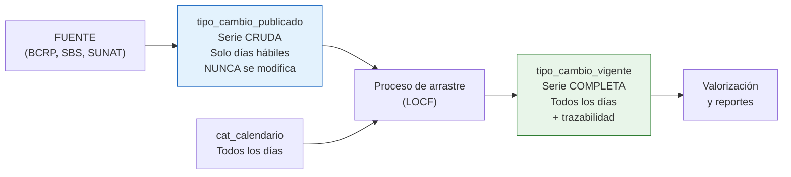

# Caso 06 — Guía paso a paso: tipo de cambio y posición en moneda extranjera

📄 Lee primero el [enunciado](enunciado.md).
💾 Tu trabajo va en [`soluciones/caso-06-tipo-cambio-posicion-me/mi-solucion/`](../../soluciones/caso-06-tipo-cambio-posicion-me/mi-solucion/).

## Herramientas

| Herramienta | Para qué |
|---|---|
| **PostgreSQL 14+** | Motor. Este caso usa funciones de ventana avanzadas |
| **DBeaver Community** | Cliente SQL |
| **curl** o el navegador | Descargar la serie real del BCRP (opcional) |
| **API BCRPData** | <https://estadisticas.bcrp.gob.pe/estadisticas/series/> — **gratuita y sin registro** |

---

## PASO 1 — Entender por qué "el tipo de cambio" no es un número

Antes de modelar, responde:

| Pregunta | Tu respuesta |
|---|---|
| ¿Cuántos tipos de cambio distintos existen para un mismo día en el Perú? | |
| ¿Cuál usa Contabilidad para valorizar el balance? | |
| ¿Cuál usa Tesorería para una operación de venta de dólares? | |
| ¿Cuál usa la SUNAT para efectos tributarios? | |
| ¿Qué pasa el 1 de enero? ¿Y el 29 de julio? | |

**Ejercicio de calibración:** valoriza USD 1 000 000 con el tipo de compra y con el de venta. La
diferencia, para un solo saldo, ya es material. Multiplícalo por toda la cartera en dólares de un
banco.

> Esa diferencia es la razón de ser de `cat_tipo_cambio`. Un modelo con una sola columna
> `tipo_cambio` obliga a cada área a elegir por su cuenta, y **cada una elige distinto**.

---

## PASO 2 — La decisión central: dos tablas, no una



| Tabla | Contiene | Se modifica | Responde a |
|---|---|---|---|
| `tipo_cambio_publicado` | Lo que la fuente publicó, tal cual | **Nunca** | "¿Qué publicó el BCRP el 15 de setiembre?" |
| `tipo_cambio_vigente` | Un valor para cada día calendario | Se recalcula | "¿Con qué valor valorizo el sábado 19?" |

**Por qué no una sola tabla con los huecos rellenados:** porque perderías la respuesta a la primera
pregunta. Y esa es exactamente la que te hace el auditor.

---

## PASO 3 — El calendario de días hábiles

Sin esta tabla no puedes distinguir estos dos casos, que se ven **idénticos** (una fila que falta):

| Caso | ¿Es un problema? |
|---|---|
| No hay cotización del 28 de julio | **No**: es feriado nacional |
| No hay cotización del 15 de setiembre | **Sí**: es martes, el proceso de carga falló |

```sql
CREATE TABLE cat_calendario (
    fecha          DATE PRIMARY KEY,
    es_fin_semana  BOOLEAN NOT NULL,
    es_feriado     BOOLEAN NOT NULL DEFAULT FALSE,
    nombre_feriado VARCHAR(60),
    es_dia_habil   BOOLEAN NOT NULL,
    ...
    CHECK ((es_feriado AND nombre_feriado IS NOT NULL)
        OR (NOT es_feriado AND nombre_feriado IS NULL))
);
```

> El `CHECK` obliga a **nombrar** el feriado. Un `es_feriado = true` sin nombre es un dato que nadie
> puede auditar.

**Feriados peruanos 2026 cargados en el caso** (lista referencial; verifica siempre en
<https://www.gob.pe/>): Año Nuevo, Jueves y Viernes Santo, Día del Trabajo, San Pedro y San Pablo,
Día de la Fuerza Aérea, Fiestas Patrias (28 y 29 de julio), Batalla de Junín, Santa Rosa de Lima,
Combate de Angamos, Todos los Santos, Inmaculada Concepción, Batalla de Ayacucho y Navidad.

---

## PASO 4 — Resolver los huecos: LOCF con gaps-and-islands

**El problema:** el viernes hay cotización, el sábado y domingo no, el lunes sí. ¿Qué valor uso el
sábado?

**La técnica** (vale la pena aprenderla: sirve para cualquier serie con huecos):

```sql
WITH malla AS (
    -- (a) Todos los días x todas las combinaciones, con NULL donde no hay dato
    SELECT c.fecha, k.moneda_cod, k.tipo_tc_cod, p.valor, p.fecha AS fecha_pub
    FROM       cat_calendario c
    CROSS JOIN combinaciones k
    LEFT JOIN  tipo_cambio_publicado p ON p.fecha = c.fecha AND ...
),
islas AS (
    -- (b) El truco: un COUNT acumulado de valores NO nulos numera cada "isla"
    SELECT m.*,
           COUNT(m.valor) OVER (PARTITION BY m.moneda_cod, m.tipo_tc_cod
                                ORDER BY m.fecha
                                ROWS BETWEEN UNBOUNDED PRECEDING AND CURRENT ROW) AS isla
    FROM malla m
),
arrastrado AS (
    -- (c) Dentro de cada isla, el primer valor es el que se arrastra
    SELECT i.fecha, i.moneda_cod, i.tipo_tc_cod,
           FIRST_VALUE(i.valor)     OVER w AS valor,
           FIRST_VALUE(i.fecha_pub) OVER w AS fecha_cotizacion
    FROM   islas i
    WHERE  i.isla > 0
    WINDOW w AS (PARTITION BY i.moneda_cod, i.tipo_tc_cod, i.isla ORDER BY i.fecha)
)
```

**Cómo funciona el truco de la isla:**

| fecha | valor | COUNT acumulado (isla) |
|---|---|---|
| vie 17 | 3.7250 | 1 |
| sáb 18 | *null* | 1 ← misma isla que el viernes |
| dom 19 | *null* | 1 ← misma isla |
| lun 20 | 3.7290 | 2 ← isla nueva |

`COUNT()` ignora los nulos, así que **no se incrementa** en los días sin dato: todos los días sin
cotización quedan en la misma isla que su último día con dato. Luego `FIRST_VALUE` dentro de la
isla trae ese valor.

**Y se registra la trazabilidad:**

```sql
CASE WHEN fecha = fecha_cotizacion THEN 'PUBLICADO' ELSE 'ARRASTRE' END,
(fecha - fecha_cotizacion) AS dias_arrastre
```

Protegido por un `CHECK` que impide combinaciones incoherentes:

```sql
CHECK ((origen_valor = 'PUBLICADO' AND dias_arrastre = 0 AND fecha_cotizacion = fecha)
    OR (origen_valor = 'ARRASTRE'  AND dias_arrastre > 0 AND fecha_cotizacion < fecha))
```

> **Nunca interpoles.** Promediar viernes y lunes para "obtener" el sábado inventa un precio que
> nunca existió en el mercado. En banca se arrastra el último precio conocido — y se deja
> constancia de que se arrastró.

---

## PASO 5 — Una sola implementación de la conversión

```sql
CREATE FUNCTION fn_convertir_a_mn(p_monto NUMERIC, p_moneda CHAR(3),
                                  p_fecha DATE, p_tipo_tc VARCHAR(20) DEFAULT 'CONTABLE_SBS')
RETURNS NUMERIC LANGUAGE sql STABLE AS $$
    SELECT CASE WHEN p_moneda = 'PEN' THEN ROUND(p_monto, 2)
                ELSE ROUND(p_monto * (SELECT v.valor FROM tipo_cambio_vigente v
                                      WHERE v.fecha = p_fecha AND v.moneda_cod = p_moneda
                                        AND v.tipo_tc_cod = p_tipo_tc), 2) END;
$$;
```

**Tres decisiones dentro de esas seis líneas:**

1. **El valor por defecto es el contable.** Si alguien no especifica, obtiene el que usa
   Contabilidad — la opción más conservadora y la que cuadra con el balance.
2. **PEN se devuelve sin convertir**, no multiplicado por 1. Evita depender de que exista una fila
   `PEN→PEN` en la tabla.
3. **Devuelve `NULL` si no hay tipo de cambio.** Un `NULL` es visible y hace fallar el reporte; un
   `0` silencioso descuadra el balance sin que nadie lo note.

---

## PASO 6 — Cargar y verificar

```bash
psql -d bcp_lab -f soluciones/caso-06-tipo-cambio-posicion-me/03-modelo-fisico.sql
psql -d bcp_lab -f casos/caso-06-tipo-cambio-posicion-me/datos/carga_datos.sql
```

Resultado esperado: 365 días de calendario (248 hábiles, 15 feriados), 1 240 cotizaciones
publicadas, 1 820 valores vigentes de los cuales **580 por arrastre**.

**Pruebas negativas — cada una debe fallar:**

```sql
SET search_path TO caso06;

-- 1) Declarar PUBLICADO con arrastre
INSERT INTO tipo_cambio_vigente (fecha, moneda_cod, tipo_tc_cod, valor,
                                 fecha_cotizacion, origen_valor, dias_arrastre)
VALUES (DATE '2026-02-01','USD','CONTABLE_SBS',3.72, DATE '2026-01-30','PUBLICADO',2);

-- 2) Una segunda moneda local
UPDATE cat_moneda SET es_moneda_local = TRUE WHERE moneda_cod = 'USD';

-- 3) Feriado sin nombre
INSERT INTO cat_calendario (fecha, anio, mes, periodo, dia_semana, es_fin_semana,
                            es_feriado, es_dia_habil, es_fin_mes)
VALUES (DATE '2027-01-01', 2027, 1, '202701', 5, FALSE, TRUE, FALSE, FALSE);

-- 4) Posición que no cuadra
INSERT INTO posicion_cambio_dia (fecha, moneda_cod, activos_me, pasivos_me, posicion_me,
                                 tipo_cambio_cierre, posicion_mn)
VALUES (DATE '2026-02-02','EUR',100,50,999,3.7,3696.30);
```

---

## PASO 7 — Usar la serie REAL del BCRP (opcional, muy recomendable)

```bash
curl -o tc_bcrp.csv \
  "https://estadisticas.bcrp.gob.pe/estadisticas/series/api/PD04637PD-PD04638PD/csv/2026-01-01/2026-12-31/esp"
```

Luego sigue [`datos/carga_bcrp_real.sql`](datos/carga_bcrp_real.sql), que incluye el área de
staging, la función de conversión de fechas del formato del BCRP y la carga.

**La prueba de fuego del modelo:** cámbiale la fuente de datos y **las 14 reglas de calidad deben
seguir en `OK`**. Si el modelo solo funciona con los datos que tú generaste, no es un modelo: es un
molde para tus datos.

> ⚠️ Los códigos de serie (`PD04637PD`, etc.) pueden cambiar entre versiones del portal.
> Verifícalos en la ficha de la serie dentro de BCRPData antes de automatizar la descarga.

---

## PASO 8 — Consultas de negocio

Resuelve PN-01 a PN-10. La más importante es **PN-06**: el mismo saldo valorizado con los cuatro
tipos de cambio. Esa tabla es el argumento que necesitas cuando alguien proponga "simplificar" y
dejar una sola columna de tipo de cambio.

---

## PASO 9 — Reglas de calidad

Las específicas de este caso:

| ID | Regla | Por qué importa |
|---|---|---|
| CAL-02 | Ninguna cotización en día no hábil | Detecta datos inventados o mal fechados |
| CAL-04 | Venta > compra, siempre | Detecta columnas intercambiadas en la carga |
| CAL-07 | **Sin variaciones diarias mayores al 5 %** | La regla más útil de todas: detecta un decimal mal puesto |
| CAL-08 | Toda fecha de cotización existe en la serie publicada | El arrastre no puede apuntar a un día inexistente |
| CAL-12 | Arrastre no mayor a 6 días | Más de eso significa que falta procesar cargas |

> **CAL-07 en la práctica:** si alguien carga `37.25` en vez de `3.725`, ninguna restricción de tipo
> lo detecta — es un número válido. Solo una regla de **razonabilidad** lo atrapa.

---

## PASO 10 — Documentar y validar

ADR mínimos: dos tablas (cruda y vigente); arrastre en lugar de interpolación; función única de
conversión; calendario como tabla propia.

```bash
./validacion/validar.sh caso06
```

---

## Para profundizar

- **Consolidar los saldos del caso 01.** Ese modelo tiene cuentas en PEN y USD y su PN-02 evita
  sumarlas a propósito. Con `fn_convertir_a_mn()` ya puedes consolidarlas correctamente. Hazlo.
- **Tipo de cambio intradiario.** Tesorería opera con cotizaciones que cambian durante el día.
  ¿Cómo cambia el grano del modelo? ¿Qué pasa con la PK?
- **Más monedas.** Agrega JPY o CHF. ¿El modelo aguanta sin cambios? *(debería)*
- **Límites de posición.** La posición de cambio suele tener límites regulatorios. Modela
  `par_limite_posicion` con vigencia y una regla de calidad que detecte excesos.
- **Triangulación.** Si tienes USD→PEN y EUR→PEN, ¿cómo obtienes EUR→USD? ¿Lo almacenas o lo
  calculas?
