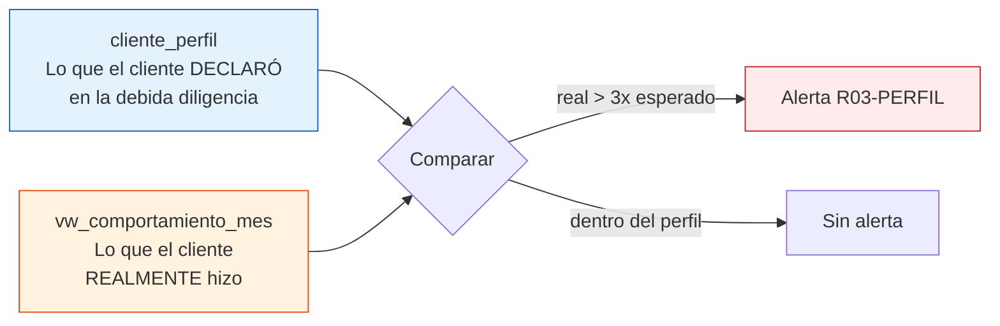

# Caso 07 — Guía paso a paso: monitoreo PLAFT

📄 Lee primero el [enunciado](enunciado.md).
💾 Tu trabajo va en [`soluciones/caso-07-plaft-monitoreo/mi-solucion/`](../../soluciones/caso-07-plaft-monitoreo/mi-solucion/).

## Herramientas

| Herramienta | Para qué |
|---|---|
| **PostgreSQL 14+** | Motor. Usa `JSONB`, ventanas `RANGE BETWEEN INTERVAL` y **RLS** |
| **DBeaver Community** | Cliente SQL |
| **Metabase OSS** (opcional) | Tablero de alertas para el equipo de Cumplimiento |

> ⚠️ Este caso **crea dos roles de base de datos** (`rol_oficial_cumplimiento` y
> `rol_analista_negocio`). La creación es idempotente y no otorga permisos de conexión. Si trabajas
> en una base compartida, revisa con tu DBA antes de ejecutar.

---

## PASO 1 — Leer la norma y separar lo fijo de lo variable

| Elemento | ¿Fijo o variable? | Dónde debe vivir |
|---|---|---|
| "Existen operaciones que deben registrarse" | Fijo | Estructura (tabla) |
| "El umbral es S/ 40 000" | **Variable por norma** | `par_umbral` con vigencia |
| "El fraccionamiento se evalúa en 5 días" | **Variable** | `par_umbral.ventana_dias` |
| "Los PEP requieren diligencia reforzada" | Fijo | Estructura (`es_pep`) |
| "Panamá es jurisdicción de alto riesgo" | **Variable** | `cat_pais.es_alto_riesgo` |
| "Una operación sospechosa se reporta a la UIF" | Fijo | Estructura (`ros`) |

**Regla del caso:** todo lo que una resolución pueda cambiar el año que viene **es un dato**.

---

## PASO 2 — El motor de reglas como datos

```sql
CREATE TABLE regla_monitoreo (
    regla_cod    VARCHAR(20)  NOT NULL,
    regla_nombre VARCHAR(100) NOT NULL,
    descripcion  VARCHAR(300) NOT NULL,
    tipo_regla   VARCHAR(20)  NOT NULL,   -- UMBRAL / FRACCIONAMIENTO / PERFIL / GEOGRAFICA / COMPORTAMIENTO
    severidad    SMALLINT     NOT NULL,   -- 1 a 5
    parametros   JSONB        NOT NULL DEFAULT '{}'::JSONB,
    fecha_desde  DATE         NOT NULL,
    fecha_hasta  DATE         NOT NULL DEFAULT DATE '9999-12-31',
    esta_activa  BOOLEAN      NOT NULL DEFAULT TRUE,
    base_legal   VARCHAR(150),
    PRIMARY KEY (regla_cod, fecha_desde)
);
```

**¿Por qué `JSONB` para los parámetros?** Porque cada tipo de regla necesita parámetros distintos:

| Tipo de regla | Parámetros |
|---|---|
| `UMBRAL` | `{"umbral_cod":"RO_EFECTIVO"}` |
| `FRACCIONAMIENTO` | `{"ventana_dias":5,"min_operaciones":3}` |
| `PERFIL` | `{"factor_exceso":3}` |
| `COMPORTAMIENTO` | `{"umbral_mes":25000}` |

Una columna por parámetro daría una tabla con veinte columnas casi siempre nulas. `JSONB` es la
excepción **justificada y documentada** a la regla de "modela cada atributo".

> **Cuándo `JSONB` es correcto:** cuando la estructura varía legítimamente por fila y el conjunto de
> claves no es estable. **Cuándo no:** cuando lo usas para no pensar el modelo. Si `JSONB` guarda
> siempre las mismas cinco claves, esas cinco claves son columnas.

---

## PASO 3 — La detección de fraccionamiento

**El problema, en una tabla:**

| Fecha | Operación | Monto | ¿Supera S/ 40 000? |
|---|---|---|---|
| 10-ago | Depósito | 35 100 | No |
| 11-ago | Depósito | 34 800 | No |
| 12-ago | Depósito | 36 200 | No |
| 13-ago | Depósito | 35 400 | No |
| | **Total en 4 días** | **141 500** | **¡Sí!** |

Una regla que evalúa fila por fila **no ve nada**. La que necesitas es una **ventana deslizante**:

```sql
SELECT o.cliente_id, o.fecha_contable, o.monto_mn,
       SUM(o.monto_mn) OVER w AS suma_ventana,
       COUNT(*)        OVER w AS ops_ventana,
       MAX(o.monto_mn) OVER w AS mayor_ventana
FROM   operacion o
JOIN   cat_tipo_operacion t ON t.tipo_op_cod = o.tipo_op_cod
WHERE  t.es_efectivo
WINDOW w AS (PARTITION BY o.cliente_id ORDER BY o.fecha_contable
             RANGE BETWEEN INTERVAL '4 days' PRECEDING AND CURRENT ROW)
```

**`RANGE BETWEEN INTERVAL '4 days' PRECEDING`** es la pieza clave: define la ventana por **tiempo
real**, no por número de filas. `ROWS BETWEEN 3 PRECEDING` sería incorrecto, porque cuatro
operaciones pueden estar separadas por meses.

Y las tres condiciones que definen el patrón:

```sql
WHERE suma_ventana  >= umbral      -- juntas superan el umbral
  AND ops_ventana   >= 3           -- son varias operaciones
  AND mayor_ventana <  umbral      -- pero NINGUNA lo supera por sí sola  ← la clave
```

**La tercera condición es la que casi nadie escribe.** Sin ella, toda operación grande genera
también una alerta de fraccionamiento, duplicando el trabajo del analista y arruinando las
estadísticas de la regla. Por eso existe **CAL-07**.

---

## PASO 4 — Perfil esperado vs. comportamiento real



**Por qué `cliente_perfil` tiene vigencia:** cuando un cliente justifica su operativa, el perfil se
**actualiza** — no se sobrescribe. Hay que poder responder "¿contra qué perfil se evaluó la alerta
de agosto?", y esa respuesta no puede cambiar porque en octubre se actualizó el perfil.

---

## PASO 5 — La evidencia de la alerta

Una alerta sin evidencia es una alerta que el analista descarta por defecto.

```sql
JSONB_BUILD_OBJECT(
    'ventana_dias',      5,
    'operaciones',       4,
    'suma_ventana',      141500.00,
    'operacion_mayor',   36200.00,
    'umbral_individual', 40000.00,
    'observacion',       'Ninguna operacion supera el umbral individualmente')
```

Con eso el analista **reconstruye el razonamiento** sin ejecutar consultas. Y CAL-15 verifica que
ninguna alerta llegue con evidencia vacía.

---

## PASO 6 — El deber de reserva, implementado en la base de datos

Esta es la parte más distintiva del caso.

```sql
ALTER TABLE ros ENABLE ROW LEVEL SECURITY;

CREATE POLICY pol_ros_cumplimiento ON ros
    FOR ALL TO rol_oficial_cumplimiento
    USING (TRUE);

GRANT SELECT ON ros TO rol_oficial_cumplimiento;
-- Deliberadamente NO se otorga SELECT sobre ros a rol_analista_negocio.
GRANT SELECT ON operacion, alerta TO rol_analista_negocio;
```

**Por qué en la base y no en la aplicación:**

| Control | ¿Lo evade una consulta SQL directa? |
|---|---|
| Validación en el código de la aplicación | **Sí** |
| Pantalla oculta en la interfaz | **Sí** |
| `GRANT` + política RLS | **No** |

Más la bitácora:

```sql
CREATE TABLE bitacora_acceso_ros (
    acceso_id   BIGINT GENERATED BY DEFAULT AS IDENTITY PRIMARY KEY,
    ros_id      BIGINT,
    usuario_bd  VARCHAR(50) NOT NULL,
    fecha_hora  TIMESTAMP   NOT NULL DEFAULT CURRENT_TIMESTAMP,
    tipo_acceso VARCHAR(15) NOT NULL,
    motivo      VARCHAR(200)
);
```

> Ante una revisión, la pregunta no es "¿quién debería poder ver el ROS?" sino **"demuéstreme quién
> lo vio"**. La bitácora es la respuesta.

---

## PASO 7 — Cargar y ejecutar el motor

```bash
psql -d bcp_lab -f soluciones/caso-07-plaft-monitoreo/03-modelo-fisico.sql
psql -d bcp_lab -f casos/caso-07-plaft-monitoreo/datos/carga_datos.sql
```

Resultado esperado: 800 clientes, **27 666** operaciones, 59 en el Registro de Operaciones, **235
alertas** repartidas entre las 5 reglas, 21 casos y 2 ROS.

**Pruebas negativas — cada una debe fallar:**

```sql
SET search_path TO caso07;

-- 1) Registrar en el RO una operación que NO supera el umbral
INSERT INTO registro_operacion (operacion_id, fecha_registro, umbral_cod, monto_umbral, monto_operacion)
VALUES (1, CURRENT_DATE, 'RO_EFECTIVO', 40000, 100);

-- 2) Cerrar un caso sin disposición
UPDATE caso_investigacion SET fecha_cierre = CURRENT_DATE, disposicion_cod = NULL
WHERE caso_id = (SELECT MIN(caso_id) FROM caso_investigacion);

-- 3) Dos perfiles vigentes para el mismo cliente
INSERT INTO cliente_perfil (cliente_id, fecha_desde, ingreso_declarado, monto_esperado_mes,
                            num_op_esperadas_mes, nivel_riesgo, fecha_ultima_dd)
VALUES (1, DATE '2026-01-01', 5000, 20000, 10, 'BAJO', DATE '2026-01-01');

-- 4) Alerta con severidad fuera de rango
UPDATE alerta SET severidad = 9 WHERE alerta_id = (SELECT MIN(alerta_id) FROM alerta);
```

---

## PASO 8 — Consultas de negocio

Las tres que más enseñan:

- **PN-02 (tasa de falsos positivos).** Es el indicador que decide si una regla sirve. Una regla con
  99 % de descartes satura al equipo y termina ignorada — el peor resultado posible, porque da
  sensación de control sin control real.
- **PN-03b (detalle del fraccionamiento).** Muestra las cuatro operaciones y el acumulado. Es el
  entregable que el analista adjunta al expediente.
- **PN-10 (deber de reserva).** Consulta `pg_policy` e `information_schema.table_privileges` para
  **demostrar** quién puede ver qué. Es lo que se presenta en una revisión.

---

## PASO 9 — Calidad (16 reglas)

Las específicas:

| ID | Regla | Por qué |
|---|---|---|
| CAL-01 | Todo RO supera efectivamente su umbral | Evita registros indebidos |
| CAL-07 | Fraccionamiento sin operaciones sobre umbral | La condición que casi nadie escribe |
| CAL-10 | Toda operación sobre umbral está en el RO | **Incumplimiento normativo si falla** |
| CAL-11 | Todo ROS tiene bitácora | Exigible en una revisión |
| CAL-13 | Todo PEP tiene riesgo ALTO | Debida diligencia reforzada |
| CAL-14 | La tabla ROS tiene RLS activa | El control técnico del deber de reserva |

---

## PASO 10 — Documentar y validar

ADR mínimos: reglas como datos; `JSONB` para parámetros y evidencia; ventana deslizante por tiempo;
RLS en lugar de control en la aplicación.

```bash
./validacion/validar.sh caso07
```

---

## Para profundizar

- **Calibrar una regla.** Sube el `factor_exceso` de R03 de 3 a 5 y mide cuánto baja la tasa de
  falsos positivos. Ese ejercicio —tuning de reglas— es trabajo cotidiano en Cumplimiento.
- **Fraccionamiento entre cuentas vinculadas.** ¿Y si el fraccionamiento se hace entre varias
  cuentas de personas relacionadas? Necesitas el grafo de relaciones → eso conecta con el **caso 08**.
- **Monitoreo en tiempo real.** Las reglas del caso corren en lote. ¿Qué cambia si deben evaluarse
  en el momento de la operación? *(pista: la ventana deslizante ya no puede recorrer toda la historia)*
- **Listas de vigilancia.** Modela listas de personas y entidades restringidas, con control de
  versiones y registro de coincidencias parciales.
- **Retención.** La información PLAFT tiene plazos de conservación largos. ¿Cómo se concilia con el
  derecho de cancelación de la Ley 29733? *(pista: hay una obligación legal que prevalece — pero
  debe estar documentada en el modelo)*
