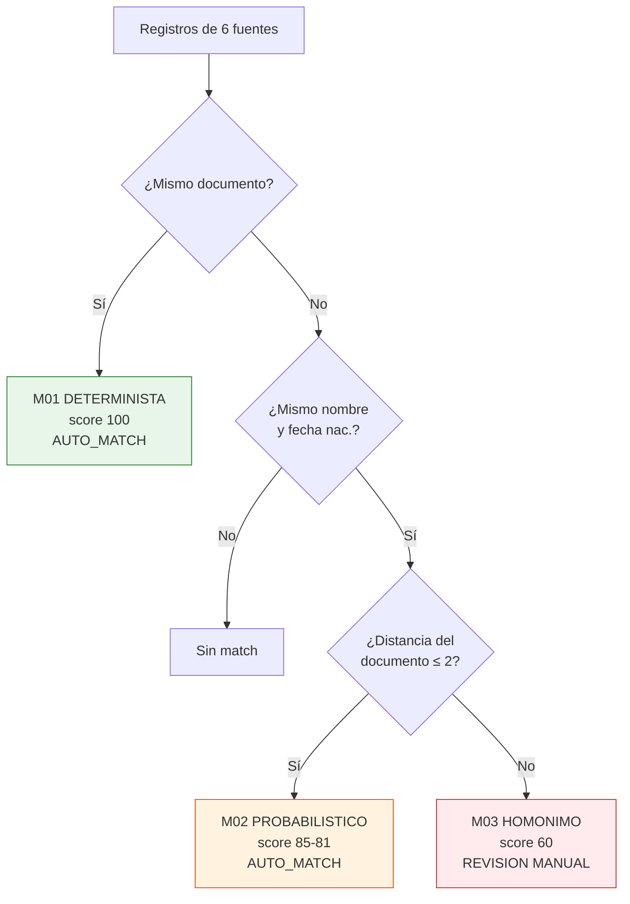

# Caso 08 — Guía paso a paso: MDM / Cliente 360

📄 Lee primero el [enunciado](enunciado.md).
💾 Tu trabajo va en [`soluciones/caso-08-cliente-360-mdm/mi-solucion/`](../../soluciones/caso-08-cliente-360-mdm/mi-solucion/).
⏱️ **Tiempo estimado:** 12 a 14 horas.
📚 Si te atascas: [glosario](../../00-fundamentos/06-glosario.md) ·
[estándares de modelado](../../00-fundamentos/05-estandares-modelado.md) ·
[normativa peruana](../../00-fundamentos/04-normativa-peru.md) ·
[problemas comunes](../../00-fundamentos/07-problemas-comunes.md)

## Herramientas

| Herramienta | Para qué |
|---|---|
| **PostgreSQL 14+** | Motor |
| **Extensiones `fuzzystrmatch` y `pg_trgm`** | `LEVENSHTEIN()` y búsqueda por trigramas |
| **DBeaver Community** | Cliente SQL |
| **OpenMetadata / DataHub** (opcional) | Catálogo donde publicar el linaje |

### Requisitos previos

```bash
# Casos 01, 02, 04 y 07 cargados
# Y las extensiones (requieren postgresql-contrib y permiso de superusuario):
psql -d bcp_lab -c "CREATE EXTENSION IF NOT EXISTS fuzzystrmatch;"
psql -d bcp_lab -c "CREATE EXTENSION IF NOT EXISTS pg_trgm;"
```

> **Si no puedes instalar extensiones:** el matching determinista (M01) funciona sin ellas y ya
> resuelve la mayor parte del caso. Para M02 puedes sustituir `LEVENSHTEIN()` por una comparación
> de documentos ordenados carácter a carácter — menos elegante, pero suficiente para aprender.

---

## PASO 1 — Definir la precedencia entre fuentes

**Es la decisión de gobierno más importante del MDM, y no es técnica: es política.**

| Fuente | Precedencia | Por qué |
|---|---|---|
| `PADRON_SUNAT` | **1** | Fuente externa oficial; autoritativa para razón social y actividad económica |
| `CORE_CAPTACIONES` | 2 | Datos validados con documento físico en la apertura |
| `CORE_CREDITOS` | 3 | Validados en la evaluación crediticia |
| `MONITOREO` | 4 | Datos de la debida diligencia |
| `BILLETERA` | 5 | Alta digital con validación mínima: mucha cobertura, menos calidad |
| `CRM` | 6 | Carga manual: la fuente con más errores |

```sql
CONSTRAINT uq_cat_fuente_prec UNIQUE (precedencia)
```

**El `UNIQUE` es deliberado:** si dos fuentes empatan, la decisión queda al azar del plan de
ejecución, y el mismo proceso puede dar resultados distintos en dos corridas. **Los empates se
resuelven en una reunión, no en la base de datos.**

---

## PASO 2 — Conservar los datos crudos

```sql
CREATE TABLE cliente_fuente (
    fuente_cod VARCHAR(20) NOT NULL,
    id_origen  VARCHAR(40) NOT NULL,
    ...
    PRIMARY KEY (fuente_cod, id_origen)
);
```

**No se limpia, no se corrige, no se normaliza destructivamente.** Los duplicados y los errores
**son el insumo** del proceso, no un problema a ocultar. Si limpias el origen:

- pierdes la evidencia de por qué se fusionaron dos registros;
- no puedes reprocesar con reglas mejores;
- no puedes explicarle a un área por qué su dato "desapareció".

Lo que sí se hace es **derivar** una clave de comparación, sin tocar el original:

```sql
ALTER TABLE cliente_fuente
    ADD COLUMN nombre_normalizado VARCHAR(200)
    GENERATED ALWAYS AS (
        UPPER(TRIM(REGEXP_REPLACE(
            COALESCE(razon_social, COALESCE(ape_paterno,'') || ' ' ||
                                   COALESCE(ape_materno,'') || ' ' || COALESCE(nombres,'')),
            '\s+', ' ', 'g')))
    ) STORED;
```

---

## PASO 3 — Matching determinista y probabilístico



### La distinción que define el caso

| | M02 — error de digitación | M03 — homónimo |
|---|---|---|
| Nombre | Idéntico | Idéntico |
| Fecha de nacimiento | Idéntica | Idéntica |
| Documento | `70000013` vs `70000031` | `70000082` vs `61000574` |
| Distancia de edición | **2** | **8** |
| Interpretación | Transposición de dígitos | **Dos personas distintas** |
| Decisión | `AUTO_MATCH` | **`REVISION`** |

> **En el Perú los homónimos son frecuentes.** Un modelo que fusiona por nombre y fecha de
> nacimiento mezcla historiales crediticios de personas distintas. En MDM, **el falso positivo es
> más grave que el falso negativo**: no detectar un duplicado cuesta una campaña repetida; fusionar
> dos personas cuesta un reclamo, un incidente regulatorio y un reproceso manual.

### El problema de rendimiento

Comparar todos contra todos es un producto cartesiano. Con 5 400 registros son 29 millones de
comparaciones; con 5 millones, 25 **billones**.

**Dos técnicas para evitarlo:**

1. **Blocking**: solo se comparan registros que comparten una clave gruesa (aquí, el nombre
   normalizado y la fecha de nacimiento).
2. **Índice de trigramas**: permite buscar nombres parecidos con rendimiento razonable.

```sql
CREATE INDEX ix_cliente_fuente_nombre ON cliente_fuente USING GIN (nombre_normalizado gin_trgm_ops);
```

En la solución, M02 además se **restringe a la fuente con errores conocidos** (`CRM`). Acotar el
espacio de búsqueda con conocimiento del dominio es una decisión de diseño legítima y muy efectiva.

---

## PASO 4 — Reglas de supervivencia por atributo

**El error más común: un solo criterio para todo.**

| Atributo | Criterio | Por qué |
|---|---|---|
| `nombre_completo` | **PRECEDENCIA** | El core lo validó contra documento físico |
| `fecha_nacimiento` | **PRECEDENCIA** | Igual |
| `ubigeo`, `direccion` | **MAS_RECIENTE** | La dirección cambia; el core puede tener la de hace cuatro años |
| `telefono`, `correo` | **MAS_RECIENTE** | Cambian con frecuencia |
| `ciiu_cod` | **FUENTE_FIJA** (SUNAT) | La actividad económica la determina SUNAT, sin importar la frescura |

Los tres criterios en SQL:

```sql
-- PRECEDENCIA: gana la fuente de mayor autoridad que tenga el dato
ORDER BY (f.valor IS NULL), rc.precedencia LIMIT 1

-- MAS_RECIENTE: gana el dato actualizado más recientemente
ORDER BY (f.valor IS NULL), rc.fecha_actualizacion DESC LIMIT 1

-- FUENTE_FIJA: gana siempre SUNAT si aporta el dato
ORDER BY (f.valor IS NULL), (rc.fuente_cod <> 'PADRON_SUNAT'), rc.precedencia LIMIT 1
```

> El `(f.valor IS NULL)` al inicio del `ORDER BY` es clave: empuja los nulos al final, de modo que
> **una fuente de alta precedencia sin el dato no gana con un nulo**. Es un detalle pequeño que
> cambia por completo el resultado.

---

## PASO 5 — El linaje por atributo

```sql
CREATE TABLE cliente_maestro_linaje (
    cliente_maestro_id BIGINT      NOT NULL,
    atributo           VARCHAR(40) NOT NULL,
    fuente_cod         VARCHAR(20) NOT NULL,
    id_origen          VARCHAR(40) NOT NULL,
    criterio_aplicado  VARCHAR(20) NOT NULL,
    PRIMARY KEY (cliente_maestro_id, atributo)
);
```

**Responde la pregunta que siempre llega:** *"¿por qué el maestro dice esta dirección y no la que
tengo yo en mi sistema?"*

Sin esta tabla, la respuesta es "porque el proceso lo decidió", y el MDM pierde credibilidad la
primera semana.

---

## PASO 6 — La referencia cruzada

```sql
CREATE TABLE cliente_xref (
    cliente_maestro_id BIGINT      NOT NULL,
    fuente_cod         VARCHAR(20) NOT NULL,
    id_origen          VARCHAR(40) NOT NULL,
    tipo_vinculo       VARCHAR(15) NOT NULL,
    score_vinculo      NUMERIC(5,2) NOT NULL,
    PRIMARY KEY (fuente_cod, id_origen)      -- ← la clave del diseño
);
```

**La PK sobre `(fuente_cod, id_origen)`** —y no sobre el maestro— garantiza RN-12: un registro de
origen pertenece a **un solo** maestro. Es imposible que un mismo registro quede colgando de dos
golden records.

El xref es lo que permite **navegar en ambos sentidos**: del maestro a cada sistema, y de cualquier
sistema al maestro.

---

## PASO 7 — Cargar y verificar

```bash
psql -d bcp_lab -f soluciones/caso-08-cliente-360-mdm/03-modelo-fisico.sql
psql -d bcp_lab -f casos/caso-08-cliente-360-mdm/datos/carga_datos.sql
```

Resultado esperado:

| Concepto | Valor |
|---|---|
| Registros en los 6 sistemas | 5 407 |
| **Clientes reales** | **4 592** |
| Duplicados resueltos | 195 |
| Candidatos a revisión manual (homónimos) | 12 |
| Trazas de linaje | 15 534 |

**El cuadre:** `5 407 − 815 = 4 592`, donde 815 son los registros absorbidos por una fusión.
Si no cuadra, el proceso perdió o duplicó registros.

---

## PASO 8 — Las consultas que justifican el proyecto

- **PN-01** da la cifra que cambia la conversación con la gerencia: cuántos clientes hay
  realmente, y qué porcentaje de duplicación había.
- **PN-03** muestra los homónimos **no fusionados**. Es la prueba de que el proceso es prudente.
- **PN-09** muestra un cliente antes y después de la fusión, con el linaje de cada atributo. Es el
  entregable que se presenta en el comité.
- **PN-10** cruza productos entre sistemas — **imposible sin MDM**, porque cada sistema usa su
  propio id.

---

## PASO 9 — Calidad (16 reglas)

Las decisivas:

| ID | Regla | Por qué |
|---|---|---|
| CAL-09 | **Los candidatos en REVISION NO fueron fusionados** | Verifica que no cometiste el error grave |
| CAL-12 | `registros fuente = maestros + duplicados` | El cuadre del proceso |
| CAL-13 | Cada registro de origen en un solo maestro | RN-12 |
| CAL-06 | El linaje apunta a un registro del mismo maestro | Detecta linaje corrupto |
| CAL-07 | La actividad económica viene de SUNAT | Verifica la regla `FUENTE_FIJA` |

---

## PASO 10 — Documentar y validar

ADR mínimos: precedencia única; datos crudos inmutables; criterios de supervivencia por atributo;
umbral de auto-match; homónimos a revisión.

```bash
./validacion/validar.sh caso08
```

---

## Para profundizar

- **Baja el umbral de M02 a 50** y vuelve a correr. Observa cuántos homónimos se fusionan por error.
  Ese experimento enseña más sobre MDM que cualquier explicación.
- **Grupos económicos.** Modela la relación entre empresas (matriz-filial) usando el RUC. ¿Cómo
  representas una jerarquía de profundidad variable?
- **Cola de revisión manual.** Modela el flujo: candidato → asignado a un steward → decisión
  (fusionar / no fusionar / crear regla) → aplicación. ¿Cómo evitas que el proceso automático
  deshaga una decisión humana? *(pista: necesitas una tabla de decisiones manuales que el proceso respete)*
- **MDM incremental.** El proceso del caso reconstruye todo desde cero. En producción llegan
  registros nuevos cada día. ¿Cómo lo haces incremental sin recalcular 5 millones de maestros?
- **El derecho de cancelación.** Si un cliente pide que borren sus datos (Ley 29733), ¿qué pasa con
  el maestro, con el xref y con el linaje?
