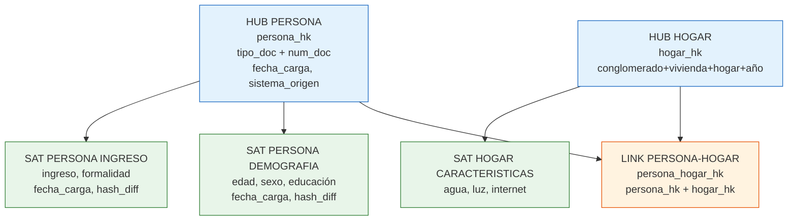
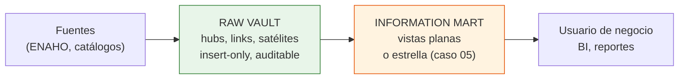

# Caso 09 — Guía paso a paso: Data Vault 2.0

📄 Lee primero el [enunciado](enunciado.md).
💾 Tu trabajo va en [`soluciones/caso-09-data-vault-inclusion/mi-solucion/`](../../soluciones/caso-09-data-vault-inclusion/mi-solucion/).
⏱️ **Tiempo estimado:** 12 a 16 horas.
📚 Si te atascas: [glosario](../../00-fundamentos/06-glosario.md) ·
[estándares de modelado](../../00-fundamentos/05-estandares-modelado.md) ·
[normativa peruana](../../00-fundamentos/04-normativa-peru.md) ·
[problemas comunes](../../00-fundamentos/07-problemas-comunes.md)

## Herramientas

| Herramienta | Para qué |
|---|---|
| **PostgreSQL 14+** | Motor |
| **DBeaver Community** | Cliente SQL |
| **dbt Core** (opcional) | Automatizar cargas de Data Vault; existen paquetes específicos |
| **Microdatos INEI** (opcional) | <https://proyectos.inei.gob.pe/microdatos/> — ENAHO real, descarga gratuita con registro |

Requisito: haber completado el **caso 05** (modelo dimensional). Este caso solo se entiende **por
contraste** con aquel.

---

## PASO 1 — Los tres tipos de tabla, y solo tres



| Tipo | Contiene | **No** contiene |
|---|---|---|
| **HUB** | La llave de negocio, su hash, fecha de carga y sistema origen | **Ningún atributo descriptivo** |
| **LINK** | Los hashes de los hubs que relaciona, su propio hash, carga y origen | **Ningún atributo descriptivo** |
| **SATÉLITE** | Los atributos, con fecha de carga y `hash_diff` | Relaciones con otros satélites |

**Ejercicio antes de continuar:** clasifica cada elemento.

| Elemento | ¿Hub, link o satélite? |
|---|---|
| El documento de identidad de una persona | |
| La edad de una persona | |
| El hecho de que una persona vive en un hogar | |
| Cuántos miembros tiene el hogar | |
| El ubigeo del distrito | |
| La antigüedad del producto que tiene una persona | |

*(Respuestas: hub, satélite, link, satélite, hub, satélite **de un link**)*


**Entregable:** `mi-solucion/01-modelo-conceptual.md` clasificando cada concepto en hub, link o satélite.

**Verificación:** ninguna de tus llaves de negocio es un autoincremental. Si lo es, no es una llave de negocio.

---

## PASO 2 — La clave hash

```sql
CREATE FUNCTION fn_hash_key(VARIADIC p_partes TEXT[])
RETURNS CHAR(32)
LANGUAGE sql IMMUTABLE AS $$
    SELECT MD5(ARRAY_TO_STRING(
        ARRAY(SELECT UPPER(TRIM(COALESCE(x, '^^'))) FROM UNNEST(p_partes) AS x), '||'))::CHAR(32);
$$;
```

**Tres decisiones en cuatro líneas:**

| Decisión | Por qué |
|---|---|
| `UPPER(TRIM(...))` | `' 12345678 '` y `'12345678'` deben dar **el mismo hash** |
| `COALESCE(x, '^^')` | Un nulo debe producir un hash estable, no otro nulo |
| Separador `'||'` | Sin él, `('AB','C')` y `('A','BC')` darían el mismo hash |

**Por qué un hash y no un autoincremental:**

| Aspecto | Secuencia | Hash |
|---|---|---|
| Carga en paralelo | Requiere coordinación | **Cada proceso calcula la clave solo** |
| Cargar un link | Hay que buscar primero los hubs | **Se calcula desde la llave de negocio** |
| Reprocesar | Las claves cambian | **Las claves son idénticas** |
| Dos entornos | Claves distintas | **Las mismas claves** |

> **MD5 basta.** Se usa por su distribución uniforme, no por seguridad. Si tu política prohíbe MD5,
> usa SHA-256 y ajusta a `CHAR(64)`: el modelo no cambia.


**Entregable:** Tu función de clave hash, **una sola**.

**Verificación:** dos procesos distintos que hashean el mismo documento obtienen la misma clave. Con dos implementaciones, no.

---

## PASO 3 — Insert-only y `hash_diff`

**La regla:** jamás `UPDATE`, jamás `DELETE`.

**El problema que resuelve `hash_diff`:** si el satélite insertara en cada carga, con 10 millones de
personas y carga mensual crecería 120 millones de filas al año aunque nadie cambiara de dato.

```sql
WITH con_hash AS (
    SELECT persona_hk, ingreso, fuente, formal,
           fn_hash_key(ingreso::TEXT, fuente, formal::TEXT) AS hd
    FROM   fuente_nueva
),
vigente AS (
    SELECT persona_hk, hash_diff FROM sat_persona_ingreso WHERE fecha_fin_carga IS NULL
)
INSERT INTO sat_persona_ingreso (...)
SELECT ...
FROM      con_hash c
LEFT JOIN vigente  v ON v.persona_hk = c.persona_hk
WHERE     v.hash_diff IS DISTINCT FROM c.hd;      -- <<< SOLO SI CAMBIÓ
```

`IS DISTINCT FROM` —y no `<>`— porque debe funcionar también cuando no hay versión previa
(`v.hash_diff IS NULL`).

**El resultado, medible:** en la ola 2026 de este caso,

| Satélite | Filas ola 2025 | Filas ola 2026 | Por qué |
|---|---|---|---|
| `sat_persona_ingreso` | 1 500 | **500** | Solo cambió el ingreso de 1 de cada 3 |
| `sat_persona_demografia` | 1 500 | **1 500** | Todos cumplieron un año más |


**Entregable:** Tu diseño de satélites con `hash_diff`.

**Verificación:** usaste `IS DISTINCT FROM` y no `<>`. Con `<>`, la primera carga no inserta nada por culpa de los nulos.

---

## PASO 4 — Separar satélites con criterio

Un hub puede tener **varios satélites**. Se separan por tres criterios:

| Criterio | Ejemplo en este caso |
|---|---|
| **Ritmo de cambio** | La demografía cambia todos los años; el ingreso, no |
| **Sensibilidad** | El ingreso es **dato sensible** (Ley 29733): merece control de acceso propio |
| **Sistema origen** | Un satélite por fuente: no se mezclan datos de orígenes distintos |

> Meter todo en un satélite obliga a insertar la fila completa cuando cambia un solo campo, y hace
> imposible dar acceso al dato demográfico sin dar acceso al ingreso.


**Entregable:** `mi-solucion/02-modelo-logico.md` justificando cada separación.

**Verificación:** cada satélite se justifica por sensibilidad, ritmo de cambio o fuente. "Por comodidad" no es criterio.

---

## PASO 5 — LA PRUEBA DEL DATA VAULT: la fuente cambia

Es la razón de ser de la metodología. En la ola 2026 la encuesta agrega preguntas sobre uso de
canales digitales.

| Enfoque | Qué hay que hacer |
|---|---|
| Modelo dimensional | `ALTER TABLE dim_persona ADD COLUMN ...` sobre una dimensión de millones de filas; revisar todos los procesos que la leen; decidir qué valor tienen las filas históricas |
| **Data Vault** | **`CREATE TABLE sat_persona_canal_digital`** |

```sql
CREATE TABLE sat_persona_canal_digital (
    persona_hk      CHAR(32)    NOT NULL,
    fecha_carga     TIMESTAMP   NOT NULL,
    hash_diff       CHAR(32)    NOT NULL,
    sistema_origen  VARCHAR(30) NOT NULL,
    usa_banca_movil BOOLEAN,
    usa_billetera   BOOLEAN,
    motivo_no_uso   VARCHAR(40),
    PRIMARY KEY (persona_hk, fecha_carga)
);
```

**Cero tablas modificadas. Cero procesos rotos. Cero migraciones.** Las personas de 2025
simplemente no tienen filas en ese satélite — que es exactamente la verdad: esa pregunta no existía.

> **Este es el argumento del Data Vault**, y solo se aprecia cuando se ve funcionando. Ejecuta la
> ola 2026 y comprueba que ninguna tabla anterior se tocó.


**Entregable:** `mi-solucion/05-ola-2026.md` con lo que hubo que cambiar.

**Verificación:** absorbiste atributos nuevos **sin `ALTER TABLE`** sobre nada existente. Ese es el argumento entero del Data Vault.

---

## PASO 6 — Cargar las dos olas

```bash
psql -d bcp_lab -f soluciones/caso-09-data-vault-inclusion/03-modelo-fisico.sql
psql -d bcp_lab -f casos/caso-09-data-vault-inclusion/datos/carga_datos.sql
```

Resultado esperado:

| Tabla | Filas | Observación |
|---|---|---|
| `hub_persona` | 1 600 | 1 500 de 2025 + 100 nuevas en 2026 |
| `sat_persona_demografia` | 3 000 | 1 500 + 1 500: todos cambiaron |
| `sat_persona_ingreso` | 2 000 | 1 500 + **500**: solo cambiaron algunos |
| `sat_persona_canal_digital` | 1 600 | Satélite **nuevo** de la ola 2026 |


**Entregable:** Salida de las dos cargas.

**Verificación:** el satélite de ingreso creció mucho menos que el de demografía. Si crecieron igual, tu `hash_diff` no está filtrando.

---

### Resultado esperado

Los datos son **deterministas**: sin `random()`, así que tu ejecución debe dar estas mismas cifras.

| Qué | Cuánto |
|---|---:|
| `hub_persona` | 1 600 |
| `sat_persona_demografia` | 3 000 (todos cumplieron un año) |
| `sat_persona_ingreso` | 2 000 (solo cambió 1 de cada 3) |
| `sat_persona_canal_digital` | 1 600 (satélite nuevo de la ola 2026) |
| Reglas de calidad en `OK` | 16 |
| Pruebas negativas rechazadas | 6 |

**Si no coinciden**, en orden de probabilidad: cargaste dos veces sin recrear el esquema · editaste
el generador y olvidaste revertirlo · te saltaste un prerrequisito. Compruébalo de golpe con
`psql -d bcp_lab -f validacion/cifras-documentadas.sql`, que te dice la diferencia cifra por cifra.
Ver también [problemas comunes](../../00-fundamentos/07-problemas-comunes.md).

## PASO 7 — Viaje en el tiempo

La capacidad que justifica toda la complejidad:

```sql
SELECT h.num_doc_bk, d.edad, i.ingreso_mensual
FROM        hub_persona h
LEFT JOIN   sat_persona_demografia d ON d.persona_hk = h.persona_hk
        AND TIMESTAMP '2025-12-31' >= d.fecha_carga
        AND (d.fecha_fin_carga IS NULL OR TIMESTAMP '2025-12-31' < d.fecha_fin_carga)
LEFT JOIN   sat_persona_ingreso i ON i.persona_hk = h.persona_hk
        AND TIMESTAMP '2025-12-31' >= i.fecha_carga
        AND (i.fecha_fin_carga IS NULL OR TIMESTAMP '2025-12-31' < i.fecha_fin_carga);
```

**Reconstruye el informe publicado el año pasado, sin reprocesar nada.** Porque la historia nunca
se borró.


**Entregable:** `mi-solucion/07-viaje-tiempo.sql`

**Verificación:** reconstruyes la foto de una persona a una fecha pasada con una sola consulta.

---

## PASO 8 — El costo: la capa de entrega

Ejecuta PN-09. Responder "¿cuántas personas del sur rural tienen cuenta de ahorro?" cuesta **ocho
JOINs** en Data Vault, contra **dos** en el modelo estrella del caso 05.

**Por eso el Data Vault nunca se expone al usuario final.** Encima se construye:

| Capa | Qué es | En este caso |
|---|---|---|
| Raw Vault | Hubs, links y satélites crudos | Las 14 tablas |
| Business Vault | Reglas de negocio aplicadas | — |
| **Information Mart** | Vistas o tablas planas para consumo | `vw_persona_vigente`, `vw_inclusion_financiera` |




**Entregable:** Tu capa de vistas.

**Verificación:** cuenta los `JOIN` que necesita un usuario final. Si son más de uno, no terminaste la capa de entrega.

---

## PASO 9 — Calidad (16 reglas)

Las específicas de la metodología:

| ID | Regla | Por qué |
|---|---|---|
| CAL-01/02 | El hash corresponde a la llave de negocio | Detecta funciones de hash divergentes |
| **CAL-07** | **Ningún hub tiene atributos descriptivos** | Consulta `information_schema`: verifica la metodología, no los datos |
| **CAL-08** | Ningún link tiene atributos descriptivos | Igual |
| **CAL-09** | Sin `hash_diff` repetidos consecutivos | Prueba que la carga no inserta sin cambios |
| CAL-05 | Vigencias sin solapamiento | Integridad de la historia |

> CAL-07 y CAL-08 son inusuales: **validan el diseño, no los datos**. Consultan el catálogo del
> sistema para verificar que nadie agregó una columna descriptiva a un hub. Es una idea que vale la
> pena copiar a otros modelos.


**Entregable:** `mi-solucion/06-calidad-datos.sql`

**Verificación:** corre `06-pruebas-negativas.sql`. Las 6 deben quedar en `OK`.

---

## PASO 10 — Documentar y validar

ADR mínimos: hash vs secuencia; separación de satélites; insert-only; capa de entrega.

```bash
./validacion/validar.sh caso09
```

---

## Cuándo usar Data Vault y cuándo no

| Usa Data Vault si… | Usa modelo dimensional si… |
|---|---|
| Integras muchas fuentes que cambian | Tienes una fuente estable |
| Necesitas auditoría total del origen | La auditoría no es crítica |
| Las reglas de negocio cambian seguido | Las reglas son estables |
| Requieres carga masiva en paralelo | El volumen es manejable |
| El regulador puede pedir reconstruir el pasado | No hay exigencia regulatoria |

**En banca peruana suelen convivir:** Data Vault como capa integrada (auditable ante la SBS) y
modelo estrella como capa de consumo (rápida para el negocio). **No compiten: se complementan.**

---

## Para profundizar

- **ENAHO real.** Descarga los microdatos de <https://proyectos.inei.gob.pe/microdatos/> y carga el
  módulo de sumarias. Las llaves de negocio del caso ya usan la estructura real
  (conglomerado + vivienda + hogar + año).
- **Point-in-Time (PIT) y Bridge.** Son tablas auxiliares que reducen los JOINs de consulta.
  Impleméntalas y mide la diferencia.
- **Satélite multi-activo.** ¿Cómo modelas varios teléfonos por persona en un satélite?
- **Same-as link.** ¿Cómo integrarías el resultado del MDM del **caso 08** en este Data Vault?
  *(pista: un link que relaciona un hub consigo mismo)*
- **Automatización.** El código de carga de Data Vault es tan repetitivo que suele generarse a
  partir de metadatos. Escribe un generador que produzca el SQL de un satélite a partir de su
  definición.

**Entregable:** `mi-solucion/09-adr.md`

**Verificación:** `./validacion/validar.sh --mi-solucion caso09` termina sin fallos.
