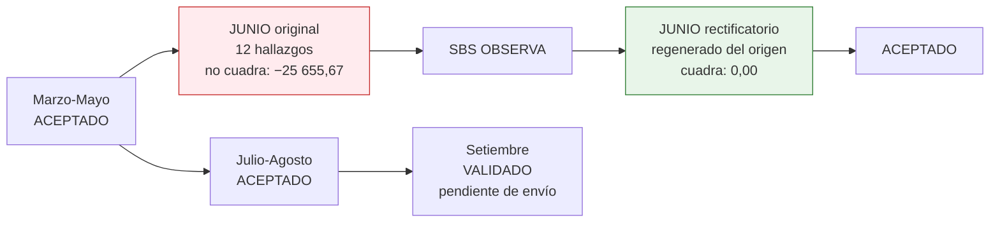

# Caso 10 — Guía paso a paso: reporte regulatorio a la SBS

📄 Lee primero el [enunciado](enunciado.md).
💾 Tu trabajo va en [`soluciones/caso-10-reporte-regulatorio-sbs/mi-solucion/`](../../soluciones/caso-10-reporte-regulatorio-sbs/mi-solucion/).
⏱️ **Tiempo estimado:** 12 a 14 horas.
📚 Si te atascas: [glosario](../../00-fundamentos/06-glosario.md) ·
[estándares de modelado](../../00-fundamentos/05-estandares-modelado.md) ·
[normativa peruana](../../00-fundamentos/04-normativa-peru.md) ·
[problemas comunes](../../00-fundamentos/07-problemas-comunes.md) ·
[trazabilidad de reglas](../../00-fundamentos/08-trazabilidad-reglas.md)

## Herramientas

| Herramienta | Para qué |
|---|---|
| **PostgreSQL 14+** | Motor |
| **DBeaver Community** | Cliente SQL |
| **Navegador** | Normativa SBS: <https://www.sbs.gob.pe/normativa> |

Requisito: **caso 02** cargado. Recomendado: haber hecho el **caso 05** (el DWH es la otra fuente
natural de un reporte regulatorio).

---

## PASO 1 — La idea central: la estructura del reporte es un dato

**El problema:** cuando la SBS agrega un campo, ¿qué hay que cambiar?

| Enfoque | Qué se modifica | Tiempo |
|---|---|---|
| Estructura programada | Código del generador, pruebas, despliegue | Semanas |
| **Estructura como dato** | **Una fila en `reporte_campo`** | Minutos |

```sql
CREATE TABLE reporte_campo (
    reporte_cod    VARCHAR(20) NOT NULL,
    version        SMALLINT    NOT NULL,
    posicion       SMALLINT    NOT NULL,
    campo_cod      VARCHAR(40) NOT NULL,
    campo_nombre   VARCHAR(120) NOT NULL,
    tipo_dato      VARCHAR(15) NOT NULL,
    longitud       SMALLINT    NOT NULL,
    decimales      SMALLINT    NOT NULL DEFAULT 0,
    es_obligatorio BOOLEAN     NOT NULL DEFAULT TRUE,
    dominio        VARCHAR(200),
    base_legal     VARCHAR(200),
    PRIMARY KEY (reporte_cod, version, campo_cod),
    UNIQUE (reporte_cod, version, posicion)
);
```

**El `UNIQUE` sobre la posición** impide dos campos en el mismo lugar del archivo — un error que de
otro modo solo se descubre cuando el supervisor rechaza el envío.


**Entregable:** `mi-solucion/01-definicion-reporte.md` con la estructura campo a campo en forma de tabla.

**Verificación:** ninguna posición ni longitud del archivo aparece en tu código generador.

---

## PASO 2 — Versionar la estructura

Cuando la SBS cambia el reporte **no se modifica la definición: se crea una versión nueva.**

| Versión | Vigencia | Campos |
|---|---|---|
| 1 | 2024-01-01 → 2026-06-30 | 10 campos |
| 2 | 2026-07-01 → vigente | 11 campos (se agregó `GARANTIA`) |

**Por qué conservar la versión 1:** sin ella es imposible regenerar un envío de mayo de 2026 con la
estructura que realmente tenía. Y esa es exactamente la petición que llega en una revisión.

Cada envío guarda **qué versión usó**, y una regla verifica la coherencia:

```sql
-- CAL-13: la versión usada estaba vigente a la fecha de corte
WHERE e.fecha_corte NOT BETWEEN d.fecha_desde AND d.fecha_hasta
```


**Entregable:** Tu diseño de versionado.

**Verificación:** puedes reproducir un envío de marzo **con la estructura de marzo**, no con la de hoy.

---

## PASO 3 — Las validaciones también son datos

```sql
INSERT INTO reporte_validacion (reporte_cod, version, validacion_cod, descripcion,
                                severidad, expresion_sql, base_legal) VALUES
    ('RCD',2,'V03-PROV-SALDO','La provisión no puede superar el saldo de capital','BLOQUEA',
     'monto_provision > saldo_capital','Coherencia aritmetica'),
    ('RCD',2,'V05-ATRASO-CLAS','Un deudor Normal no debería tener más de 8 días de atraso','ADVIERTE',
     'clasificacion_cod = ''0'' AND dias_atraso > 8','Res. SBS 11356-2008 (referencial)');
```

### `CHECK` vs. validación: no son lo mismo

| | `CHECK` de la base | Regla de validación |
|---|---|---|
| Cuándo actúa | Al escribir: **impide** la fila | Al validar: **reporta** la fila |
| Qué detecta | Lo estructuralmente imposible | Lo posible pero **incoherente** |
| Ejemplo | Provisión mayor que el saldo | Clasificación "Normal" con 60 días de atraso |
| Se puede desactivar | No | Sí, cambiando su severidad |

> **La distinción es el corazón del caso.** Un deudor clasificado como Normal con 60 días de atraso
> es un dato **estructuralmente válido**: ningún `CHECK` puede impedirlo, porque ambos campos son
> legítimos por separado. Solo una **regla de validación** lo detecta. Es exactamente el error que
> el caso planta en el envío de junio.

**Dos severidades, dos comportamientos:**

| Severidad | Efecto |
|---|---|
| `BLOQUEA` | No se envía hasta corregir. **CAL-04 verifica que ningún envío remitido los tenga.** |
| `ADVIERTE` | Se envía, pero queda registrado. Si el supervisor lo observa, hay evidencia de que se detectó. |


**Entregable:** Tu catálogo de validaciones.

**Verificación:** puedes añadir una validación nueva sin desplegar código, y cada una dice qué norma la sustenta.

---

## PASO 4 — El linaje campo a campo

**Es el entregable que se presenta ante una observación.**

```sql
CREATE TABLE reporte_linaje (
    reporte_cod    VARCHAR(20)  NOT NULL,
    version        SMALLINT     NOT NULL,
    campo_cod      VARCHAR(40)  NOT NULL,
    esquema_origen VARCHAR(30)  NOT NULL,
    tabla_origen   VARCHAR(60)  NOT NULL,
    columna_origen VARCHAR(60),
    transformacion VARCHAR(300) NOT NULL,
    responsable    VARCHAR(60)  NOT NULL,
    PRIMARY KEY (reporte_cod, version, campo_cod)
);
```

Ejemplo de una fila que vale su peso en oro cuando llega la observación:

| Campo | Origen | Transformación | Responsable |
|---|---|---|---|
| `CLASIFICACION` | `caso02.deudor_clasificacion_mes.clasificacion_cod` | Derivado de `dias_atraso` mediante `fn_clasificar()` con la norma vigente a la fecha de corte | Riesgos |

**La columna `responsable` no es decorativa:** cuando el supervisor observa un campo, define a qué
área se le pide la explicación. Sin ella, la observación rebota entre TI, Riesgos y Contabilidad
durante una semana.

**CAL-02** verifica que **todos** los campos de la versión vigente tengan linaje.


**Entregable:** `mi-solucion/06-linaje.md`

**Verificación:** todo campo de **toda** versión tiene linaje, no solo los de la vigente. Hay envíos remitidos con la anterior.

---

## PASO 5 — Generar el reporte desde el origen

```sql
INSERT INTO reporte_detalle (...)
SELECT  e.envio_id,
        ROW_NUMBER() OVER (PARTITION BY e.envio_id ORDER BY d.num_doc),
        d.tipo_doc_cod, d.num_doc, ...
FROM    reporte_envio e
JOIN    caso02.deudor_clasificacion_mes dcm ON dcm.fecha_corte = e.fecha_corte
JOIN    caso02.deudor d ON d.deudor_id = dcm.deudor_id;
```

**El reporte no inventa datos: los extrae.** Por eso el linaje importa tanto, y por eso el cuadre
contra el origen tiene que dar exacto.

Y los totales se **derivan**, nunca se digitan:

```sql
UPDATE reporte_envio e
SET    cant_registros = t.n, monto_total = t.saldo,
       hash_archivo = MD5(...)
FROM  (SELECT envio_id, COUNT(*) AS n, SUM(saldo_capital) AS saldo
       FROM reporte_detalle GROUP BY envio_id) t
WHERE  t.envio_id = e.envio_id;
```

> ⚠️ **El orden importa.** Si corriges el detalle *después* de calcular los totales, el archivo se
> autocontradice. **CAL-12** lo detecta.


**Entregable:** Tu generador del detalle.

**Verificación:** el número de líneas del envío coincide con el número de filas que entrega el origen. Si es menor, dejaste deudores fuera.

---

## PASO 6 — El cuadre contable

```sql
CONSTRAINT ck_cuadre_dif    CHECK (diferencia = valor_reporte - valor_contable),
CONSTRAINT ck_cuadre_estado CHECK (esta_cuadrado = (ABS(diferencia) <= tolerancia))
```

**`esta_cuadrado` no se digita: se deriva.** Si fuera una columna que alguien marca, alguien la
marcará mal — probablemente el día del cierre, a las once de la noche.


**Entregable:** Tu tabla de cuadre.

**Verificación:** `UPDATE cuadre_reporte SET esta_cuadrado = TRUE` sobre una fila descuadrada **falla**. Pruébalo.

---

## PASO 7 — Cargar y observar la historia completa

```bash
psql -d bcp_lab -f soluciones/caso-10-reporte-regulatorio-sbs/03-modelo-fisico.sql
psql -d bcp_lab -f casos/caso-10-reporte-regulatorio-sbs/datos/carga_datos.sql
```

El caso simula un ciclo regulatorio real de siete meses:



**Lo que pasó en junio:** el proceso usó una versión desactualizada de los tramos de clasificación y
reportó como *Normal* a 11 deudores con atraso alto; además, un deudor quedó con saldo cero por un
error de corte. Ningún `CHECK` lo impidió —los datos son estructuralmente válidos— pero:

- las validaciones `V05` y `V04` lo detectaron (12 hallazgos),
- el cuadre contable **no cerró** (−25 655,67),
- la SBS observó el envío.

El rectificatorio **se regeneró desde `caso02`**, no se parchó el archivo. Resultado: cuadre 0,00 y
aceptación.

**Pruebas negativas — cada una debe fallar:**

```sql
SET search_path TO caso10;

-- 1) Dos campos en la misma posición del archivo
INSERT INTO reporte_campo (reporte_cod, version, posicion, campo_cod, campo_nombre,
                           tipo_dato, longitud) VALUES ('RCD',2,1,'OTRO','Otro','TEXTO',5);

-- 2) Un rectificatorio con número de envío 1
INSERT INTO reporte_envio (reporte_cod, version, periodo, fecha_corte, fecha_limite,
                           num_envio, tipo_envio, estado)
VALUES ('RCD',2,'202610',DATE '2026-10-31',DATE '2026-11-15',1,'RECTIFICATORIO','EN_PROCESO');

-- 3) Provisión mayor que el saldo
UPDATE reporte_detalle SET monto_provision = saldo_capital + 1
WHERE (envio_id, num_linea) = (SELECT envio_id, MIN(num_linea) FROM reporte_detalle
                               GROUP BY envio_id LIMIT 1);

-- 4) Marcar como cuadrado algo que no cuadra
UPDATE cuadre_reporte SET esta_cuadrado = TRUE WHERE NOT esta_cuadrado;
```


**Entregable:** Salida de la carga.

**Verificación:** el envío de junio queda observado y el rectificatorio cuadra en 0,00, conservando **ambos**.

---

### Resultado esperado

Los datos son **deterministas**: sin `random()`, así que tu ejecución debe dar estas mismas cifras.

| Qué | Cuánto |
|---|---:|
| Envíos | 8 (7 originales + 1 rectificatorio) |
| Líneas de detalle | 3 212 |
| Hallazgos del envío observado | 20 |
| Registros del envío de junio | 417 |
| Diferencia del rectificatorio | 0,00 |
| Reglas de calidad en `OK` | 19 |
| Pruebas negativas rechazadas | 7 |

**Si no coinciden**, en orden de probabilidad: cargaste dos veces sin recrear el esquema · editaste
el generador y olvidaste revertirlo · te saltaste un prerrequisito. Compruébalo de golpe con
`psql -d bcp_lab -f validacion/cifras-documentadas.sql`, que te dice la diferencia cifra por cifra.
Ver también [problemas comunes](../../00-fundamentos/07-problemas-comunes.md).

## PASO 8 — Generar el archivo de ancho fijo

**El pago de haber modelado la estructura como dato:**

```sql
SELECT     RPAD(d.tipo_doc_cod, 2, ' ')
        || RPAD(d.num_doc, 20, ' ')
        || RPAD(LEFT(d.nombre_deudor, 40), 40, ' ')
        || RPAD(d.tipo_credito_cod, 1, ' ')
        || RPAD(d.clasificacion_cod, 1, ' ')
        || LPAD(d.dias_atraso::TEXT, 5, '0')
        || ...
FROM reporte_detalle d;
```

Las longitudes salen de `reporte_campo`. Si la SBS cambia una longitud, se cambia **una fila**.

> **Ejercicio:** escribe el generador de forma **genérica**, recorriendo `reporte_campo` en orden de
> posición y armando la línea dinámicamente. Es lo que hace un generador de reportes real, y es la
> diferencia entre un programa por reporte y **un programa para todos los reportes**.


**Entregable:** `mi-solucion/04-consultas-negocio.sql` con el generador de ancho fijo.

**Verificación:** cambia una longitud en tu tabla de campos y vuelve a generar. El archivo debe cambiar solo.

---

## PASO 9 — Calidad (19 reglas)

Las decisivas:

| ID | Regla | Por qué |
|---|---|---|
| CAL-04 | Ningún envío remitido con errores `BLOQUEA` | **Incumplimiento normativo si falla** |
| CAL-12 | Los totales coinciden con el detalle | El archivo no puede autocontradecirse |
| CAL-13 | La versión usada estaba vigente a la fecha de corte | Reproducibilidad del envío |
| CAL-14 | Todo envío aceptado cuadra con contabilidad | El cuadre es condición de envío |
| CAL-02 | Todo campo vigente tiene linaje | Poder responder una observación |
| CAL-10 | Posiciones correlativas sin huecos | Un archivo con un hueco es ilegible |


**Entregable:** `mi-solucion/05-calidad-datos.sql`

**Verificación:** corre `06-pruebas-negativas.sql`. Las 7 deben quedar en `OK`.

---

## PASO 10 — Documentar y validar

ADR mínimos: estructura como dato; versionado de la definición; validaciones configurables;
rectificatorio regenerado; cuadre derivado.

```bash
./validacion/validar.sh caso10
```

---

## Para profundizar

- **Generador genérico.** Escribe un procedimiento que arme cualquier reporte leyendo su definición.
  Es el proyecto que convierte un equipo regulatorio de reactivo en proactivo.
- **Más reportes.** Agrega un segundo reporte (por ejemplo, de depósitos, usando el caso 01) al
  mismo modelo. ¿Necesitaste cambiar alguna tabla? *(no deberías)*
- **Validaciones cruzadas entre periodos.** "El saldo no puede variar más de 30 % contra el mes
  anterior". ¿Cómo modelas una validación que necesita dos envíos?
- **Firma y acuse.** Modela el acuse de recibo del supervisor y la firma digital del archivo.
- **Conciliación con el DWH.** Genera el mismo reporte desde el caso 05 y compara: si difieren,
  tienes un problema de datos que el reporte estaba ocultando.

**Entregable:** `mi-solucion/08-adr.md`

**Verificación:** `./validacion/validar.sh --mi-solucion caso10` termina sin fallos.
