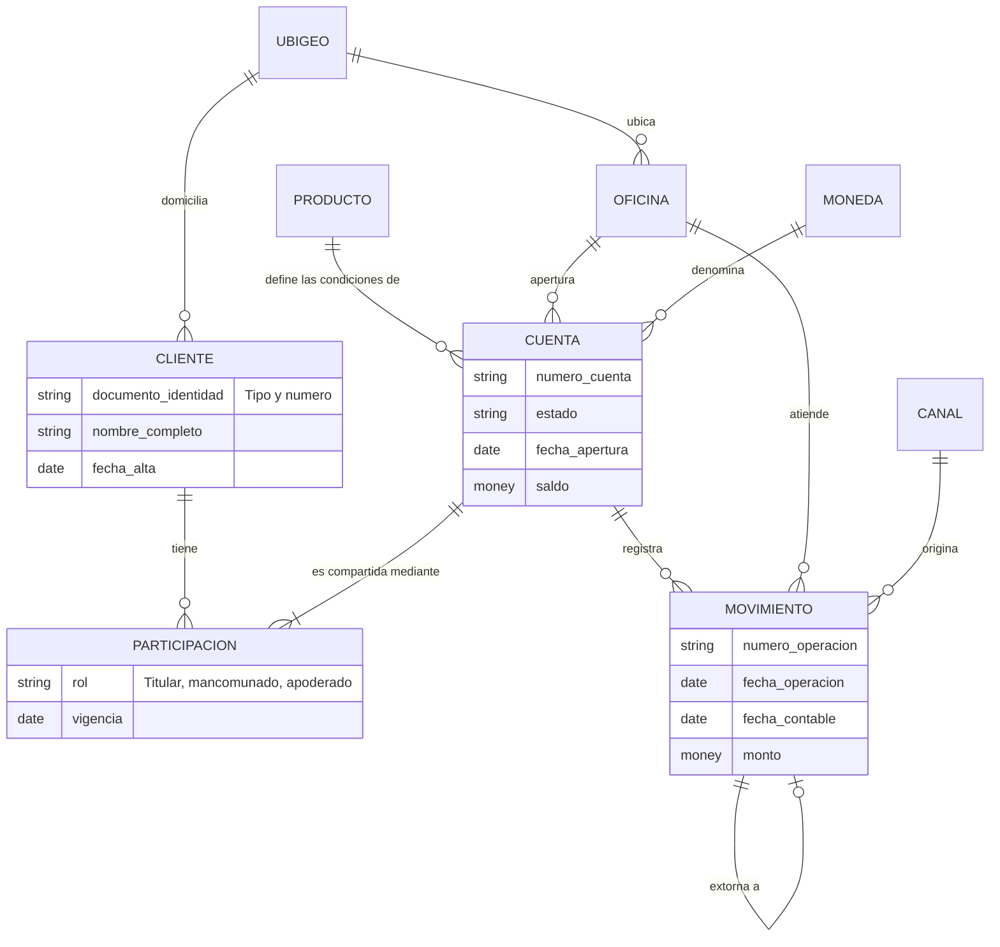

# Caso 01 — Modelo conceptual

**Audiencia:** Gerencia de Productos Pasivos, Contabilidad, Operaciones.
**Regla:** sin tipos de dato, sin llaves técnicas, sin tablas puente artificiales. Solo *qué existe*.

---

## Diagrama conceptual

---

## Entidades

| Entidad | Definición de negocio | Identidad | Ciclo de vida |
|---|---|---|---|
| **CLIENTE** | Persona natural o jurídica con relación comercial con el banco | Tipo + número de documento | Alta → vigente → baja |
| **CUENTA** | Contrato de depósito en una moneda, sobre un producto | Número de cuenta | Apertura → activa → inactiva/bloqueada → cerrada |
| **PARTICIPACION** | Vínculo de un cliente con una cuenta, con un rol y una vigencia | Cuenta + cliente + inicio de vigencia | Alta → baja |
| **MOVIMIENTO** | Evento que altera el saldo de una cuenta | Número de operación | Se registra y **nunca se elimina** |
| **PRODUCTO** | Oferta comercial que define moneda, TREA y condiciones | Código de producto | Vigente / descontinuado |
| **OFICINA** | Punto de atención físico del banco | Código de oficina | Apertura → cierre |

## Catálogos (listas de valores estables, no entidades de negocio)

| Catálogo | Valores |
|---|---|
| **MONEDA** | PEN, USD |
| **CANAL** | Oficina, ATM, Agente, App, Web, Batch |
| **TIPO DE MOVIMIENTO** | Depósito, Retiro, Transferencia recibida/enviada, Comisión, Intereses, ITF, Extorno, Cierre |
| **ESTADO DE CUENTA** | Activa, Inactiva, Bloqueada, Cerrada |
| **TIPO DE DOCUMENTO** | DNI, Carné de extranjería, RUC, Pasaporte |
| **UBIGEO** | Catálogo oficial INEI de distritos |

---

## Relaciones, con cardinalidad y verbo

| Relación | Cardinalidad | Lectura de negocio |
|---|---|---|
| CLIENTE — PARTICIPACION | 1 : 0..N | Un cliente puede participar en ninguna o muchas cuentas |
| CUENTA — PARTICIPACION | 1 : 1..N | Una cuenta tiene **al menos un** participante |
| CUENTA — MOVIMIENTO | 1 : 0..N | Una cuenta registra ninguno o muchos movimientos |
| PRODUCTO — CUENTA | 1 : 0..N | Un producto define muchas cuentas; una cuenta, un solo producto |
| OFICINA — CUENTA | 1 : 0..N | Una cuenta se abre en exactamente una oficina |
| MOVIMIENTO — MOVIMIENTO | 0..1 : 0..1 | Un movimiento de extorno anula exactamente un movimiento original |

---

## Decisiones conceptuales explicadas

### ¿Por qué `PARTICIPACION` y no una relación directa CLIENTE-CUENTA?

Porque **RN-03** exige cuentas mancomunadas: la relación es N:M y **tiene atributos propios**
(el rol y la vigencia). Una relación N:M con atributos es, conceptualmente, una entidad
asociativa. Si se modelara `cuenta.cliente_id`, sería imposible representar una cuenta con dos
titulares sin duplicar la cuenta.

### ¿`ESTADO` es entidad o atributo?

**Catálogo.** No tiene atributos propios ni ciclo de vida; es una lista de valores con una regla
asociada (`permite_movimiento`). Modelarlo como entidad con relaciones sería sobreingeniería.

### ¿Por qué el extorno es una relación reflexiva y no un atributo booleano?

Un `es_anulado = true` en el movimiento original **destruiría la partida doble**: contabilidad
necesita el asiento inverso como hecho propio, con su fecha y su número de operación. Además,
**RN-12** prohíbe borrar. La relación reflexiva conserva ambos hechos y su vínculo.

### ¿El saldo es atributo de CUENTA o se deriva de MOVIMIENTO?

Conceptualmente **se deriva**. Se conserva en `CUENTA` como valor materializado por rendimiento
(consultar el saldo es la operación más frecuente del banco), pero con la obligación de que
**siempre cuadre** — por eso existe la regla de calidad CAL-04. Es una desnormalización deliberada.

---

## Glosario acordado con negocio

| Término | Definición acordada |
|---|---|
| **Cliente** | Persona con al menos una participación vigente o histórica en una cuenta |
| **Titular** | Participante con rol TITULAR; hay exactamente uno vigente por cuenta |
| **Saldo contable** | Suma algebraica de todos los movimientos de la cuenta |
| **Saldo disponible** | Saldo contable menos retenciones vigentes |
| **Cuenta activa** | Estado = ACT; admite movimientos |
| **Cuenta inactiva** | Sin operaciones **del cliente** por más de 90 días (las comisiones del banco no cuentan) |
| **Movimiento del cliente** | Aquel originado por el cliente; excluye comisiones, ITF e intereses |
| **Fecha de operación** | Momento en que ocurrió el hecho |
| **Fecha contable** | Día al que se imputa el hecho en los libros |
