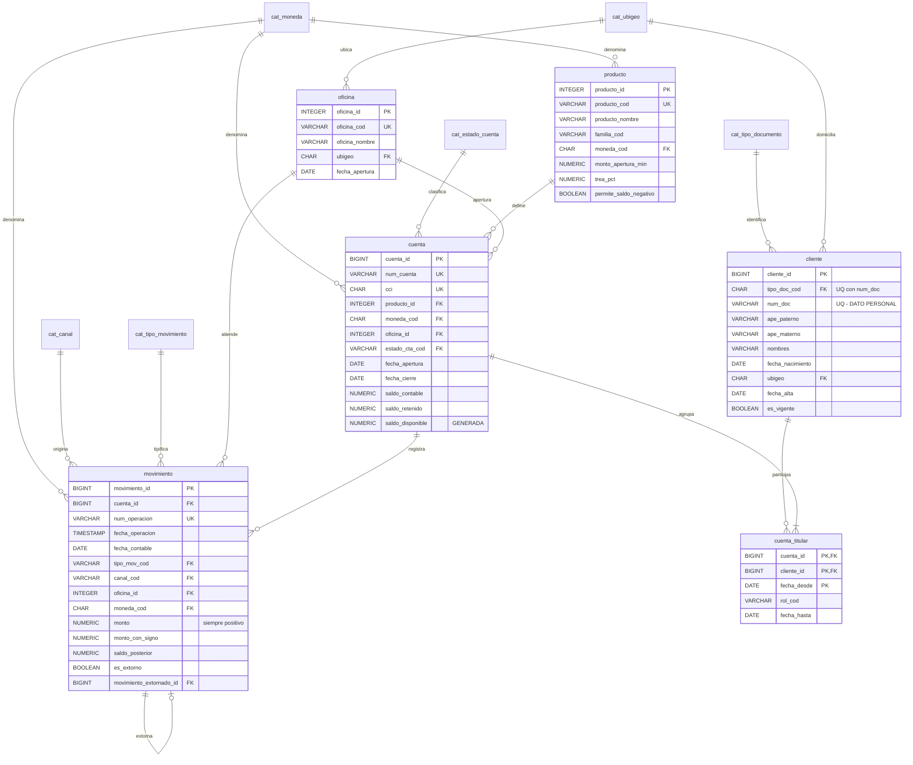

# Caso 01 — Modelo lógico y diccionario de datos

**Estilo:** normalizado a 3FN (sistema transaccional).
**Notación:** Crow's Foot (Mermaid).

---

## Diagrama entidad-relación lógico



---

## Verificación de formas normales

| Forma | Verificación | Resultado |
|---|---|---|
| **1FN** | Ningún atributo contiene listas. Los múltiples titulares se resolvieron con `cuenta_titular`. | ✅ |
| **2FN** | En `cuenta_titular (cuenta_id, cliente_id, fecha_desde)`, `rol_cod` y `fecha_hasta` dependen de la PK completa. No hay atributos del cliente ni de la cuenta. | ✅ |
| **3FN** | `departamento`/`provincia`/`distrito` no viven en `cliente` ni en `oficina`: se deducen del `ubigeo`, por eso están en `cat_ubigeo`. El `signo` no vive en `movimiento`: depende de `tipo_mov_cod`. | ✅ |
| **BCNF** | Todos los determinantes son superclaves. | ✅ |

### Desnormalizaciones deliberadas (documentadas)

| Campo | Por qué se desnormaliza | Control compensatorio |
|---|---|---|
| `cuenta.saldo_contable` | Consultar el saldo es la operación más frecuente; recalcularlo desde millones de movimientos en cada consulta es inviable | **CAL-04** verifica el cuadre en cada carga |
| `movimiento.monto_con_signo` | Evita un JOIN al catálogo en toda consulta de agregación | `CHECK (ABS(monto_con_signo) = monto)` |
| `movimiento.saldo_posterior` | Permite reconstruir el estado de cuenta sin recalcular acumulados | Se recalcula por proceso, nunca a mano |
| `movimiento.moneda_cod` | Redundante con `cuenta.moneda_cod`, pero congela la moneda del hecho | Regla de calidad CAL-07 |

---

## Diccionario de datos

### Tabla `cliente`

| Columna | Tipo | Nulo | Dominio / regla | Descripción | Sensibilidad |
|---|---|---|---|---|---|
| `cliente_id` | BIGINT | No | Identidad | Identificador interno | Interno |
| `tipo_doc_cod` | CHAR(2) | No | FK `cat_tipo_documento` | Tipo de documento | Interno |
| `num_doc` | VARCHAR(20) | No | Único junto a tipo; `^[A-Z0-9]+$` | Número de documento | **Dato personal** |
| `ape_paterno` | VARCHAR(60) | No | — | Apellido paterno | **Dato personal** |
| `ape_materno` | VARCHAR(60) | Sí | — | Apellido materno | **Dato personal** |
| `nombres` | VARCHAR(80) | No | — | Nombres | **Dato personal** |
| `fecha_nacimiento` | DATE | Sí | < `fecha_alta` | Fecha de nacimiento | **Dato personal** |
| `ubigeo` | CHAR(6) | Sí | FK `cat_ubigeo` | Distrito de domicilio | **Dato personal** |
| `fecha_alta` | DATE | No | — | Alta como cliente | Interno |
| `es_vigente` | BOOLEAN | No | — | Cliente vigente | Interno |

### Tabla `cuenta`

| Columna | Tipo | Nulo | Dominio / regla | Descripción | Sensibilidad |
|---|---|---|---|---|---|
| `cuenta_id` | BIGINT | No | Identidad | Identificador interno | Interno |
| `num_cuenta` | VARCHAR(20) | No | Único | Número de cuenta | **Confidencial** |
| `cci` | CHAR(20) | No | Único; 20 dígitos | Código de Cuenta Interbancario | **Confidencial** |
| `producto_id` | INTEGER | No | FK `producto` | Producto contratado | Interno |
| `moneda_cod` | CHAR(3) | No | FK `cat_moneda` | Moneda de la cuenta | Interno |
| `oficina_id` | INTEGER | No | FK `oficina` | Oficina de apertura | Interno |
| `estado_cta_cod` | VARCHAR(10) | No | FK `cat_estado_cuenta` | Estado | Interno |
| `fecha_apertura` | DATE | No | — | Fecha de apertura | Interno |
| `fecha_cierre` | DATE | Sí | ≥ `fecha_apertura` | Fecha de cierre | Interno |
| `saldo_contable` | NUMERIC(18,2) | No | = Σ movimientos | Saldo en libros | **Confidencial** |
| `saldo_retenido` | NUMERIC(18,2) | No | ≥ 0 | Retenciones vigentes | **Confidencial** |
| `saldo_disponible` | NUMERIC(18,2) | No | **Generada** | Saldo retirable | **Confidencial** |

### Tabla `movimiento`

| Columna | Tipo | Nulo | Dominio / regla | Descripción | Sensibilidad |
|---|---|---|---|---|---|
| `movimiento_id` | BIGINT | No | Identidad | Identificador interno | Interno |
| `cuenta_id` | BIGINT | No | FK `cuenta` | Cuenta afectada | Interno |
| `num_operacion` | VARCHAR(30) | No | **Único en el banco** | Número de operación | **Confidencial** |
| `fecha_operacion` | TIMESTAMP | No | — | Momento del hecho | Interno |
| `fecha_contable` | DATE | No | ≥ `fecha_operacion::DATE` | Día de imputación contable | Interno |
| `tipo_mov_cod` | VARCHAR(10) | No | FK `cat_tipo_movimiento` | Tipo de movimiento | Interno |
| `canal_cod` | VARCHAR(10) | No | FK `cat_canal` | Canal de origen | Interno |
| `monto` | NUMERIC(18,2) | No | **> 0** | Importe, siempre positivo | **Confidencial** |
| `monto_con_signo` | NUMERIC(18,2) | No | `ABS(...) = monto` | Importe con signo aplicado | **Confidencial** |
| `saldo_posterior` | NUMERIC(18,2) | No | — | Saldo tras el movimiento | **Confidencial** |
| `es_extorno` | BOOLEAN | No | — | Marca de extorno | Interno |
| `movimiento_extornado_id` | BIGINT | Sí | FK reflexiva; obligatoria si `es_extorno` | Movimiento anulado | Interno |

---

## Dónde vive cada regla de negocio

| Regla | Implementación en el modelo | Tipo de control |
|---|---|---|
| RN-01 documento único | `uq_cliente_doc UNIQUE (tipo_doc_cod, num_doc)` | Declarativo |
| RN-02 cliente 0..N cuentas | FK en `cuenta_titular` | Declarativo |
| RN-03 un solo titular vigente | `uq_cuenta_titular_principal` (índice único parcial) | Declarativo |
| RN-04 producto define moneda | `producto.moneda_cod` + CAL-07 | Mixto |
| RN-05 cuenta monomoneda | `cuenta.moneda_cod NOT NULL` + CAL-07 | **Mixto** — ver nota |
| RN-06 estados | FK `cat_estado_cuenta` | Declarativo |
| RN-07 dos fechas | `ck_movimiento_fechas` | Declarativo |
| RN-08 canal obligatorio | FK `cat_canal` NOT NULL | Declarativo |
| RN-09 signo por tipo | `ck_movimiento_signo` (solo la magnitud) | **NO DECLARADA** — ver nota |
| RN-10 saldo = Σ movimientos | CAL-04 | **Regla de calidad** |
| RN-11 disponible derivado | Columna `GENERATED ALWAYS AS ... STORED` | Declarativo |
| RN-12 extorno sin borrado | FK reflexiva + `ck_movimiento_extorno` | Declarativo |
| RN-13 operación única | `uq_movimiento_operacion` | Declarativo |
| RN-14 saldo negativo solo en corriente | `producto.permite_saldo_negativo` + CAL-05 | **Regla de calidad** |
| RN-15 oficina con ubigeo | FK `cat_ubigeo` | Declarativo |

> **Lección del caso:** 11 de 15 reglas se declaran de verdad en la base. Dos requieren
> verificación por proceso porque dependen de agregaciones (RN-10, RN-14), una es mixta (RN-05) y
> **una no está garantizada por nada (RN-09)**.
> **Cuanto más alto el porcentaje de reglas declarativas, más sano el modelo — pero solo si el
> recuento es honesto.** Contar como "declarativa" una regla que el esquema no impone es peor que
> no tener la tabla: te deja tranquilo sobre un hueco abierto.

### Las dos filas que hay que mirar dos veces

**RN-09 (signo) NO está garantizada.** `ck_movimiento_signo` solo verifica
`ABS(monto_con_signo) = monto`, es decir la **magnitud**. El **sentido** no se contrasta contra
`cat_tipo_movimiento.signo`, así que un depósito guardado con signo negativo —un retiro
contabilizado al revés— entra sin resistencia y ninguna regla de calidad lo ve. Compruébalo:

```sql
-- Un deposito (signo +1 en el catalogo) guardado como si fuera un retiro. Entra sin error.
BEGIN;
INSERT INTO movimiento (cuenta_id, num_operacion, tipo_mov_cod, canal_cod,
       fecha_operacion, fecha_contable, monto, monto_con_signo, saldo_posterior, moneda_cod)
VALUES (1, 'PRUEBA-SIGNO', 'DEP', 'APP', DATE '2026-09-01', DATE '2026-09-01',
        100.00, -100.00, 0.00, 'PEN');
ROLLBACK;   -- probado en transaccion, para no ensuciar el laboratorio
```

**Ejercicio (y es de los buenos):** escribe la regla que lo detecta, y después decide si debería ser
una regla o una restricción. La regla es directa:

```sql
SELECT m.movimiento_id, m.tipo_mov_cod, tm.signo, m.monto, m.monto_con_signo
FROM   movimiento m
JOIN   cat_tipo_movimiento tm ON tm.tipo_mov_cod = m.tipo_mov_cod
WHERE  m.monto_con_signo <> m.monto * tm.signo;
```

Declararlo es más difícil: un `CHECK` no puede consultar otra tabla. Las salidas son replicar
`signo` en `movimiento` con una FK compuesta `(tipo_mov_cod, signo)` y entonces sí
`CHECK (monto_con_signo = monto * signo)`, o no guardar `monto_con_signo` en absoluto y derivarlo en
una vista. **Ese dilema —replicar un dato para poder declarar una regla— es el oficio.**

**RN-05 (cuenta monomoneda) es mixta, no declarativa.** `NOT NULL` obliga a que la cuenta tenga
moneda; no impide que llegue un movimiento en otra. Eso lo cubre CAL-07, que es una regla de
calidad.

---

## Matriz source-to-target (cómo se poblaría en la realidad)

| Destino | Campo | Sistema origen | Campo origen | Transformación |
|---|---|---|---|---|
| `cliente` | `num_doc` | Core bancario | `NUM_DOCUM` | `TRIM`, `UPPER`, conservar ceros a la izquierda |
| `cliente` | `tipo_doc_cod` | Core bancario | `COD_TDOC` | Mapeo `1→01`, `4→04`, `6→06` |
| `cuenta` | `cci` | Core bancario | `CTA_CCI` | Validar 20 dígitos |
| `movimiento` | `fecha_contable` | Core bancario | `FEC_PROCESO` | `TO_DATE(...,'YYYYMMDD')` |
| `movimiento` | `monto_con_signo` | Core bancario | `IMPORTE`, `IND_DB_CR` | `IMPORTE * (CASE IND_DB_CR WHEN 'D' THEN -1 ELSE 1 END)` |
| `cuenta` | `saldo_contable` | Core bancario | `SALDO_CONT` | Validar contra Σ movimientos (CAL-04) |
