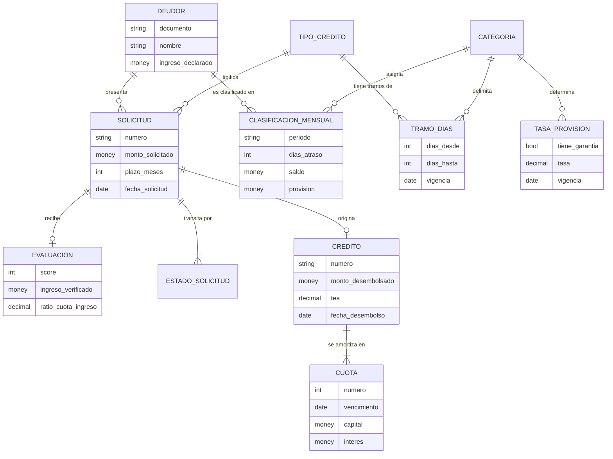

# Caso 02 — Modelo conceptual

## Entidades

| Entidad | Definición | Identidad | Granularidad |
|---|---|---|---|
| **DEUDOR** | Persona que solicita u obtiene crédito | Tipo + número de documento | Una fila por persona |
| **SOLICITUD** | Pedido formal de crédito | Número de solicitud | Una fila por trámite |
| **ESTADO_SOLICITUD** | Cada paso del trámite, con fecha y usuario | Solicitud + secuencia | Una fila por transición |
| **EVALUACION** | Resultado del análisis de riesgo | Solicitud (1:1) | Una fila por solicitud evaluada |
| **CREDITO** | Operación efectivamente desembolsada | Número de crédito | Una fila por operación |
| **CUOTA** | Obligación de pago en una fecha | Crédito + número de cuota | Una fila por cuota |
| **CLASIFICACION_MENSUAL** | Foto regulatoria del deudor | Deudor + periodo | **Una fila por deudor y mes** |

## Parámetros normativos (entidades de configuración, no de negocio)

| Entidad | Qué guarda | Por qué es entidad y no constante |
|---|---|---|
| **TRAMO_DIAS** | De cuántos a cuántos días corresponde cada categoría, por tipo de crédito y periodo de vigencia | La SBS lo modifica; debe poder reclasificarse el pasado con la norma que regía |
| **TASA_PROVISION** | Qué % provisionar según categoría y existencia de garantía | Igual: cambia por norma |

---

## Decisiones conceptuales

### La clasificación es del DEUDOR, no del crédito

La Res. SBS 11356-2008 establece el **alineamiento**: un deudor con varias operaciones recibe una
clasificación considerando su comportamiento global. Por eso `CLASIFICACION_MENSUAL` cuelga de
`DEUDOR` y no de `CREDITO`.

**Consecuencia de modelarlo mal:** si la clasificación colgara del crédito, un mismo deudor podría
aparecer Normal en una operación y Dudoso en otra. El reporte a la SBS sería rechazado.

### ¿Snapshot mensual o SCD2?

| Criterio | Snapshot mensual | SCD2 |
|---|---|---|
| El reporte regulatorio tiene corte **mensual obligatorio** | ✅ coincide con el grano exigido | ❌ hay que calcular la vigente a fin de mes |
| Volumen | Mayor (una fila por deudor y mes) | Menor (solo al cambiar) |
| Consulta "cartera de julio" | Trivial: `WHERE periodo='202607'` | Requiere lógica de vigencia |
| Reproceso de un mes | Borrar e insertar ese periodo | Complejo: reabrir vigencias |

**Decisión: snapshot mensual.** El grano del negocio *es* mensual porque el reporte regulatorio lo
es. SCD2 sería técnicamente más eficiente y funcionalmente peor.

### La historia de estados es una entidad

RN-03 exige conservar el recorrido completo. Con solo `solicitud.estado_actual`, PN-09 (tiempo de
ciclo por canal) es imposible de responder. El estado actual se conserva **además**, como
desnormalización controlada por CAL-09.

---

## Glosario acordado

| Término | Definición |
|---|---|
| **Deudor** | Persona con al menos una solicitud presentada |
| **Solicitud desembolsada** | Solicitud que generó un crédito efectivamente entregado |
| **Tasa de aprobación** | Desembolsadas / total de solicitudes del periodo (no incluye las que siguen en evaluación) |
| **Cartera no normal** | Saldo de deudores con clasificación distinta de Normal |
| **Días de atraso** | Días desde el vencimiento de la cuota más antigua impaga |
| **Alineamiento** | Ajuste de la clasificación del deudor según su peor situación |
| **Cosecha (vintage)** | Conjunto de créditos desembolsados en un mismo mes |
| **Provisión requerida** | Saldo × tasa de la categoría y condición de garantía |
