# Caso 02 — Modelo lógico y diccionario de datos

**Estilo:** normalizado 3FN + tablas de parámetros con vigencia temporal.

## Diagrama E-R lógico

```mermaid
erDiagram
    cat_tipo_documento  ||--o{ deudor : identifica
    cat_tipo_credito    ||--o{ solicitud_credito : tipifica
    cat_tipo_credito    ||--o{ par_clasificacion_dias : "define tramos de"
    cat_clasificacion   ||--o{ par_clasificacion_dias : delimita
    cat_clasificacion   ||--o{ par_provision : "determina tasa de"
    cat_clasificacion   ||--o{ deudor_clasificacion_mes : asigna
    cat_clasificacion   ||--o{ evaluacion_crediticia : "peor del sistema"
    cat_estado_solicitud ||--o{ solicitud_credito : clasifica
    cat_estado_solicitud ||--o{ solicitud_estado_hist : registra
    cat_motivo_rechazo  ||--o{ solicitud_credito : justifica
    cat_canal_venta     ||--o{ solicitud_credito : origina
    cat_moneda          ||--o{ solicitud_credito : denomina
    deudor              ||--o{ solicitud_credito : presenta
    deudor              ||--o{ credito : mantiene
    deudor              ||--o{ deudor_clasificacion_mes : "es clasificado en"
    solicitud_credito   ||--|{ solicitud_estado_hist : "transita por"
    solicitud_credito   ||--o| evaluacion_crediticia : recibe
    solicitud_credito   ||--o| credito : origina
    credito             ||--|{ cronograma_cuota : "se amortiza en"

    deudor {
        BIGINT  deudor_id PK
        CHAR    tipo_doc_cod FK
        VARCHAR num_doc "UQ - DATO PERSONAL"
        VARCHAR ape_paterno
        VARCHAR nombres
        NUMERIC ingreso_declarado "DATO SENSIBLE"
        VARCHAR situacion_laboral
        INTEGER antiguedad_meses
    }
    solicitud_credito {
        BIGINT  solicitud_id PK
        VARCHAR num_solicitud UK
        BIGINT  deudor_id FK
        CHAR    tipo_credito_cod FK
        VARCHAR canal_cod FK
        NUMERIC monto_solicitado
        INTEGER plazo_meses
        DATE    fecha_solicitud
        VARCHAR estado_sol_cod FK
        VARCHAR motivo_cod FK "solo si RECHAZADA"
    }
    solicitud_estado_hist {
        BIGINT   solicitud_id PK,FK
        SMALLINT secuencia PK
        VARCHAR  estado_sol_cod FK
        TIMESTAMP fecha_hora
        VARCHAR  usuario
    }
    evaluacion_crediticia {
        BIGINT  evaluacion_id PK
        BIGINT  solicitud_id FK,UK
        INTEGER score
        NUMERIC ingreso_verificado "DATO SENSIBLE"
        NUMERIC deuda_sistema
        NUMERIC ratio_cuota_ingreso
        CHAR    peor_clasif_sistema FK
        VARCHAR resultado
    }
    credito {
        BIGINT  credito_id PK
        VARCHAR num_credito UK
        BIGINT  solicitud_id FK,UK
        BIGINT  deudor_id FK
        NUMERIC monto_desembolsado
        NUMERIC tea_pct
        INTEGER plazo_meses
        DATE    fecha_desembolso
        VARCHAR estado_credito
        BOOLEAN tiene_garantia
    }
    cronograma_cuota {
        BIGINT   credito_id PK,FK
        SMALLINT num_cuota PK
        DATE     fecha_vencimiento
        NUMERIC  monto_capital
        NUMERIC  monto_interes
        NUMERIC  monto_seguro
        NUMERIC  monto_cuota
        VARCHAR  estado_cuota
    }
    deudor_clasificacion_mes {
        BIGINT  deudor_id PK,FK
        CHAR    periodo PK "AAAAMM"
        DATE    fecha_corte
        CHAR    tipo_credito_cod FK
        INTEGER dias_atraso
        CHAR    clasificacion_cod FK
        NUMERIC saldo_capital
        NUMERIC tasa_provision
        NUMERIC monto_provision
    }
    par_clasificacion_dias {
        CHAR    tipo_credito_cod PK,FK
        CHAR    clasificacion_cod PK,FK
        DATE    fecha_desde PK
        INTEGER dias_desde
        INTEGER dias_hasta
        DATE    fecha_hasta
        VARCHAR base_legal
    }
    par_provision {
        CHAR    clasificacion_cod PK,FK
        BOOLEAN tiene_garantia PK
        DATE    fecha_desde PK
        NUMERIC tasa_provision
        DATE    fecha_hasta
        VARCHAR base_legal
    }
```



---

## El patrón central: parámetro vigente por fecha

```
par_clasificacion_dias
PK = (tipo_credito_cod, clasificacion_cod, fecha_desde)
```

**Por qué `fecha_desde` forma parte de la llave:** permite que coexistan la versión antigua y la
nueva del mismo tramo. Reclasificar marzo de 2026 usa la norma de marzo; reclasificar octubre usa
la de octubre. Sin `fecha_desde` en la llave, un cambio normativo **sobrescribe el pasado** y los
reportes históricos dejan de ser reproducibles.

**Por qué `tiene_garantia` está en la llave de `par_provision`:** para una misma categoría existen
**dos** tasas (con y sin garantía preferida). Si fuera un atributo, solo cabría una.

### Verificación de integridad del parámetro (CAL-08)

Un parámetro mal cargado es peor que ningún parámetro:

| Carga | Consecuencia |
|---|---|
| CPP 9-30 y Deficiente **32**-60 | Los deudores con **31 días** quedan sin clasificar: `fn_clasificar()` devuelve `NULL` |
| CPP 9-30 y Deficiente **30**-60 | Solapamiento: la clasificación depende del orden de lectura |

Por eso CAL-08 verifica que `dias_desde` del tramo siguiente = `dias_hasta + 1` del anterior.

---

## Verificación de formas normales

| Forma | Verificación | Resultado |
|---|---|---|
| 1FN | Sin campos multivaluados; la historia de estados es tabla propia | ✅ |
| 2FN | En `cronograma_cuota (credito_id, num_cuota)`, todos los montos dependen de la PK completa | ✅ |
| 3FN | `clasificacion_cod` **no** se guarda en `credito`; se deriva del parámetro. `tasa_provision` se copia en el snapshot como **valor histórico congelado**, no como dependencia transitiva | ✅ |

### Desnormalizaciones deliberadas

| Campo | Motivo | Control |
|---|---|---|
| `deudor_clasificacion_mes.tasa_provision` | Congela la tasa que se aplicó ese mes. Si mañana cambia el parámetro, el histórico no debe cambiar | CAL-04 verifica `provision = saldo × tasa` |
| `solicitud_credito.estado_sol_cod` | Evita subconsulta a la historia en cada lectura | CAL-09 verifica contra el último estado histórico |
| `credito.deudor_id` | Redundante vía `solicitud_id`, pero evita un JOIN en todas las consultas de riesgo | FK a ambas tablas |

> **Regla importante:** copiar la tasa en el snapshot **no** viola 3FN, porque el valor copiado es
> un **hecho histórico** ("la tasa que se aplicó"), no un atributo derivable del estado actual.

---

## Diccionario de datos (extracto)

### `deudor_clasificacion_mes` — la tabla que ve la SBS

| Columna | Tipo | Nulo | Dominio / regla | Descripción | Sensibilidad |
|---|---|---|---|---|---|
| `deudor_id` | BIGINT | No | FK `deudor` | Deudor clasificado | Interno |
| `periodo` | CHAR(6) | No | `^[0-9]{6}$` | Periodo AAAAMM | Interno |
| `fecha_corte` | DATE | No | Último día del periodo | Fecha de corte del reporte | Interno |
| `tipo_credito_cod` | CHAR(1) | No | FK `cat_tipo_credito` | Tipo de crédito predominante | Interno |
| `dias_atraso` | INTEGER | No | ≥ 0 | Días de atraso de la cuota más antigua impaga | **Confidencial** |
| `clasificacion_cod` | CHAR(1) | No | FK; = `fn_clasificar(...)` | Categoría SBS | **Confidencial** |
| `saldo_capital` | NUMERIC(18,2) | No | ≥ 0 | Saldo de capital a la fecha de corte | **Confidencial** |
| `tiene_garantia` | BOOLEAN | No | — | Existe garantía preferida | Interno |
| `tasa_provision` | NUMERIC(9,6) | No | Del parámetro vigente | Tasa aplicada (congelada) | Interno |
| `monto_provision` | NUMERIC(18,2) | No | = `saldo × tasa` | Provisión requerida | **Confidencial** |

### `deudor` — datos personales y sensibles

| Columna | Sensibilidad | Tratamiento exigido |
|---|---|---|
| `num_doc`, `ape_paterno`, `ape_materno`, `nombres`, `fecha_nacimiento` | **Dato personal** | Enmascarar fuera de producción |
| `ingreso_declarado`, `evaluacion.ingreso_verificado` | **DATO SENSIBLE** (ingresos económicos) | Régimen reforzado: acceso mínimo, prohibido en ambientes de desarrollo |

---

## Matriz source-to-target

| Destino | Campo | Origen | Campo origen | Transformación | Calidad |
|---|---|---|---|---|---|
| `deudor_clasificacion_mes` | `dias_atraso` | Core créditos | `FEC_VENC_MIN` | `fecha_corte - FEC_VENC_MIN` de la cuota impaga más antigua | ≥ 0 |
| `deudor_clasificacion_mes` | `clasificacion_cod` | **Derivado** | — | `fn_clasificar(tipo, dias, fecha_corte)` | CAL-03 |
| `deudor_clasificacion_mes` | `tasa_provision` | `par_provision` | `tasa_provision` | Vigente a `fecha_corte` | CAL-04 |
| `evaluacion_crediticia` | `peor_clasif_sistema` | Central de riesgos (RCC) | `CLASIF_MAX` | Máximo entre entidades | Dominio 0-4 |
| `credito` | `tea_pct` | Core créditos | `TASA_ANUAL` | `/100` si viene como porcentaje | > 0 y < 3 |
