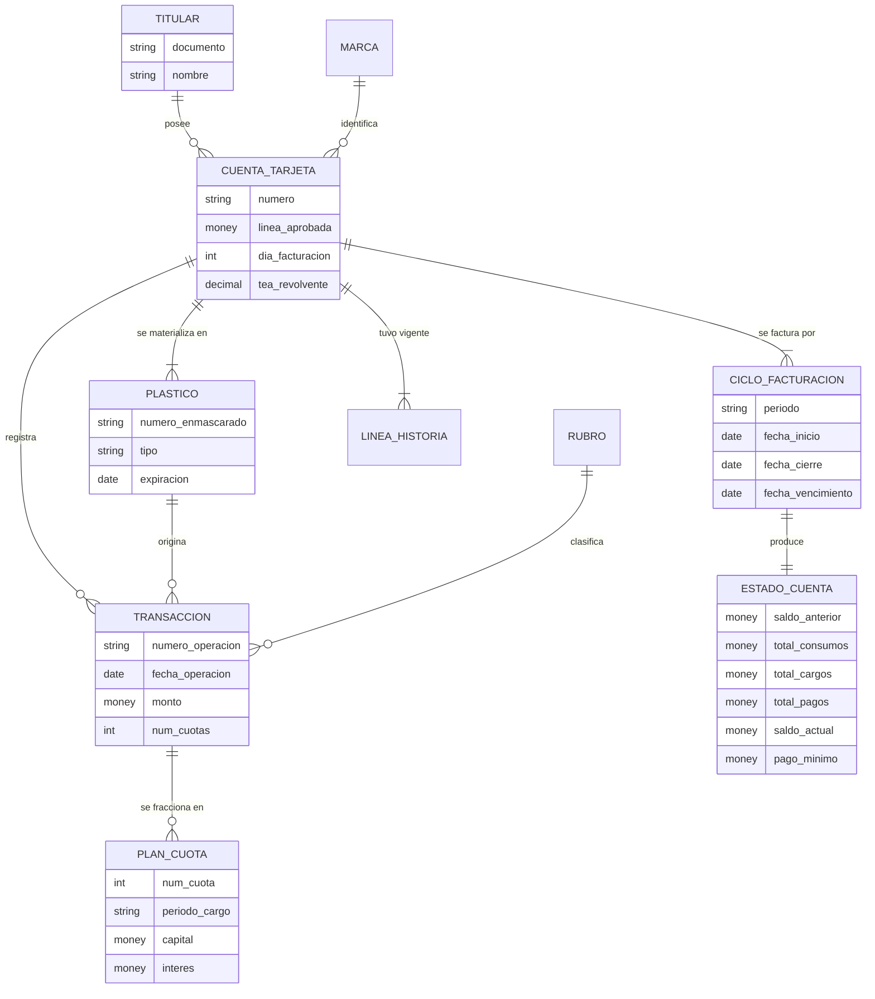

# Caso 03 — Modelo conceptual

## Entidades

| Entidad | Definición | Granularidad |
|---|---|---|
| **TITULAR** | Persona responsable de la cuenta de tarjeta | Una fila por persona |
| **CUENTA_TARJETA** | Contrato de línea de crédito revolvente | Una fila por cuenta |
| **PLASTICO** | Instrumento físico o virtual emitido sobre la cuenta | Una fila por plástico |
| **CICLO_FACTURACION** | Ventana de tiempo que se factura junta | Una fila por cuenta y periodo |
| **TRANSACCION** | Movimiento que afecta el saldo | Una fila por operación |
| **PLAN_CUOTA** | Fracción de una compra diferida | Una fila por cuota |
| **ESTADO_CUENTA** | Resumen facturado de un ciclo | Una fila por cuenta y periodo |
| **LINEA_HISTORIA** | Vigencia de cada valor de línea aprobada | Una fila por vigencia |

---

## Decisiones conceptuales

### El ciclo es una entidad, no un cálculo

Un ciclo tiene **tres fechas propias** (inicio, cierre, vencimiento) que dependen del día de
facturación de la cuenta. Modelarlo como entidad permite:
- Consultar qué transacciones pertenecen a qué ciclo sin recalcular reglas de corte.
- Tener el ciclo **abierto** (creado) antes de emitirlo (estado de cuenta aún no generado).
- Manejar excepciones (un cierre postergado por feriado) sin cambiar el código.

### La cuenta y el plástico son entidades distintas

Un mismo contrato puede tener varios plásticos (titular, adicionales, reposiciones por robo). Cada
plástico tiene su número, su vigencia y su estado. Si el número de tarjeta fuera atributo de la
cuenta, sería imposible representar un adicional o una reposición conservando el historial.

### El plan de cuotas es una entidad, no un atributo

Una compra en 12 cuotas produce **12 obligaciones futuras**, cada una con su periodo de cargo.
Modelarlo como `num_cuotas` en la transacción solamente haría imposible responder "¿cuánto tengo ya
comprometido para diciembre?" — que es exactamente PN-05.

### El estado de cuenta guarda totales, aunque sean derivables

Es una **desnormalización deliberada y obligatoria**: el estado de cuenta es un **documento emitido
al cliente**. Una vez enviado, sus cifras no pueden cambiar aunque después se corrija una
transacción. Recalcularlo cada vez desde las transacciones significaría que el cliente ve cifras
distintas cada vez que consulta el mismo mes.

---

## Glosario acordado

| Término | Definición |
|---|---|
| **Ciclo de facturación** | Periodo entre dos cierres consecutivos; **no** es el mes calendario |
| **Fecha de cierre** | Día en que se corta el ciclo y se emite el estado de cuenta |
| **Fecha de vencimiento** | Último día para pagar sin incurrir en mora |
| **Saldo anterior** | Saldo actual del ciclo previo, sin excepción |
| **Consumos** | Compras al contado + disposiciones + cuotas que vencen en el ciclo |
| **Cargos** | Intereses revolventes + comisiones |
| **Pago mínimo** | Importe mínimo exigido para no incurrir en incumplimiento |
| **Pagador total** | Cliente que paga el 100 % del saldo facturado; no genera intereses |
| **Revolvente** | Cliente que paga menos del total y financia el resto |
| **Utilización de línea** | Saldo actual / línea aprobada |
| **Backlog de cuotas** | Deuda ya contraída pero aún no facturada |
