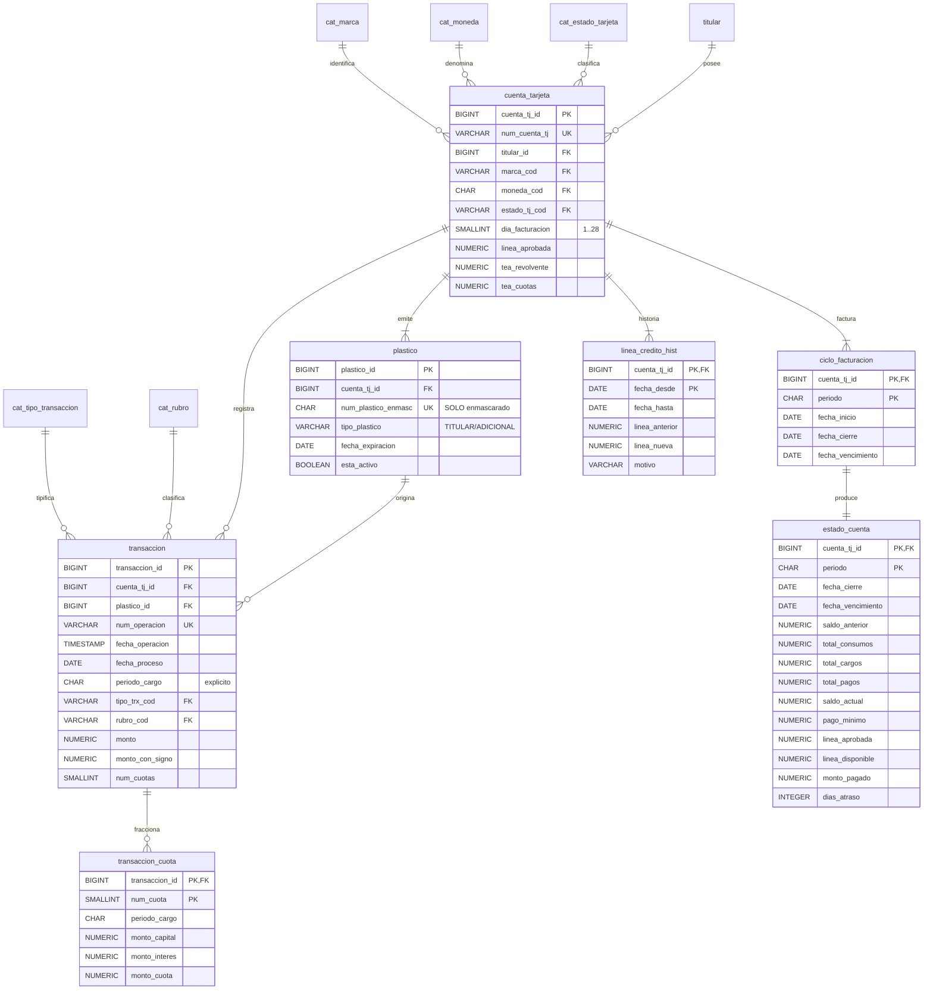

# Caso 03 — Modelo lógico y diccionario de datos

---

## Las tres reglas que viven en la base

| Regla | Implementación | Por qué declarativa y no por proceso |
|---|---|---|
| **RN-06 cuadre** | `CHECK (saldo_actual = saldo_anterior + total_consumos + total_cargos - total_pagos)` | Un estado de cuenta descuadrado no debe **poder existir**; detectarlo al día siguiente es tarde: el cliente ya lo recibió |
| **RN-02 un titular activo** | Índice único parcial `WHERE tipo_plastico='TITULAR' AND esta_activo` | Permite históricamente varios titulares (reposiciones), pero solo uno vigente |
| **RN-11 pago mínimo** | `CHECK (pago_minimo <= GREATEST(saldo_actual, 0))` | Evita cobrar más de lo facturado por un error de cálculo |

### RN-14 implementada por **ausencia**

No existe columna para el PAN completo. La forma más fuerte de garantizar que un dato no se filtre
es **que no haya dónde guardarlo**. Complementa con CAL-11, que verifica que todo número almacenado
contenga caracteres de enmascaramiento.

---

## Verificación de formas normales

| Forma | Verificación | Resultado |
|---|---|---|
| 1FN | Las cuotas están en tabla propia, no como columnas `cuota_1..cuota_12` | ✅ |
| 2FN | En `transaccion_cuota (transaccion_id, num_cuota)`, los montos dependen de la PK completa | ✅ |
| 3FN | `rubro_desc` vive en `cat_rubro`; `marca_desc` en `cat_marca`; ningún atributo derivable duplicado en `transaccion` | ✅ |

### Desnormalizaciones deliberadas

| Campo | Motivo | Control |
|---|---|---|
| `estado_cuenta.total_*` y `saldo_*` | El estado de cuenta es un **documento emitido**: sus cifras se congelan | `CHECK` de cuadre + CAL-03 contra transacciones |
| `transaccion.periodo_cargo` | Derivable de la fecha y el ciclo, pero se almacena para fijar el corte y evitar recalcularlo | CAL-08: el periodo debe existir como ciclo de esa cuenta |
| `transaccion.monto_con_signo` | Evita JOIN al catálogo en agregaciones | `CHECK (ABS(monto_con_signo) = monto)` |
| `estado_cuenta.linea_aprobada` | Congela la línea vigente al cierre | `linea_credito_hist` conserva la historia completa |

> **`periodo_cargo` explícito es la decisión más importante del modelo físico.** La alternativa
> —deducir el ciclo en cada consulta a partir de la fecha y el día de facturación— es lenta, se
> repite en cada reporte y se rompe con la primera excepción operativa.

---

## Diccionario de datos (extracto)

### `estado_cuenta`

| Columna | Tipo | Nulo | Dominio / regla | Descripción | Sensibilidad |
|---|---|---|---|---|---|
| `cuenta_tj_id` | BIGINT | No | FK | Cuenta de tarjeta | Interno |
| `periodo` | CHAR(6) | No | FK a ciclo | Periodo AAAAMM | Interno |
| `saldo_anterior` | NUMERIC(18,2) | No | = saldo actual del ciclo previo | Saldo con que abre el ciclo | **Confidencial** |
| `total_consumos` | NUMERIC(18,2) | No | = Σ transacciones del ciclo | Contado + disposiciones + cuotas vencidas | **Confidencial** |
| `total_cargos` | NUMERIC(18,2) | No | ≥ 0 | Intereses + comisiones | **Confidencial** |
| `total_pagos` | NUMERIC(18,2) | No | ≥ 0 | Pagos aplicados en el ciclo | **Confidencial** |
| `saldo_actual` | NUMERIC(18,2) | No | **`CHECK` de cuadre** | Saldo facturado | **Confidencial** |
| `pago_minimo` | NUMERIC(18,2) | No | ≤ `saldo_actual` | Mínimo exigido | **Confidencial** |
| `dias_atraso` | INTEGER | No | ≥ 0 | Atraso al vencimiento | **Confidencial** |

### `plastico`

| Columna | Sensibilidad | Tratamiento |
|---|---|---|
| `num_plastico_enmasc` | **Confidencial** | Solo enmascarado; el PAN completo **no se almacena** |
| `nombre_impreso` | **Dato personal** | Enmascarar fuera de producción |

---

## Matriz source-to-target

| Destino | Campo | Origen | Campo origen | Transformación | Calidad |
|---|---|---|---|---|---|
| `transaccion` | `periodo_cargo` | Autorizador | `FEC_PROCESO` | Ubicar el ciclo de la cuenta que contiene la fecha | CAL-08 |
| `transaccion` | `monto_con_signo` | Autorizador | `IMPORTE`, `COD_TRX` | `IMPORTE × signo` del catálogo | `ABS = monto` |
| `plastico` | `num_plastico_enmasc` | Emisor | `PAN` | **Enmascarar en origen**; el PAN nunca llega al almacén | CAL-11 |
| `estado_cuenta` | `saldo_anterior` | Proceso de cierre | ciclo previo | `LAG(saldo_actual)` | CAL-02 |
| `transaccion_cuota` | `periodo_cargo` | Motor de cuotas | — | periodo de compra + (nro. cuota − 1) meses | CAL-05 |
