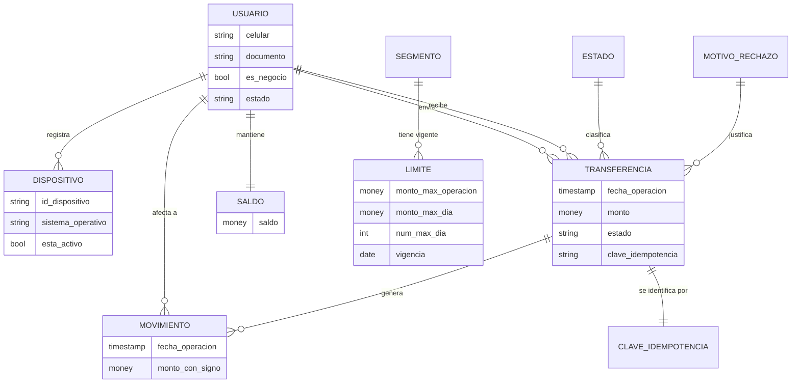

# Caso 04 — Modelo conceptual

## Entidades

| Entidad | Definición | Granularidad | Volumen esperado |
|---|---|---|---|
| **USUARIO** | Persona o negocio afiliado a la billetera | Una fila por afiliado | Millones |
| **DISPOSITIVO** | Celular desde el que opera | Una fila por dispositivo registrado | ≈ usuarios |
| **TRANSFERENCIA** | Intención de mover dinero | Una fila por operación | **Miles de millones al año** |
| **MOVIMIENTO** | Asiento en el libro mayor | **Dos filas** por transferencia P2P confirmada | 2× transferencias |
| **SALDO** | Disponible actual del usuario | Una fila por usuario y moneda | ≈ usuarios |
| **CLAVE_IDEMPOTENCIA** | Registro de la intención ya procesada | Una fila por clave | ≈ transferencias |
| **LIMITE** | Tope operativo vigente por segmento | Una fila por segmento y vigencia | Decenas |

---

## Decisiones conceptuales

### TRANSFERENCIA y MOVIMIENTO son entidades distintas

Una transferencia es **un hecho de negocio**: "María le envió S/ 25 a José".
Un movimiento es **un asiento contable**: "a María se le descontaron S/ 25" y "a José se le
abonaron S/ 25".

| Si los fusionas | Consecuencia |
|---|---|
| Una sola fila por transferencia | No puedes representar el abono al destinatario como hecho propio de su billetera |
| El estado de cuenta del destinatario | Tendrías que consultarlo con `OR usuario_destino = X`, lo que impide indexar y particionar bien |
| El cuadre | No puedes verificar que el dinero no se crea ni se destruye |

**La separación permite la regla más importante del caso:** los movimientos de una transferencia
**suman cero**.

### El SALDO es una entidad, aunque sea derivable

Conceptualmente el saldo es `SUM(movimientos)`. Pero cuando el usuario abre la app, lo primero que
ve es su saldo, y esa consulta se ejecuta millones de veces al día. Sumar miles de millones de
filas en cada apertura es inviable.

**Decisión:** materializar el saldo, con dos controles:
- `CHECK (saldo >= 0)` — una billetera no es una línea de crédito.
- CAL-02 verifica que `saldo = SUM(movimientos)` en cada cierre.

### La CLAVE DE IDEMPOTENCIA es una entidad, no un atributo

Podría parecer un simple atributo de la transferencia. Pero su **razón de existir** es garantizar
unicidad global, y —como se ve en el modelo lógico— el particionamiento impide imponer esa unicidad
sobre la tabla particionada. Al elevarla a entidad propia (tabla no particionada con PK sobre la
clave), la garantía vuelve a ser estructural.

> Este es un caso donde **una restricción física del motor obliga a una decisión conceptual**.
> Ocurre más seguido de lo que se admite: el modelador debe conocer el motor destino.

### El LÍMITE es parámetro con vigencia, no constante

Mismo patrón del caso 02. Los límites cambian por política comercial y por norma PLAFT. Deben poder
evaluarse **a la fecha de la operación**, no con el valor actual, o el control retroactivo daría
falsos positivos.

---

## Glosario acordado

| Término | Definición |
|---|---|
| **Usuario activo mensual (MAU)** | Usuario que **originó** al menos una operación confirmada en el mes. *(Decisión explícita: recibir dinero no cuenta como actividad. Si se contara, la cifra sería mayor; lo importante es que la definición esté escrita.)* |
| **Operación confirmada** | Transferencia en estado `CONFIRMADA`; es la única que mueve dinero |
| **Transferencia P2P** | Envío entre dos usuarios de la billetera |
| **Carga** | Traslado de dinero desde la cuenta bancaria hacia la billetera |
| **Ticket promedio** | Monto promedio de las operaciones confirmadas |
| **Clave de idempotencia** | Identificador de la **intención** de pago, generado por la app |
| **Par frecuente** | Combinación origen-destino con 3 o más transferencias |
| **Saldo** | Suma de los movimientos del usuario; nunca negativo |
