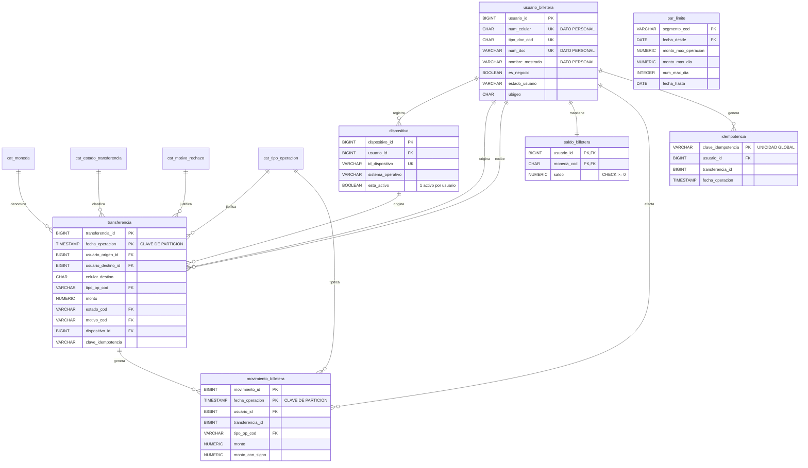
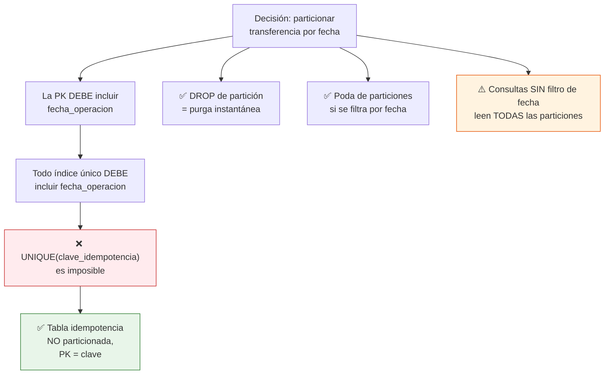

# Caso 04 — Modelo lógico y diccionario de datos



---

## El particionamiento y sus consecuencias en cadena



**Tabla resumen de lo que cambia al particionar:**

| Aspecto | Sin particionar | Particionado por mes |
|---|---|---|
| PK | `(transferencia_id)` | `(transferencia_id, fecha_operacion)` |
| Unicidad global de un atributo | `UNIQUE (col)` | **Imposible**: requiere tabla auxiliar |
| Purga de datos antiguos | `DELETE` masivo | `DROP TABLE particion` |
| Consulta con filtro de fecha | Escaneo total | **Una partición** |
| Consulta sin filtro de fecha | Escaneo total | Escaneo total **+ overhead** de planificación |
| FK hacia tablas normales | Normal | **Soportadas** (PostgreSQL 12+) |
| Índices | Uno | Uno por partición (PostgreSQL los propaga) |

---

## Verificación de formas normales

| Forma | Verificación | Resultado |
|---|---|---|
| 1FN | Los dos lados de una transferencia están en filas separadas de `movimiento_billetera`, no en columnas `monto_origen`/`monto_destino` | ✅ |
| 2FN | En `saldo_billetera (usuario_id, moneda_cod)`, el saldo depende de la PK completa | ✅ |
| 3FN | Ningún atributo del usuario se repite en la transferencia; el signo vive en `cat_tipo_operacion` | ✅ |

### Desnormalizaciones deliberadas

| Campo | Motivo | Control |
|---|---|---|
| `saldo_billetera.saldo` | Consulta de altísima frecuencia (cada apertura de la app) | `CHECK (saldo >= 0)` + CAL-02 |
| `movimiento_billetera.monto_con_signo` | Evita JOIN al catálogo en agregaciones de miles de millones de filas | `CHECK (ABS(monto_con_signo) = monto)` |
| `transferencia.celular_destino` | Permite registrar envíos a celulares aún no afiliados | `CHECK`: destino o celular, al menos uno |
| `idempotencia.transferencia_id` + `fecha_operacion` | Permite recuperar la transferencia original sin recorrer particiones | CAL-13 |

---

## Diccionario de datos (extracto)

### `transferencia` (particionada)

| Columna | Tipo | Nulo | Dominio / regla | Descripción | Sensibilidad |
|---|---|---|---|---|---|
| `transferencia_id` | BIGINT | No | Parte de la PK | Identificador | Interno |
| `fecha_operacion` | TIMESTAMP | No | **Clave de partición**, parte de la PK | Momento de la operación | Interno |
| `usuario_origen_id` | BIGINT | No | FK | Quien envía | Interno |
| `usuario_destino_id` | BIGINT | Sí | FK; ≠ origen | Quien recibe (nulo si no está afiliado) | Interno |
| `celular_destino` | CHAR(9) | Sí | Formato peruano | Destino cuando no hay afiliación | **Dato personal** |
| `monto` | NUMERIC(18,2) | No | > 0 | Importe | **Confidencial** |
| `estado_cod` | VARCHAR(12) | No | FK | Estado final | Interno |
| `motivo_cod` | VARCHAR(20) | Sí | Obligatorio solo si RECHAZADA | Motivo del rechazo | Interno |
| `clave_idempotencia` | VARCHAR(64) | No | Única **globalmente** (vía `idempotencia`) | Clave de la intención de pago | Interno |
| `mensaje` | VARCHAR(80) | Sí | — | Nota del usuario | **Dato personal** (texto libre) |

> ⚠️ `mensaje` es texto libre escrito por el usuario: puede contener datos personales de terceros.
> Debe enmascararse fuera de producción y **excluirse** de las extracciones analíticas.

### `usuario_billetera`

| Columna | Sensibilidad | Tratamiento |
|---|---|---|
| `num_celular` | **Dato personal** | Es el identificador público de la billetera; enmascarar fuera de producción |
| `num_doc`, `nombre_mostrado` | **Dato personal** | Enmascaramiento obligatorio |
| `ubigeo` | Interno | Suficiente para análisis geográfico sin identificar |

---

## Matriz source-to-target

| Destino | Campo | Origen | Campo origen | Transformación | Calidad |
|---|---|---|---|---|---|
| `transferencia` | `fecha_operacion` | App / core de pagos | `TS_EVENTO` | Convertir a hora local; **determina la partición** | CAL-08 |
| `transferencia` | `clave_idempotencia` | App móvil | `X-Idempotency-Key` | Sin transformación; se valida contra `idempotencia` **antes** de insertar | CAL-07 |
| `movimiento_billetera` | `monto_con_signo` | Derivado | — | `monto × signo` del tipo de operación | CAL-04 |
| `saldo_billetera` | `saldo` | Derivado | — | `SUM(monto_con_signo)` por usuario | CAL-01, CAL-02 |
| `usuario_billetera` | `num_celular` | Afiliación | `MSISDN` | Quitar prefijo de país; validar 9 dígitos | CAL-11 |

---

## Nota operativa: creación automática de particiones

En producción, las particiones futuras deben crearse **antes** de que lleguen los datos:

```sql
-- Ejecutar mensualmente (job programado o pg_partman)
CREATE TABLE transferencia_2026_10 PARTITION OF transferencia
    FOR VALUES FROM ('2026-10-01') TO ('2026-11-01');
```

La partición `DEFAULT` + la regla **CAL-08** son la red de seguridad: si alguien olvida crear la
partición del mes, los datos no se pierden y la alerta salta el día 1.
