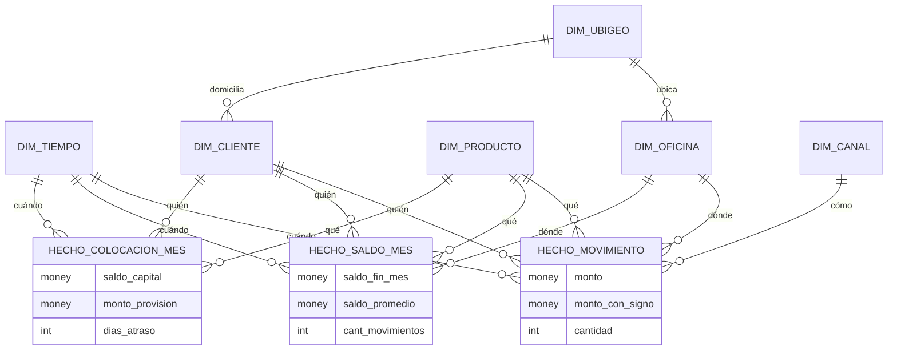

# Caso 05 — Modelo conceptual (dimensional)

En un modelo dimensional, el "modelo conceptual" es la **matriz de bus**: qué procesos de negocio
existen y qué dimensiones comparte cada uno. Es el documento que se acuerda con el negocio **antes**
de dibujar una sola tabla.

## Matriz de bus (Kimball)

Filas = procesos de negocio. Columnas = dimensiones. ✅ = el proceso usa esa dimensión.

| Proceso de negocio | Grano | Tiempo | Cliente | Producto | Oficina | Ubigeo | Canal |
|---|---|:--:|:--:|:--:|:--:|:--:|:--:|
| **Movimientos de cuenta** | Un movimiento | ✅ | ✅ | ✅ | ✅ | ✅ | ✅ |
| **Saldos de captación** | Cuenta-mes | ✅ | ✅ | ✅ | ✅ | ✅ | — |
| **Situación crediticia** | Deudor-mes | ✅ | ✅ | ✅ | — | ✅ | — |

**Las columnas compartidas son las dimensiones conformadas.** Que `Cliente` y `Producto` aparezcan
en los tres procesos es lo que permite cruzarlos en un mismo tablero. Si cada proceso tuviera su
propia definición de cliente, tendrías tres silos.

---

## Diagrama conceptual

---

## Las dimensiones

| Dimensión | Responde a | Atributos clave | Tipo |
|---|---|---|---|
| **DIM_TIEMPO** | ¿Cuándo? | Año, trimestre, mes, día, periodo, fin de mes | Estática (se genera) |
| **DIM_CLIENTE** | ¿Quién? | Documento, nombre, **segmento**, rango de edad, ubigeo | **SCD tipo 2** |
| **DIM_PRODUCTO** | ¿Qué? | Código, nombre, familia, **negocio** (captación/colocación) | **Conformada**, SCD1 |
| **DIM_OFICINA** | ¿Dónde se originó? | Código, nombre, ubigeo | SCD1 |
| **DIM_UBIGEO** | ¿Dónde geográficamente? | Distrito, provincia, departamento, **macro región** | Estática |
| **DIM_CANAL** | ¿Cómo? | Código, descripción, presencial/digital | Estática |

## Los hechos

| Hecho | Grano | Medidas | Aditividad |
|---|---|---|---|
| **HECHO_MOVIMIENTO** | Un movimiento | `monto`, `monto_con_signo`, `cantidad` | **Aditivas** |
| **HECHO_SALDO_MES** | Cuenta-mes | `saldo_fin_mes` | **SEMIADITIVA** (no suma en el tiempo) |
| | | `saldo_promedio` | Semiaditiva |
| | | `cant_movimientos`, `monto_abonos`, `monto_cargos` | Aditivas |
| **HECHO_COLOCACION_MES** | Deudor-mes | `saldo_capital`, `monto_provision` | **SEMIADITIVAS** |
| | | `dias_atraso` | **No aditiva** (solo promedio o máximo) |

---

## Decisiones conceptuales

### Por qué tres hechos y no uno

| Alternativa | Problema |
|---|---|
| Un solo hecho "todo junto" | Granos incompatibles: un movimiento y un saldo mensual no pueden convivir en la misma fila |
| Solo el hecho transaccional | Calcular el saldo de fin de mes desde 28 millones de movimientos, en cada consulta, es inviable |
| Solo los snapshots | Se pierde el detalle: no se puede responder por canal ni por hora |

**Los tres se complementan:** el transaccional da detalle, los snapshots dan velocidad. Es el patrón
estándar en banca.

### Por qué el segmento vive en la dimensión y no en el hecho

El segmento es un **atributo descriptivo del cliente**, no una medida. Ponerlo en el hecho
(desnormalizado) funcionaría, pero:
- Duplicaría el valor en millones de filas.
- Cambiar la definición de segmento obligaría a reprocesar todos los hechos.
- Rompería el principio de que el hecho guarda **qué pasó** y la dimensión **el contexto**.

### Por qué `dim_cliente` es SCD2 y `dim_producto` es SCD1

| Dimensión | Tipo | Razón |
|---|---|---|
| `dim_cliente` | **SCD2** | El negocio **necesita** analizar el pasado con el segmento de entonces (RN-03) |
| `dim_producto` | SCD1 | Si se corrige el nombre de un producto, nadie quiere ver el nombre viejo en los reportes históricos |

> **La regla:** SCD2 cuando el cambio **tiene significado analítico**; SCD1 cuando el cambio es una
> **corrección**. Aplicar SCD2 a todo infla la dimensión sin aportar valor.

---

## Glosario acordado

| Término | Definición acordada |
|---|---|
| **Cliente** | Persona identificada por tipo y número de documento, **sin importar de qué sistema provenga** |
| **Segmento** | Clasificación comercial del cliente, **vigente a la fecha del análisis** |
| **Captación** | Saldo de productos pasivos (ahorro, sueldo, CTS, corriente) |
| **Colocación** | Saldo de capital de créditos vigentes |
| **Macro región** | Agrupación comercial de departamentos (NORTE/CENTRO/SUR/ORIENTE); **no es una división oficial** |
| **Saldo de fin de mes** | Último saldo conocido de la cuenta en el mes; **medida semiaditiva** |
| **Periodo de referencia** | Último periodo con volumen representativo; **no necesariamente `MAX(periodo)`** |
| **Cliente con producto dual** | Cliente con al menos un producto de captación y uno de colocación |
