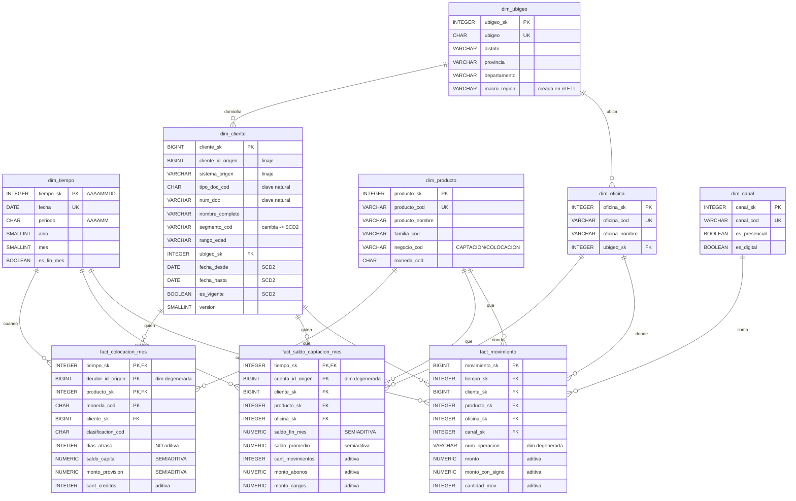

# Caso 05 — Modelo lógico dimensional y diccionario

## Esquema estrella



---

## Diccionario de medidas con su aditividad

> **Esta tabla es el entregable más subestimado del modelador dimensional.** Sin ella, un tablero
> sumará saldos entre meses y nadie sabrá que la cifra está mal.

| Hecho | Medida | Aditividad | Cómo se agrega correctamente |
|---|---|---|---|
| `fact_movimiento` | `monto` | **Aditiva** | `SUM()` en cualquier dimensión |
| `fact_movimiento` | `monto_con_signo` | **Aditiva** | `SUM()` — da el efecto neto |
| `fact_movimiento` | `cantidad_mov` | **Aditiva** | `SUM()` o `COUNT(*)` |
| `fact_saldo_captacion_mes` | `saldo_fin_mes` | **SEMIADITIVA** | `SUM()` entre cuentas; **último valor** o `AVG()` en el tiempo |
| `fact_saldo_captacion_mes` | `saldo_promedio` | Semiaditiva | Igual que arriba |
| `fact_saldo_captacion_mes` | `cant_movimientos` | Aditiva | `SUM()` |
| `fact_saldo_captacion_mes` | `monto_abonos` / `monto_cargos` | Aditivas | `SUM()` |
| `fact_colocacion_mes` | `saldo_capital` | **SEMIADITIVA** | `SUM()` entre deudores; **nunca** entre meses |
| `fact_colocacion_mes` | `monto_provision` | **SEMIADITIVA** | Igual |
| `fact_colocacion_mes` | `dias_atraso` | **NO ADITIVA** | Solo `AVG()`, `MAX()` o distribución |

---

## Diccionario de `dim_cliente` (la dimensión más compleja)

| Columna | Tipo | Nulo | Regla | Descripción | Sensibilidad |
|---|---|---|---|---|---|
| `cliente_sk` | BIGINT | No | PK, identidad | Clave sustituta del DWH | Interno |
| `cliente_id_origen` | BIGINT | No | — | Id en el sistema fuente (**linaje**) | Interno |
| `sistema_origen` | VARCHAR(20) | No | `CORE_CAPTACIONES` / `CORE_CREDITOS` | De qué sistema vino (**linaje**) | Interno |
| `tipo_doc_cod` + `num_doc` | CHAR(2)+VARCHAR(20) | No | **Clave natural de negocio** | Identificación de la persona | **Dato personal** |
| `nombre_completo` | VARCHAR(160) | No | — | Nombre para reportes | **Dato personal** |
| `rango_edad` | VARCHAR(12) | No | Dominio cerrado | Banda etaria (**no** la fecha exacta) | Interno |
| `segmento_cod` | VARCHAR(15) | No | Dominio cerrado | Segmento comercial **vigente en el periodo** | Interno |
| `ubigeo_sk` | INTEGER | No | FK | Domicilio | Interno |
| `fecha_desde` / `fecha_hasta` | DATE | No | `hasta >= desde` | Vigencia de **esta versión** | Interno |
| `es_vigente` | BOOLEAN | No | Único `TRUE` por clave natural | Marca de versión actual | Interno |
| `version` | SMALLINT | No | ≥ 1 | Número de versión | Interno |

> **Nota de privacidad:** la dimensión guarda `rango_edad`, no `fecha_nacimiento`. Es
> **minimización de datos** (Ley 29733): el análisis necesita la banda etaria, no el dato exacto.
> Esa decisión se toma en el modelado, no en el reporte.

---

## Matriz source-to-target del ETL

| Destino | Campo | Origen | Campo origen | Transformación | Calidad |
|---|---|---|---|---|---|
| `dim_tiempo` | todo | **Generado** | — | `generate_series` sobre el rango del almacén | CAL-08 |
| `dim_ubigeo` | `macro_region` | **Regla de negocio** | — | `CASE` sobre `departamento` | Revisión de negocio |
| `dim_producto` | `producto_cod` | `caso01.producto` | `producto_cod` | Directo (`negocio_cod = 'CAPTACION'`) | CAL-11 |
| `dim_producto` | `producto_cod` | `caso02.cat_tipo_credito` | `tipo_credito_cod` | `'CRED-' \|\| cod` (`negocio_cod = 'COLOCACION'`) | CAL-11 |
| `dim_cliente` | clave natural | `caso01.cliente` + `caso02.deudor` | `tipo_doc_cod`, `num_doc` | **Unión por documento**; el deudor solo se inserta si no existe | CAL-02 |
| `dim_cliente` | `segmento_cod` | Regla comercial | — | Cambio simulado el 2026-06-01 → genera versión 2 | CAL-03, CAL-04 |
| `fact_movimiento` | `cliente_sk` | `caso01.movimiento` | vía cuenta → titular → cliente | **JOIN al SCD2 por `fecha_contable BETWEEN fecha_desde AND fecha_hasta`** | CAL-12 |
| `fact_movimiento` | `tiempo_sk` | `caso01.movimiento` | `fecha_contable` | `TO_CHAR(fecha,'YYYYMMDD')::INTEGER` | CAL-05 |
| `fact_saldo_captacion_mes` | `saldo_fin_mes` | `caso01.movimiento` | `saldo_posterior` | `DISTINCT ON` del último movimiento del mes | CAL-09 |
| `fact_saldo_captacion_mes` | `saldo_promedio` | `caso01.movimiento` | `saldo_posterior` | `AVG()` por cuenta-mes | — |
| `fact_colocacion_mes` | todo | `caso02.deudor_clasificacion_mes` | directo, **al mismo grano** | Sustitución de claves naturales por SK | CAL-07, **CAL-16** |

> **El grano del hecho es el del origen: mes × deudor × producto × moneda.** La primera versión
> declaraba la PK en `(tiempo_sk, deudor_id_origen)` **y tenía `producto_sk` en la fila**: la
> contradicción clásica. Si el producto está en la fila, pertenece al grano; si no, la carga tiene
> que elegir uno y perder los demás.
>
> Lo bueno de este error es cómo avisa: **la carga falla con clave duplicada** en cuanto el origen
> entrega la realidad completa. Lo malo es que si alguien lo "arregla" agrupando en el `SELECT`,
> el error se vuelve silencioso y el DWH reporta menos colocación de la que hay. Por eso **CAL-16**
> compara el número de filas del hecho contra el del origen: un grano colapsado deja de cuadrar.

### La transformación crítica

```sql
-- CORRECTO: la versión vigente a la fecha del hecho
LEFT JOIN dim_cliente dc ON dc.tipo_doc_cod = cli.tipo_doc_cod
                        AND dc.num_doc      = cli.num_doc
                        AND m.fecha_contable BETWEEN dc.fecha_desde AND dc.fecha_hasta
```

Si esta línea usa `AND dc.es_vigente` en lugar del `BETWEEN`, todo el análisis histórico queda mal
**y no hay ningún error visible**. Es la razón por la que CAL-02, CAL-03 y CAL-04 existen.

---

## Notas de implementación física

| Decisión | Motivo |
|---|---|
| `tiempo_sk` como `AAAAMMDD` (clave inteligente) | Excepción deliberada a la regla de "claves sin significado": permite filtrar y ordenar por fecha en el hecho **sin JOIN** a la dimensión. Es práctica estándar en modelado dimensional |
| PK compuesta en los snapshots | `(tiempo_sk, cuenta_id_origen)` impide duplicar el grano (CAL-09) |
| Índices sobre las FK de los hechos | Son el camino de todo JOIN en un modelo estrella |
| Dimensiones degeneradas dentro del hecho | `num_operacion` y `cuenta_id_origen` no tienen atributos propios; crear una dimensión para ellos sería una tabla tan grande como el hecho |
| Vistas de consumo | Aíslan al usuario de los cambios de esquema y le evitan escribir JOINs |
