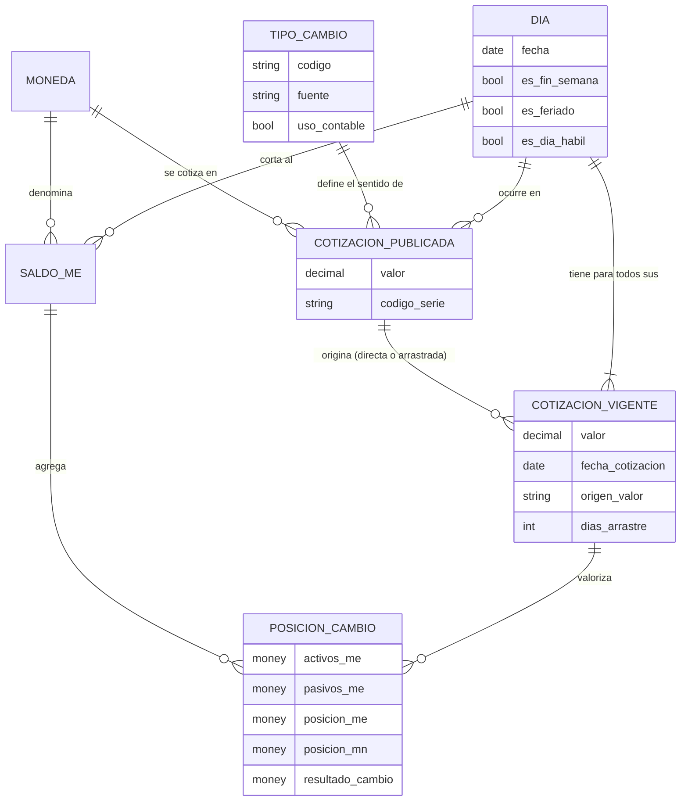

# Caso 06 — Modelo conceptual

## Entidades

| Entidad | Definición | Granularidad |
|---|---|---|
| **DIA** | Día del calendario, con su condición de hábil o no | Una fila por fecha |
| **MONEDA** | Moneda operada; exactamente una es la local | Una fila por moneda |
| **TIPO_CAMBIO** | Clase de cotización según su uso y su fuente | Una fila por tipo |
| **COTIZACION_PUBLICADA** | Lo que la fuente publicó, tal cual | Una fila por día **hábil**, moneda y tipo |
| **COTIZACION_VIGENTE** | El valor que se usa para valorizar cualquier día | Una fila por día **calendario**, moneda y tipo |
| **SALDO_ME** | Saldo en moneda extranjera por cuenta contable | Una fila por día, moneda y cuenta |
| **POSICION_CAMBIO** | Exposición neta a una moneda, valorizada | Una fila por día y moneda |

---

## La decisión conceptual del caso: dos entidades para "el tipo de cambio"

Parece una sola cosa, pero son dos hechos distintos:

| | COTIZACION_PUBLICADA | COTIZACION_VIGENTE |
|---|---|---|
| **Qué es** | Un hecho del mundo exterior | Una **decisión de la organización** |
| **Quién lo produce** | El BCRP, la SBS, la SUNAT | El proceso de valorización del banco |
| **Cuándo existe** | Solo días hábiles | Todos los días |
| **¿Se puede modificar?** | Nunca | Se recalcula cuando llegan datos nuevos |
| **Pregunta que responde** | "¿Qué publicó la fuente el día X?" | "¿Con qué valor valorizo el día X?" |

**Fusionarlas destruye información.** Si escribes el valor arrastrado sobre la tabla publicada,
la respuesta a la primera pregunta desaparece para siempre — y esa es la que hace el auditor
cuando revisa por qué el balance del sábado 19 muestra un valor si ese día no hubo mercado.

> **Principio general, aplicable fuera de este caso:** cuando un dato derivado se guarda, el dato
> original debe conservarse por separado. La derivación es una **decisión**, y las decisiones se
> documentan.

---

## Por qué el DIA es una entidad y no un simple atributo

Un calendario con feriados permite distinguir dos situaciones que se ven idénticas —una fila que
falta— pero significan cosas opuestas:

| Situación | Qué es | Qué hacer |
|---|---|---|
| Falta la cotización del 28 de julio | Feriado nacional | Nada: es normal |
| Falta la cotización del 15 de setiembre | **Falla del proceso de carga** | Alertar y reprocesar |

Sin `cat_calendario` el modelo no puede decir cuál de las dos es. Un monitoreo que alerte por ambas
genera falsos positivos todos los fines de semana y termina siendo ignorado.

---

## Glosario acordado

| Término | Definición acordada |
|---|---|
| **Tipo de cambio compra** | Precio al que la entidad **compra** moneda extranjera (el menor) |
| **Tipo de cambio venta** | Precio al que la entidad **vende** moneda extranjera (el mayor) |
| **Spread** | Diferencia entre venta y compra |
| **Tipo de cambio contable** | El que se usa para valorizar el balance; **valor por defecto del modelo** |
| **Día hábil bancario** | Día que no es sábado, domingo ni feriado nacional |
| **Arrastre** | Uso del último valor publicado cuando el día no tiene cotización |
| **Días de arrastre** | Cuántos días han pasado desde la cotización que se está usando |
| **Posición de cambio** | Activos en ME menos pasivos en ME, por moneda |
| **Sobrecompra** | Posición positiva: la entidad gana si la moneda se aprecia |
| **Sobreventa** | Posición negativa: la entidad pierde si la moneda se aprecia |
| **Resultado por diferencia de cambio** | Posición del **día anterior** × variación del tipo de cambio |
