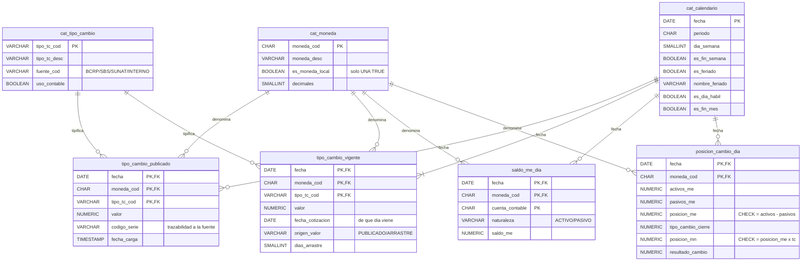

# Caso 06 — Modelo lógico y diccionario



---

## Las restricciones que hacen el trabajo

| Constraint | Qué impide | Por qué es declarativa |
|---|---|---|
| `ck_tc_vig_arrastre` | Declarar `PUBLICADO` con días de arrastre, o `ARRASTRE` con 0 días o con fecha de cotización posterior | La incoherencia entre los tres campos **no debe poder persistirse** |
| `ck_cat_calendario_feriado` | Marcar un día como feriado sin nombrarlo | Un feriado anónimo no es auditable |
| `uq_cat_moneda_local` | Tener dos monedas locales | Índice único parcial `WHERE es_moneda_local` |
| `ck_posicion_cuadre` | `posicion_me ≠ activos − pasivos` | El cuadre estructural nunca debe romperse |
| `ck_posicion_mn` | Valorización inconsistente con el tipo de cambio declarado | Obliga a que la cifra y su tipo de cambio viajen juntos |
| `fk_tc_pub_calendario` | Cargar una cotización con una fecha que no existe en el calendario | Detecta fechas mal parseadas en la carga |

> El `CHECK` de arrastre es el más instructivo del repositorio: **codifica una regla de tres
> campos** que de otro modo viviría en la documentación (y se incumpliría).

---

## Diccionario de datos

### `tipo_cambio_publicado` — el dato crudo

| Columna | Tipo | Nulo | Dominio / regla | Descripción | Sensibilidad |
|---|---|---|---|---|---|
| `fecha` | DATE | No | FK a `cat_calendario` | Fecha de la cotización | Público |
| `moneda_cod` | CHAR(3) | No | FK, ISO 4217 | Moneda cotizada | Público |
| `tipo_tc_cod` | VARCHAR(20) | No | FK | Tipo de cambio | Público |
| `valor` | NUMERIC(12,6) | No | > 0 | Valor publicado | Público |
| `codigo_serie` | VARCHAR(20) | Sí | — | Código en la fuente (ej. `PD04637PD`) | Público |
| `fecha_carga` | TIMESTAMP | No | Default `CURRENT_TIMESTAMP` | Cuándo se cargó (**auditoría**) | Interno |

### `tipo_cambio_vigente` — el dato derivado

| Columna | Tipo | Nulo | Dominio / regla | Descripción |
|---|---|---|---|---|
| `fecha` | DATE | No | FK | Día que se valoriza |
| `valor` | NUMERIC(12,6) | No | > 0 | Valor a aplicar |
| `fecha_cotizacion` | DATE | No | ≤ `fecha`; existe en la serie publicada (CAL-08) | **De qué día viene realmente el valor** |
| `origen_valor` | VARCHAR(15) | No | `PUBLICADO` / `ARRASTRE` | Cómo se obtuvo |
| `dias_arrastre` | SMALLINT | No | 0 si publicado; > 0 si arrastre | Antigüedad del valor usado |

> Los tres últimos campos son **la trazabilidad del dato derivado**. Sin ellos, `tipo_cambio_vigente`
> sería indistinguible de un dato inventado.

### `posicion_cambio_dia`

| Columna | Tipo | Regla | Descripción | Sensibilidad |
|---|---|---|---|---|
| `activos_me` / `pasivos_me` | NUMERIC(18,2) | ≥ 0 | Agregados del día | **Confidencial** |
| `posicion_me` | NUMERIC(18,2) | `CHECK` = activos − pasivos | Exposición neta | **Confidencial** |
| `tipo_cambio_cierre` | NUMERIC(12,6) | Del tipo contable vigente | TC usado para valorizar | Interno |
| `posicion_mn` | NUMERIC(18,2) | `CHECK` = posición × TC | Exposición en soles | **Confidencial** |
| `resultado_cambio` | NUMERIC(18,2) | Posición del **día anterior** × Δ TC | Efecto en resultados | **Confidencial** |

---

## Precisión numérica: por qué `NUMERIC(12,6)`

| Aspecto | Decisión | Motivo |
|---|---|---|
| Tipo | `NUMERIC`, **nunca** `FLOAT` | Un error de redondeo multiplicado por millones de dólares no cuadra con contabilidad |
| Decimales | 6 | El BCRP publica 3 a 4; se reserva margen para tipos derivados y triangulaciones |
| Enteros | 6 | Soporta monedas con valores altos frente al sol |
| Redondeo | `ROUND(..., 2)` **solo al final** | Redondear en pasos intermedios acumula error |

---

## Matriz source-to-target

| Destino | Campo | Origen | Campo origen | Transformación | Calidad |
|---|---|---|---|---|---|
| `tipo_cambio_publicado` | `fecha` | API BCRPData (CSV) | `Fecha` | Parseo de `DD.Mmm.AA` → `DATE` | FK a calendario |
| `tipo_cambio_publicado` | `valor` | API BCRPData | valor de la serie | `::NUMERIC(12,6)`; descartar `n.d.` | CAL-07 |
| `tipo_cambio_publicado` | `codigo_serie` | Parámetro de la llamada | — | Literal | CAL-08 |
| `tipo_cambio_vigente` | todo | **Derivado** | `tipo_cambio_publicado` + `cat_calendario` | **LOCF con gaps-and-islands** | CAL-01, CAL-03 |
| `posicion_cambio_dia` | `activos_me` / `pasivos_me` | Balance contable | saldos ME | Agregación por naturaleza | CAL-05 |
| `posicion_cambio_dia` | `resultado_cambio` | **Derivado** | posición y TC | `LAG(posicion) × (TC − LAG(TC))` | Revisión de signo |

### La transformación crítica

```sql
COUNT(valor) OVER (PARTITION BY moneda_cod, tipo_tc_cod ORDER BY fecha
                   ROWS BETWEEN UNBOUNDED PRECEDING AND CURRENT ROW) AS isla
```

`COUNT()` **ignora los nulos**: no se incrementa en los días sin cotización, de modo que cada día
sin dato queda en la misma "isla" que su último día con dato. Luego `FIRST_VALUE` dentro de la isla
trae ese valor y su fecha.

Es la técnica estándar de *gaps and islands*, y sirve para cualquier serie con huecos: precios,
tasas, índices, stock.
