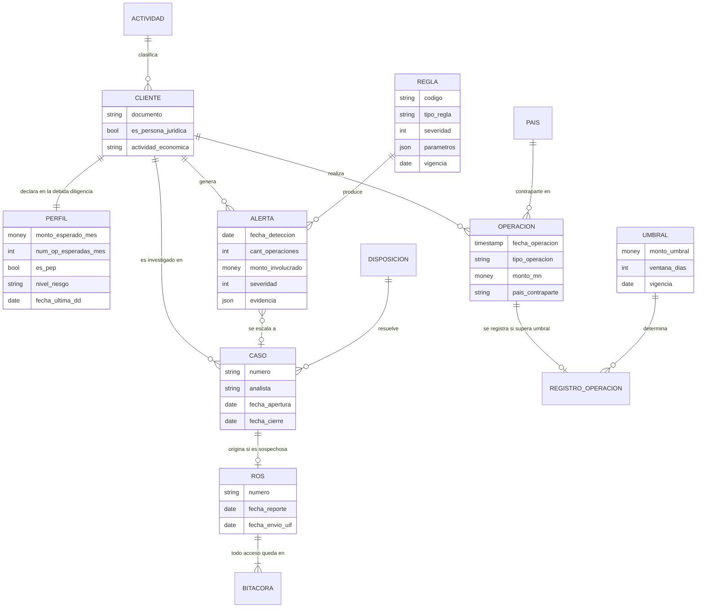

# Caso 07 — Modelo conceptual

## Entidades

| Entidad | Definición | Granularidad |
|---|---|---|
| **CLIENTE** | Persona natural o jurídica sujeta a monitoreo | Una fila por cliente |
| **PERFIL** | Comportamiento **esperado**, declarado en la debida diligencia | Una fila por cliente y vigencia |
| **OPERACION** | Transacción sujeta a monitoreo | Una fila por operación |
| **REGISTRO_OPERACION** | Operación incorporada al Registro por superar umbral | Una fila por operación registrada |
| **UMBRAL** | Monto y ventana a partir de los cuales aplica una obligación | Una fila por umbral, tipo, moneda y vigencia |
| **REGLA** | Criterio de detección configurable | Una fila por regla y vigencia |
| **ALERTA** | Coincidencia detectada entre una regla y el comportamiento | Una fila por detección |
| **CASO** | Investigación que agrupa alertas de un cliente | Una fila por investigación |
| **ROS** | Reporte remitido a la UIF | Una fila por reporte |
| **BITACORA** | Registro de cada acceso a información reservada | Una fila por acceso |

---

## Decisiones conceptuales

### La REGLA es una entidad, no código

Si las reglas viven en funciones o procedimientos:

| Necesidad del negocio | Con reglas programadas | Con reglas como datos |
|---|---|---|
| Subir un umbral | Despliegue de software | `UPDATE` |
| Desactivar una regla que satura | Despliegue | `esta_activa = FALSE` |
| Saber qué regla regía en marzo | Revisar el historial del repositorio | `WHERE fecha BETWEEN fecha_desde AND fecha_hasta` |
| Explicar a la SBS por qué no se detectó algo | Leer código | Mostrar la fila vigente ese día |

La última fila es la decisiva: ante una revisión, **hay que poder demostrar qué reglas estaban
vigentes en una fecha determinada**. Un repositorio de código no es evidencia cómoda; una tabla con
vigencias, sí.

### El PERFIL tiene vigencia

Cuando un cliente justifica su operativa, el perfil se **actualiza**. Si se sobrescribiera, la
pregunta "¿contra qué perfil se evaluó la alerta de agosto?" quedaría sin respuesta, y la alerta
pasada parecería injustificada.

### La ALERTA guarda su propia evidencia

Una alerta es una **afirmación**: "este comportamiento es inusual". Toda afirmación necesita
sustento. Sin la evidencia embebida, el analista tendría que reconstruir a mano por qué se disparó
—y, en la práctica, la descarta.

### El CASO agrupa alertas; la relación es N:1 con historia

Varias alertas del mismo cliente se investigan juntas. Modelarlo como una alerta por caso
multiplicaría el trabajo del equipo y perdería la visión del cliente completo.

### El ROS es una entidad con régimen de acceso propio

Es la única entidad del repositorio con **seguridad a nivel de fila**. La razón no es técnica sino
legal: el deber de reserva prohíbe que el cliente o terceros conozcan que fue reportado. Un control
que viva solo en la aplicación no cumple esa obligación.

---

## Glosario acordado

| Término | Definición |
|---|---|
| **PLAFT** | Prevención del Lavado de Activos y Financiamiento del Terrorismo |
| **UIF-Perú** | Unidad de Inteligencia Financiera, incorporada a la SBS |
| **Registro de Operaciones (RO)** | Registro obligatorio de operaciones que superan el umbral |
| **Operación inusual** | La que no guarda relación con el perfil del cliente |
| **Operación sospechosa** | Inusual que, tras análisis, no tiene justificación razonable |
| **ROS** | Reporte de Operaciones Sospechosas remitido a la UIF |
| **Deber de reserva** | Prohibición de informar al cliente o a terceros sobre un ROS |
| **Fraccionamiento** | Dividir una operación en varias menores para evadir el umbral |
| **PEP** | Persona Expuesta Políticamente |
| **Debida diligencia (KYC)** | Proceso de conocimiento del cliente |
| **Debida diligencia reforzada** | Nivel mayor de verificación para clientes de alto riesgo |
| **Falso positivo** | Alerta que tras el análisis se descarta |
| **Disposición** | Resultado del análisis de un caso |
| **Severidad** | Prioridad de atención de una alerta (1 a 5) |
