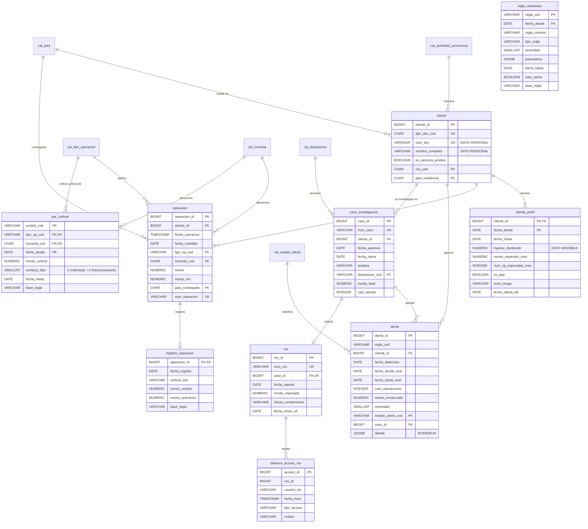

# Caso 07 — Modelo lógico y diccionario



---

## Los dos usos de `ventana_dias`

Una sola columna soporta dos reglas distintas:

| `ventana_dias` | Significado | Regla que lo usa |
|---|---|---|
| `1` | Evalúa la **operación individual** contra el umbral | R01-UMBRAL |
| `5` | Evalúa el **acumulado de 5 días** contra el mismo umbral | R02-FRACC |

Modelar la ventana como parámetro —y no como dos tablas— permite que cambiar "el fraccionamiento se
evalúa en 7 días" sea un `UPDATE`.

---

## Las restricciones que hacen el trabajo

| Constraint | Qué impide | Consecuencia normativa de no tenerla |
|---|---|---|
| `ck_registro_supera` | Registrar en el RO una operación bajo el umbral | Registro inflado que distorsiona el reporte |
| `ck_caso_disposicion` | Cerrar un caso sin disposición | Casos cerrados sin sustento documentado |
| `uq_cliente_perfil_vigente` | Dos perfiles vigentes simultáneos | Ambigüedad sobre contra qué se evaluó |
| `uq_ros_caso` | Dos ROS para el mismo caso | Duplicación del reporte ante la UIF |
| `ck_alerta_sev` | Severidad fuera de 1-5 | Priorización sin escala válida |
| **Política RLS sobre `ros`** | Que un rol no autorizado lea el ROS | **Violación del deber de reserva** |

---

## Uso de `JSONB`: dos usos legítimos

| Campo | Contenido | Por qué JSONB y no columnas |
|---|---|---|
| `regla_monitoreo.parametros` | Parámetros específicos de cada tipo de regla | Cada tipo necesita claves distintas; una columna por parámetro daría una tabla mayormente nula |
| `alerta.detalle` | Evidencia de la detección | La evidencia depende de la regla: la de fraccionamiento no se parece a la geográfica |

**Cuándo `JSONB` es correcto:** la estructura varía legítimamente por fila y el conjunto de claves
no es estable.
**Cuándo no:** cuando se usa para evitar modelar. Si siempre guarda las mismas cinco claves, esas
cinco claves son columnas.

Para consultarlo con rendimiento se indexa:

```sql
CREATE INDEX ix_alerta_detalle ON alerta USING GIN (detalle);
```

Y se consulta con los operadores de JSONB:

```sql
WHERE (detalle ->> 'operacion_mayor')::NUMERIC < (detalle ->> 'umbral_individual')::NUMERIC
```

---

## Diccionario de datos (extracto)

### `alerta`

| Columna | Tipo | Nulo | Dominio / regla | Descripción | Sensibilidad |
|---|---|---|---|---|---|
| `alerta_id` | BIGINT | No | Identidad | Identificador | Interno |
| `regla_cod` | VARCHAR(20) | No | Regla vigente a la fecha (CAL-02) | Regla que la produjo | Interno |
| `cliente_id` | BIGINT | No | FK | Cliente alertado | **Confidencial** |
| `fecha_desde_eval` / `fecha_hasta_eval` | DATE | No | `hasta >= desde` | Ventana evaluada | Interno |
| `cant_operaciones` | INTEGER | No | > 0 | Operaciones involucradas | **Confidencial** |
| `monto_involucrado` | NUMERIC(18,2) | No | > 0 | Monto de la alerta | **Confidencial** |
| `severidad` | SMALLINT | No | 1 a 5 | Prioridad | Interno |
| `estado_alerta_cod` | VARCHAR(15) | No | FK | Estado de atención | Interno |
| `caso_id` | BIGINT | Sí | Obligatorio si ESCALADA (CAL-05) | Caso al que se escaló | **Confidencial** |
| `detalle` | JSONB | No | No vacío (CAL-15) | **Evidencia** de la detección | **Confidencial** |

### `cliente_perfil` — el dato más sensible del caso

| Columna | Sensibilidad | Tratamiento |
|---|---|---|
| `ingreso_declarado` | **DATO SENSIBLE** (Ley 29733) | Acceso mínimo; prohibido en ambientes no productivos |
| `es_pep` | **Confidencial** | Condición personal con implicancias reputacionales |
| `nivel_riesgo` | **Confidencial** | No debe ser visible para áreas comerciales |

### `ros` — régimen especial

| Aspecto | Tratamiento |
|---|---|
| Acceso | **Solo** `rol_oficial_cumplimiento`, vía política RLS |
| Auditoría | Todo acceso se registra en `bitacora_acceso_ros` |
| Comunicación | **Prohibido** informar al cliente o a terceros |
| Ambientes no productivos | **No se replica**, ni siquiera enmascarado |

---

## Matriz source-to-target

| Destino | Campo | Origen | Transformación | Calidad |
|---|---|---|---|---|
| `operacion` | `monto_mn` | Core transaccional | Conversión a soles con el TC de la fecha (ver caso 06) | > 0 |
| `registro_operacion` | todo | **Derivado** | Operación ⋈ `par_umbral` vigente, filtrando `monto_mn >= umbral` | CAL-01, CAL-10 |
| `alerta` (R01) | `detalle` | **Derivado** | `JSONB_BUILD_OBJECT` con operación, umbral y exceso | CAL-15 |
| `alerta` (R02) | `monto_involucrado` | **Derivado** | `SUM() OVER (RANGE BETWEEN INTERVAL '4 days' PRECEDING…)` | CAL-07 |
| `alerta` (R03) | `detalle` | `vw_comportamiento_mes` ⋈ `cliente_perfil` | Factor real/esperado | CAL-15 |
| `caso_investigacion` | `monto_total` | **Derivado** | `SUM(monto_involucrado)` de sus alertas | CAL-12 |
| `ros` | todo | `caso_investigacion` | Solo disposiciones con `genera_ros` | CAL-04 |

### La transformación crítica

```sql
WINDOW w AS (PARTITION BY o.cliente_id ORDER BY o.fecha_contable
             RANGE BETWEEN INTERVAL '4 days' PRECEDING AND CURRENT ROW)
```

`RANGE` con `INTERVAL` define la ventana por **tiempo transcurrido**, no por número de filas.
`ROWS BETWEEN 3 PRECEDING` sería incorrecto: cuatro operaciones pueden estar separadas por meses.
