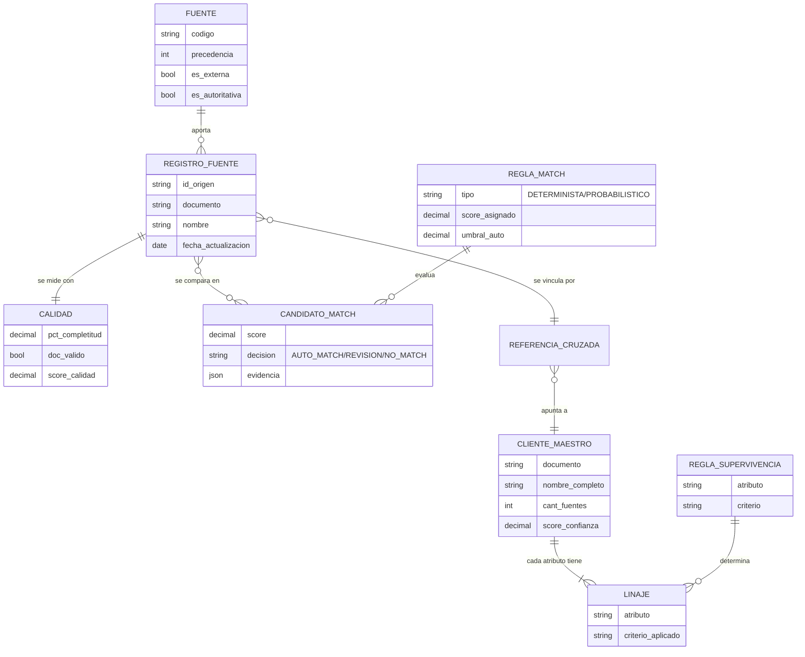
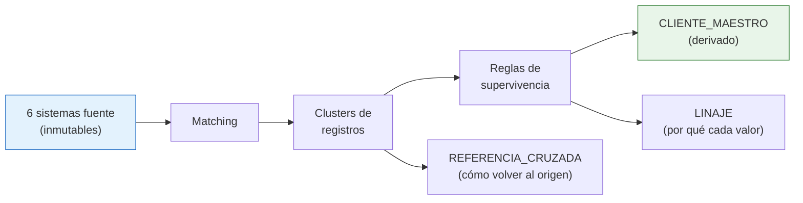

# Caso 08 — Modelo conceptual

## Entidades

| Entidad | Definición | Granularidad |
|---|---|---|
| **FUENTE** | Sistema que aporta registros de cliente | Una fila por sistema |
| **REGISTRO_FUENTE** | Un cliente **tal como lo ve un sistema** | Una fila por sistema y cliente de ese sistema |
| **CALIDAD** | Medición objetiva de cada registro | Una fila por registro fuente |
| **REGLA_MATCH** | Criterio para decidir si dos registros son la misma persona | Una fila por regla |
| **CANDIDATO_MATCH** | Par de registros evaluado, con su score y decisión | Una fila por par y regla |
| **CLIENTE_MAESTRO** | El **golden record**: la versión única de la persona | Una fila por persona real |
| **REFERENCIA_CRUZADA** | Vínculo entre un registro de origen y su maestro | Una fila por registro fuente |
| **REGLA_SUPERVIVENCIA** | Criterio para elegir el valor ganador de cada atributo | Una fila por atributo |
| **LINAJE** | De qué registro salió cada atributo del maestro | Una fila por maestro y atributo |

---

## Decisiones conceptuales

### El registro maestro es DERIVADO, no un registro más

**Consecuencia práctica:** si alguien necesita corregir un dato del maestro, se corrige **en la
fuente** y se reconstruye. Editar el maestro directamente garantiza que el próximo proceso borre la
corrección.

### El matching es una ENTIDAD, no un paso del proceso

Los candidatos de match se **persisten** con su score, su regla y su evidencia. Por tres razones:

1. **Auditoría**: hay que poder explicar por qué se fusionaron dos personas.
2. **Revisión manual**: los candidatos dudosos forman una cola de trabajo.
3. **Calibración**: sin guardar los scores no se puede ajustar el umbral con criterio.

### La supervivencia se decide por ATRIBUTO, no por registro

Es el error conceptual más común. "Gana el registro de la fuente más confiable" produce un maestro
con la dirección de hace cuatro años. **El golden record es un collage**: el nombre de una fuente,
la dirección de otra, la actividad económica de una tercera.

| Atributo | Qué prima | Fuente típica ganadora |
|---|---|---|
| Nombre, fecha de nacimiento | **Autoridad** | Core bancario |
| Dirección, teléfono, correo | **Frescura** | Billetera, CRM |
| Actividad económica | **Fuente oficial** | SUNAT |

### Los homónimos son una entidad de primera clase del problema

No son un caso raro: en el Perú son frecuentes. Por eso el modelo tiene una **decisión explícita**
(`REVISION`) distinta de `AUTO_MATCH` y de `NO_MATCH`. Un modelo binario (fusiona / no fusiona)
obliga a equivocarse en uno de los dos sentidos.

---

## Glosario acordado

| Término | Definición |
|---|---|
| **MDM** | Master Data Management: gestión de datos maestros |
| **Golden record / registro maestro** | Versión única y gobernada de una entidad |
| **Sistema fuente** | Aplicación que aporta registros al MDM |
| **Precedencia** | Orden de autoridad entre fuentes cuando discrepan |
| **Matching determinista** | Coincidencia exacta de un identificador |
| **Matching probabilístico** | Coincidencia por similitud, con score y umbral |
| **Umbral de auto-match** | Score a partir del cual se fusiona sin intervención humana |
| **Supervivencia (survivorship)** | Regla que decide qué valor gana por atributo |
| **Referencia cruzada (xref)** | Tabla que vincula cada registro de origen con su maestro |
| **Linaje** | Registro de qué fuente aportó cada dato |
| **Data steward** | Persona que resuelve los casos de revisión manual |
| **Falso positivo** | Fusionar dos personas distintas. **El error más grave del MDM** |
| **Falso negativo** | No detectar un duplicado. Menos grave: cuesta una campaña repetida |
| **Homónimo** | Personas distintas con el mismo nombre |
