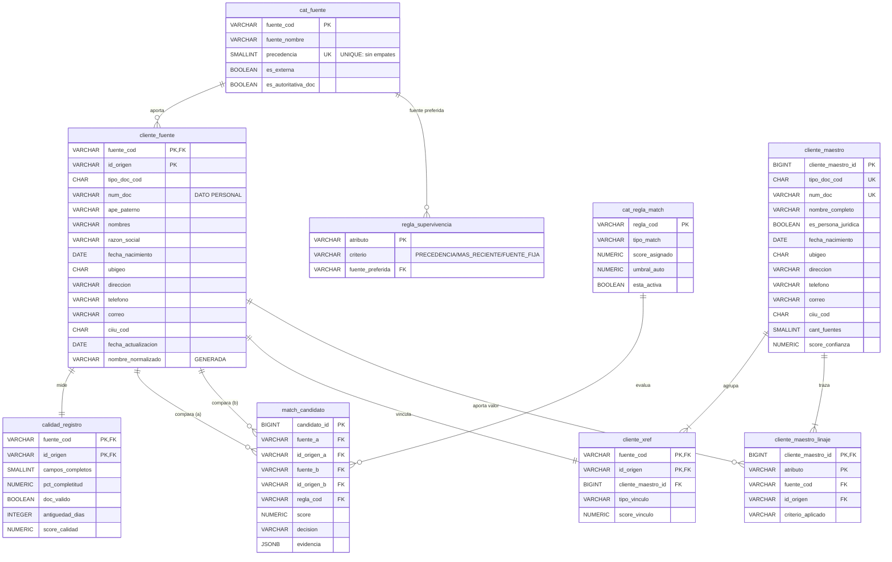

# Caso 08 — Modelo lógico y diccionario



---

## Las claves primarias que codifican las reglas

| Tabla | PK | Regla que impone |
|---|---|---|
| `cliente_fuente` | `(fuente_cod, id_origen)` | Cada sistema mantiene su propio identificador |
| **`cliente_xref`** | **`(fuente_cod, id_origen)`** | **Un registro de origen pertenece a UN solo maestro** (RN-12) |
| `cliente_maestro` | `cliente_maestro_id` + `UNIQUE (tipo_doc_cod, num_doc)` | Un maestro por documento |
| `cliente_maestro_linaje` | `(cliente_maestro_id, atributo)` | Un solo origen por atributo |
| `cat_fuente` | `fuente_cod` + **`UNIQUE (precedencia)`** | **Sin empates de autoridad** |

> **La PK de `cliente_xref` es la decisión de diseño más importante del modelo.** Ponerla sobre
> `(cliente_maestro_id, fuente_cod, id_origen)` permitiría que un registro cuelgue de dos maestros,
> y ese es exactamente el estado corrupto que un MDM debe impedir.

---

## Los tres criterios de supervivencia en SQL

```sql
-- PRECEDENCIA
ORDER BY (f.valor IS NULL), rc.precedencia LIMIT 1

-- MAS_RECIENTE
ORDER BY (f.valor IS NULL), rc.fecha_actualizacion DESC LIMIT 1

-- FUENTE_FIJA (SUNAT)
ORDER BY (f.valor IS NULL), (rc.fuente_cod <> 'PADRON_SUNAT'), rc.precedencia LIMIT 1
```

### El detalle que cambia el resultado

`(f.valor IS NULL)` **primero** en el `ORDER BY`. Sin él, una fuente de precedencia 1 que **no tiene
el dato** ganaría con un `NULL`, dejando el maestro incompleto aunque otra fuente sí tuviera el
valor.

Es una línea. Es la diferencia entre un maestro útil y uno lleno de nulos.

---

## Diccionario de datos (extracto)

### `cliente_maestro` — el golden record

| Columna | Tipo | Nulo | Regla | Descripción | Sensibilidad |
|---|---|---|---|---|---|
| `cliente_maestro_id` | BIGINT | No | PK, identidad | Identificador único del cliente real | Interno |
| `tipo_doc_cod` + `num_doc` | CHAR(2)+VARCHAR(20) | No | **UNIQUE** | Clave natural de negocio | **Dato personal** |
| `nombre_completo` | VARCHAR(200) | No | Supervivencia por PRECEDENCIA | Nombre ganador | **Dato personal** |
| `fecha_nacimiento` | DATE | Sí | Supervivencia por PRECEDENCIA | Fecha ganadora | **Dato personal** |
| `ubigeo`, `direccion` | — | Sí | Supervivencia por MAS_RECIENTE | Ubicación más fresca | **Dato personal** |
| `telefono`, `correo` | — | Sí | Supervivencia por MAS_RECIENTE | Contacto más fresco | **Dato personal** |
| `ciiu_cod` | CHAR(4) | Sí | Supervivencia por FUENTE_FIJA (SUNAT) | Actividad económica | Interno |
| `cant_fuentes` | SMALLINT | No | = fuentes distintas en xref (CAL-03) | En cuántos sistemas existe | Interno |
| `score_confianza` | NUMERIC(5,2) | No | 0 a 100 | Promedio de calidad de sus registros | Interno |

### `match_candidato.evidencia` (JSONB)

Contenido según la regla:

| Regla | Claves |
|---|---|
| M01 | `tipo_doc`, `num_doc`, `criterio` |
| M02 | `doc_crm`, `doc_core`, `distancia_edicion`, `nombre`, `fecha_nac`, `criterio` |
| M03 | `nombre`, `fecha_nac`, `doc_a`, `doc_b`, `distancia_edicion`, `criterio` |

Sin esta evidencia, una fusión no se puede auditar ni revertir con criterio.

---

## Nota de protección de datos

Este modelo concentra **todos los datos personales de todos los sistemas** en un solo lugar. Eso lo
hace enormemente útil y, a la vez, el activo más sensible de la organización.

| Exigencia (Ley 29733) | Cómo lo aborda el modelo |
|---|---|
| Minimización | Solo se integran atributos con finalidad declarada |
| Finalidad | El MDM sirve a identificación y gobierno, no a cualquier uso |
| Derecho de cancelación | Requiere borrar/anonimizar el maestro, su linaje y su xref — el orden importa por las FK |
| Enmascaramiento | Obligatorio en ambientes no productivos: **especialmente aquí** |
| Registro del banco de datos | Un maestro de clientes es un banco de datos personales inscribible |

---

## Matriz source-to-target

| Destino | Campo | Origen | Transformación | Calidad |
|---|---|---|---|---|
| `cliente_fuente` | todo | 6 sistemas | **Ninguna**: se conserva el dato crudo | — |
| `cliente_fuente` | `nombre_normalizado` | Derivado | Columna generada: mayúsculas, sin espacios múltiples | — |
| `calidad_registro` | `score_calidad` | Derivado | 60% completitud + 25% validez del documento + 15% frescura | CAL-11 |
| `match_candidato` | M01 | `cliente_fuente` ⋈ sí mismo | Igualdad de `(tipo_doc, num_doc)` entre fuentes distintas | CAL-08 |
| `match_candidato` | M02 | CRM ⋈ CORE_CAPTACIONES | Igualdad de nombre y fecha + `LEVENSHTEIN(doc) <= 2` | CAL-08 |
| `match_candidato` | M03 | `cliente_fuente` ⋈ sí mismo | Igualdad de nombre y fecha + `LEVENSHTEIN(doc) > 2` → `REVISION` | **CAL-09** |
| `cliente_maestro` | cada atributo | Cluster de registros | Regla de supervivencia del atributo | CAL-07 |
| `cliente_xref` | todo | Cluster | Un registro de origen → un maestro | CAL-13 |
| `cliente_maestro_linaje` | todo | Derivado del ganador | Qué registro aportó el valor | CAL-06 |
