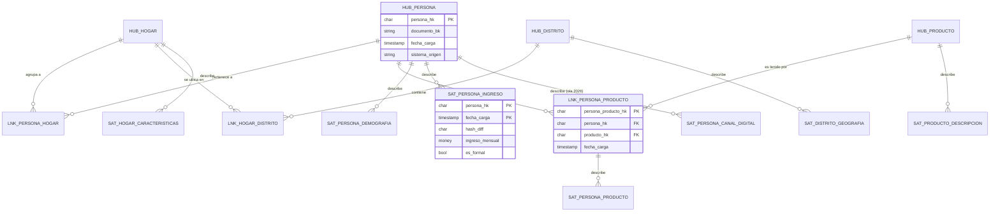

# Caso 09 — Modelo conceptual (Data Vault)

En Data Vault el modelo conceptual se construye respondiendo **tres preguntas**, en este orden:

1. ¿Cuáles son las **llaves de negocio**? → hubs
2. ¿Qué **relaciones** existen entre ellas? → links
3. ¿Qué **atributos** describen a cada una? → satélites

---

## Paso 1: las llaves de negocio (hubs)

| Concepto de negocio | Llave de negocio | ¿Es estable? | Hub |
|---|---|---|---|
| Persona | Tipo + número de documento | Sí | `hub_persona` |
| Hogar | Conglomerado + vivienda + hogar + año | Sí (dentro de la ola) | `hub_hogar` |
| Distrito | Ubigeo | Sí (código oficial) | `hub_distrito` |
| Producto financiero | Código de producto | Sí | `hub_producto` |

> **El criterio del hub:** ¿el negocio se refiere a esta cosa por una llave que reconoce y que no
> cambia? Si la respuesta es sí, es un hub. Si la llave la inventó un sistema (un autoincremental),
> **no** es una llave de negocio.

## Paso 2: las relaciones (links)

| Relación | Hubs que une | Link |
|---|---|---|
| Una persona pertenece a un hogar | persona + hogar | `lnk_persona_hogar` |
| Un hogar está en un distrito | hogar + distrito | `lnk_hogar_distrito` |
| Una persona tiene un producto | persona + producto | `lnk_persona_producto` |

## Paso 3: los atributos (satélites)

| Satélite | Cuelga de | Contiene | Por qué separado |
|---|---|---|---|
| `sat_persona_demografia` | hub persona | Edad, sexo, educación, situación laboral | Cambia cada ola |
| `sat_persona_ingreso` | hub persona | Ingreso, fuente, formalidad | **Dato sensible** + otro ritmo de cambio |
| `sat_persona_canal_digital` | hub persona | Uso de canales digitales | **Llegó en la ola 2026** |
| `sat_hogar_caracteristicas` | hub hogar | Agua, luz, internet, área | Otra entidad |
| `sat_distrito_geografia` | hub distrito | Departamento, provincia, distrito | Otra fuente (INEI) |
| `sat_producto_descripcion` | hub producto | Descripción, categoría | Otra fuente (catálogo) |
| `sat_persona_producto` | **link** persona-producto | Antigüedad, frecuencia de uso | Atributos **de la relación** |

---

## Diagrama conceptual

---

## Decisiones conceptuales

### El hub no tiene atributos. Nunca.

Es la regla que más se rompe. Poner `nombre` en el hub parece inofensivo, pero:

- El nombre **cambia** (matrimonio, corrección), y el hub debería ser inmutable.
- El nombre viene de **varias fuentes** que discrepan, y el hub tiene una sola fila.
- Obliga a hacer `UPDATE` sobre el hub, rompiendo el insert-only.

**CAL-07 verifica esto consultando `information_schema`**: valida el diseño, no los datos.

### El satélite cuelga de UNA cosa y viene de UNA fuente

| Combinación | ¿Correcto? |
|---|---|
| Un satélite del hub persona con datos de la encuesta | ✅ |
| Un satélite del hub persona con datos de la encuesta **y** del core bancario | ❌ Se separan |
| Un satélite que cuelga de dos hubs | ❌ Eso es un link, y el satélite cuelga del link |

### Los atributos de una relación viven en un satélite del LINK

"¿Hace cuánto tiene este producto?" no es un atributo de la persona ni del producto: es un atributo
de **la relación entre ambos**. Por eso `sat_persona_producto` cuelga de `lnk_persona_producto`.

Es el equivalente conceptual de la entidad asociativa del modelado relacional (el
`cuenta_titular` del caso 01).

### La llave del hogar es compuesta porque el negocio la usa así

En los microdatos de la ENAHO, un hogar se identifica por conglomerado + vivienda + hogar + año.
Reemplazarla por un autoincremental haría imposible cruzar módulos de la encuesta o comparar olas.

**Regla general:** la llave de negocio es la que **usa el negocio**, no la que le resulte cómoda al
modelador.

---

## Glosario acordado

| Término | Definición |
|---|---|
| **Hub** | Tabla que contiene una llave de negocio y nada más |
| **Link** | Tabla que relaciona dos o más hubs |
| **Satélite** | Tabla de atributos con historia, colgando de un hub o de un link |
| **Llave de negocio (BK)** | Identificador que el negocio reconoce y usa |
| **Hash key (HK)** | Hash de la llave de negocio; es la PK técnica |
| **`hash_diff`** | Hash de todos los atributos de un satélite; detecta cambios |
| **Insert-only** | Nunca se hace `UPDATE` ni `DELETE` |
| **Fecha de carga** | Cuándo entró el dato al almacén (no cuándo ocurrió el hecho) |
| **Sistema origen** | De qué fuente vino la fila |
| **Raw Vault** | Los hubs, links y satélites con el dato crudo |
| **Business Vault** | Capa con reglas de negocio aplicadas |
| **Information Mart** | Capa de consumo: vistas planas o modelo estrella |
| **Ola** | Cada levantamiento de la encuesta |
| **Inclusión financiera** | Acceso y uso efectivo de servicios financieros formales |
