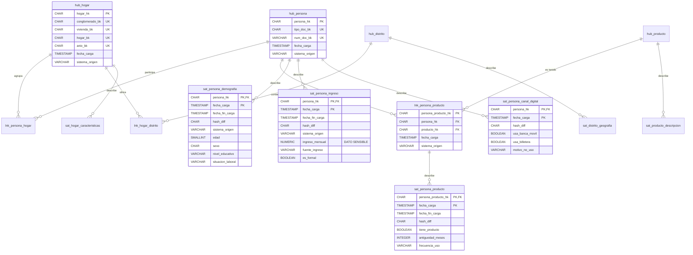

# Caso 09 — Modelo lógico y diccionario (Data Vault)



---

## La estructura de cada tipo de tabla

### HUB — siempre estas cinco columnas, ni una más

```sql
CREATE TABLE hub_persona (
    persona_hk      CHAR(32)    NOT NULL,   -- hash de la llave de negocio (PK)
    tipo_doc_bk     CHAR(2)     NOT NULL,   -- llave de negocio (parte 1)
    num_doc_bk      VARCHAR(20) NOT NULL,   -- llave de negocio (parte 2)
    fecha_carga     TIMESTAMP   NOT NULL,   -- cuándo entró al almacén
    sistema_origen  VARCHAR(30) NOT NULL,   -- de dónde vino
    PRIMARY KEY (persona_hk),
    UNIQUE (tipo_doc_bk, num_doc_bk)        -- la llave de negocio también es única
);
```

### LINK — los hashes de los hubs, su propio hash, y trazabilidad

```sql
CREATE TABLE lnk_persona_producto (
    persona_producto_hk CHAR(32) NOT NULL,  -- hash de la combinación (PK)
    persona_hk          CHAR(32) NOT NULL,  -- FK al hub
    producto_hk         CHAR(32) NOT NULL,  -- FK al hub
    fecha_carga         TIMESTAMP NOT NULL,
    sistema_origen      VARCHAR(30) NOT NULL,
    PRIMARY KEY (persona_producto_hk),
    UNIQUE (persona_hk, producto_hk)        -- la combinación no se repite
);
```

### SATÉLITE — la PK incluye la fecha de carga: por eso es insert-only

```sql
CREATE TABLE sat_persona_ingreso (
    persona_hk      CHAR(32)   NOT NULL,
    fecha_carga     TIMESTAMP  NOT NULL,    -- ← parte de la PK
    fecha_fin_carga TIMESTAMP,              -- se completa al llegar la versión siguiente
    hash_diff       CHAR(32)   NOT NULL,    -- hash de los atributos
    sistema_origen  VARCHAR(30) NOT NULL,
    ingreso_mensual NUMERIC(18,2),
    fuente_ingreso  VARCHAR(30),
    es_formal       BOOLEAN,
    PRIMARY KEY (persona_hk, fecha_carga)
);
```

> **`fecha_carga` en la PK es lo que hace el modelo insert-only.** No es una convención: es una
> restricción estructural. Insertar dos veces la misma versión es imposible, y sobrescribir requiere
> un `UPDATE` explícito que la metodología prohíbe.

---

## Comparación con el modelo dimensional del caso 05

| Aspecto | Data Vault (caso 09) | Modelo estrella (caso 05) |
|---|---|---|
| **Optimizado para** | Carga, integración, auditoría | Consulta |
| Tablas para el mismo dominio | 14 | 8 |
| JOINs de una pregunta típica | **8** | **2** |
| Agregar un atributo nuevo | `CREATE TABLE` (satélite) | `ALTER TABLE` sobre la dimensión |
| Agregar una fuente nueva | Satélite nuevo | Reprocesar la dimensión |
| Historia | **Completa y por atributo** | SCD2 en la dimensión |
| Carga en paralelo | **Natural** (hash independiente) | Requiere orden (lookups de SK) |
| Reprocesar | Reejecutar: mismas claves | Las claves sustitutas cambian |
| Usuario final | **No lo consulta** | Lo consulta directamente |
| Auditoría del origen | **Por fila** | Requiere columnas adicionales |

**No compiten.** En banca peruana conviven: Data Vault como capa integrada auditable, estrella
como capa de consumo.

---

## Diccionario de datos (extracto)

### Columnas obligatorias en TODA tabla del Data Vault

| Columna | Tipo | Significado | Por qué es obligatoria |
|---|---|---|---|
| `*_hk` | CHAR(32) | Hash de la llave | Permite carga paralela y reproceso idéntico |
| `fecha_carga` | TIMESTAMP | Cuándo **entró al almacén** | **No** es cuándo ocurrió el hecho |
| `sistema_origen` | VARCHAR(30) | De qué fuente vino | Trazabilidad exigible ante una auditoría |

> **La distinción entre `fecha_carga` y la fecha del hecho es crítica.** Una encuesta levantada en
> mayo puede cargarse en agosto. El Data Vault registra **ambas**: la de carga en la columna
> estándar, la del hecho como un atributo más del satélite.

### `sat_persona_ingreso` — el satélite sensible

| Columna | Sensibilidad | Tratamiento |
|---|---|---|
| `ingreso_mensual` | **DATO SENSIBLE** (Ley 29733: ingresos económicos) | Satélite separado → permite `GRANT` distinto |
| `fuente_ingreso`, `es_formal` | Confidencial | Van con el ingreso |

**Separar este satélite no es solo por ritmo de cambio: es un control de acceso.** Se puede dar
permiso sobre `sat_persona_demografia` sin darlo sobre `sat_persona_ingreso` — imposible si todo
estuviera en una sola tabla.

---

## Matriz source-to-target

| Destino | Campo | Origen | Transformación | Calidad |
|---|---|---|---|---|
| `hub_persona` | `persona_hk` | Encuesta | `fn_hash_key(tipo_doc, num_doc)` | CAL-01 |
| `hub_persona` | resto | Encuesta | Directo; `ON CONFLICT DO NOTHING` | CAL-03 |
| `lnk_persona_producto` | `persona_producto_hk` | Derivado | `fn_hash_key(persona_hk, producto_hk)` | CAL-02 |
| `sat_persona_ingreso` | `hash_diff` | Derivado | `fn_hash_key` de todos los atributos | CAL-09 |
| `sat_persona_ingreso` | filas | Encuesta | **Solo si `hash_diff IS DISTINCT FROM` el vigente** | CAL-09 |
| `sat_persona_ingreso` | `fecha_fin_carga` | Derivado | Se completa al insertar la versión siguiente | CAL-05, CAL-12 |
| `sat_persona_canal_digital` | todo | Encuesta ola 2026 | **Tabla nueva**: sin impacto en lo existente | CAL-10 |

### La transformación que define la metodología

```sql
LEFT JOIN vigente v ON v.persona_hk = c.persona_hk
WHERE     v.hash_diff IS DISTINCT FROM c.hd
```

`IS DISTINCT FROM` y no `<>`: debe funcionar también cuando no hay versión previa
(`v.hash_diff IS NULL`), donde `<>` devolvería `NULL` y la fila **no se insertaría**.

Es un operador. Es la diferencia entre cargar la primera ola y no cargar nada.

---

## Reglas de calidad que validan el DISEÑO, no los datos

Dos de las quince reglas del caso son inusuales: consultan el **catálogo del sistema** para
verificar que el modelo respeta la metodología.

```sql
-- CAL-07: ningún HUB tiene atributos descriptivos
SELECT COUNT(*) FROM information_schema.columns
WHERE table_schema = 'caso09' AND table_name LIKE 'hub_%'
  AND column_name NOT LIKE '%_hk'
  AND column_name NOT LIKE '%_bk'
  AND column_name NOT IN ('fecha_carga','sistema_origen');
```

Si alguien agrega `nombre` a `hub_persona` "porque era práctico", la regla falla en la siguiente
ejecución. **Es una idea que vale la pena copiar a cualquier modelo con convenciones estrictas.**
