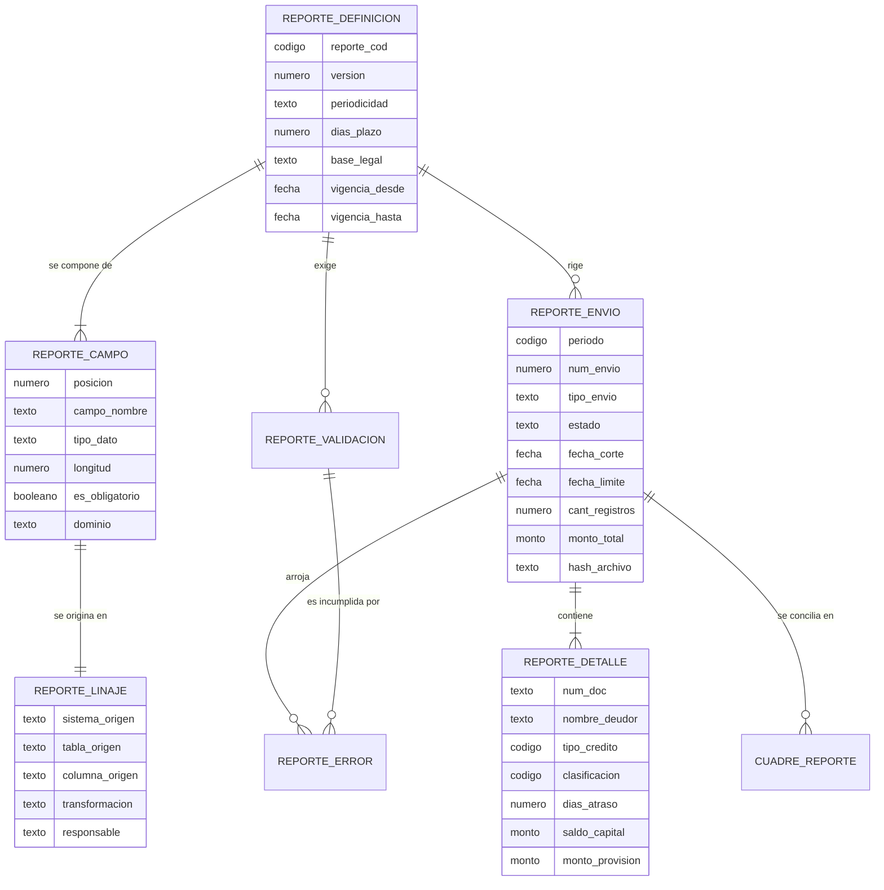

# Caso 10 — Modelo conceptual

El error conceptual de casi todos los procesos regulatorios que se construyen mal es el mismo:
**modelar el archivo y no el proceso**. El archivo es un entregable; el proceso tiene definición,
versiones, validaciones, linaje, envíos, observaciones y rectificaciones. Todo eso es información
que el banco debe poder exhibir años después.

Por eso el modelo conceptual de este caso tiene **tres grupos de entidades**:

| Grupo | Pregunta que responde | Vida útil |
|---|---|---|
| **Definición** | ¿Qué hay que reportar y cómo? | Años; cambia cuando cambia la norma |
| **Ejecución** | ¿Qué se reportó, cuándo y con qué contenido? | Un envío; se conserva indefinidamente |
| **Control** | ¿Estaba bien? ¿Cuadra? ¿Qué se corrigió? | Se acumula sobre cada envío |

---

## Diagrama conceptual

---

## Entidades

| Entidad | Qué representa | Identificador de negocio |
|---|---|---|
| `REPORTE_DEFINICION` | Una **versión** de la estructura que exige el supervisor | Código de reporte + versión |
| `REPORTE_CAMPO` | Un campo del archivo, con su posición y su dominio | Reporte + versión + código de campo |
| `REPORTE_VALIDACION` | Una regla que el supervisor aplica al recibir | Reporte + versión + código de validación |
| `REPORTE_LINAJE` | El origen y la transformación de un campo | Reporte + versión + código de campo |
| `REPORTE_ENVIO` | Una **remisión** concreta al supervisor | Reporte + periodo + número de envío |
| `REPORTE_DETALLE` | Una línea del archivo: un deudor en un periodo | Envío + documento del deudor |
| `REPORTE_ERROR` | El incumplimiento de una validación en un envío | Sustituto |
| `CUADRE_REPORTE` | La conciliación del envío con la contabilidad | Envío + concepto |

---

## Decisiones conceptuales

### La estructura del reporte es una entidad, no un programa

**Contexto.** La SBS define posiciones, tipos, longitudes y dominios. La tentación es escribirlos en
el generador.

**Decisión.** `REPORTE_CAMPO` es una entidad de primera clase.

**Prueba de que la decisión es correcta:** pregúntate quién debería poder responder *"¿qué longitud
tiene el campo de saldo?"*. Si la respuesta es "un desarrollador, leyendo el código", el modelo está
mal. Debería poder responderla un analista regulatorio con un `SELECT`.

---

### La definición está versionada, y la versión anterior se conserva

**Contexto.** La SBS modifica la estructura. En este caso, en julio de 2026 agrega el campo de
garantía.

**Decisión.** La versión forma parte de la clave de `REPORTE_DEFINICION`, y cada envío **guarda con
qué versión se generó**.

**La consecuencia que casi nadie anticipa:** sin esto, un envío de marzo no se puede reproducir. El
generador usaría la estructura de hoy y produciría un archivo distinto del que se remitió. Ante una
revisión, el banco no podría demostrar qué envió.

> **Regla general, más allá de este caso:** *todo lo que se remite a un tercero necesita que su
> estructura esté versionada con vigencia.* Vale para la SBS, para la UIF, para un bureau de crédito
> y para el archivo que se le manda a un socio comercial.

---

### La validación es una entidad distinta del `CHECK`

**Contexto.** Ambos "verifican datos". Parecen lo mismo. No lo son.

| | `CHECK` de la base | `REPORTE_VALIDACION` |
|---|---|---|
| Qué garantiza | Que el dato sea **estructuralmente posible** | Que el dato sea **regulatoriamente correcto** |
| Cuándo actúa | Al insertar | Al validar el envío |
| Qué pasa si falla | La fila no entra | Se registra un hallazgo con severidad |
| Quién la cambia | Un desarrollador, con `ALTER TABLE` | Un analista, con un `INSERT` |
| Ejemplo | `clasificacion IN ('0'..'4')` | "Un deudor con 60 días de atraso no puede ser Normal" |

**La segunda fila del ejemplo es el corazón del caso.** Un deudor clasificado como Normal con 60 días
de atraso es **estructuralmente válido**: ambos campos son legítimos por separado y ningún `CHECK`
razonable puede impedir esa combinación sin incrustar la norma en el esquema. Solo una **regla de
validación** lo detecta — y solo si esa regla existe como dato, se ejecuta y deja rastro.

---

### El envío es la entidad central, no el archivo

**Contexto.** El archivo es un `.txt` en un directorio. Se puede perder, sobrescribir o editar.

**Decisión.** La entidad es `REPORTE_ENVIO`, y el archivo es apenas una **representación** de su
detalle. Lo que se conserva del archivo es su **hash**, para probar que lo remitido es lo que está
en la base.

**Consecuencia.** El archivo se puede regenerar en cualquier momento a partir de `REPORTE_DETALLE` y
de la versión de la definición usada. Y se puede **comprobar** contra el hash.

---

### El rectificatorio es un envío nuevo, no una corrección del anterior

**Contexto.** La SBS observa el envío de junio. Hay que corregirlo.

**Decisión.** Se crea un **envío nuevo** (`num_envio = 2`, `tipo_envio = RECTIFICATORIO`) que se
**regenera desde el origen**. El original queda intacto, con estado `OBSERVADO`.

**Alternativas evaluadas.**

| Alternativa | Por qué se descartó |
|---|---|
| `UPDATE` sobre el detalle del envío observado | Destruye la evidencia. El supervisor puede pedir explicar exactamente qué cambió |
| Borrar el envío y volver a generarlo | Igual, y además rompe la numeración de envíos |
| Copiar el detalle observado y corregir las filas malas | **El error de este caso.** Arrastra los errores que no se detectaron |

> **La tercera alternativa es la trampa real.** Parece la más eficiente: "solo 12 filas están mal,
> copio las 389 y corrijo 12". Pero la observación de la SBS es una **muestra**, no un inventario.
> Regenerar desde el origen corrige también lo que nadie vio.

---

### El indicador de cuadre se deriva; no es un atributo que alguien marca

**Contexto.** "¿El reporte cuadra con contabilidad?" es una pregunta con respuesta sí/no.

**Decisión.** `esta_cuadrado` existe, pero **está atado por restricción** a la diferencia y la
tolerancia. No es un dato de opinión.

**Por qué importa:** un indicador booleano que un proceso escribe libremente termina, tarde o
temprano, en `true` sobre un reporte que no cuadra — por presión de plazo, por un `UPDATE`
apresurado o por un error de un proceso. Atarlo al cálculo lo hace imposible.

---

## Glosario acordado

| Término | Definición acordada para este caso |
|---|---|
| **Periodo** | Mes al que corresponde la información, en formato `AAAAMM`. No es la fecha de envío |
| **Fecha de corte** | Último día del periodo. Determina qué versión de la estructura aplica |
| **Fecha límite** | Último día hábil para remitir, derivado de `dias_plazo` |
| **Envío original** | Primera remisión de un periodo (`num_envio = 1`) |
| **Rectificatorio** | Remisión posterior del mismo periodo, regenerada desde el origen |
| **Observado** | Estado del envío cuyo contenido el supervisor cuestionó |
| **Rechazado** | Estado del envío que ni siquiera fue procesado (formato inválido) |
| **Hallazgo** | Incumplimiento de una validación en un envío concreto |
| **BLOQUEA / ADVIERTE** | Severidad del hallazgo: impide el envío / lo permite pero queda registrado |
| **Cuadre** | Conciliación entre el total del reporte y el saldo contable, con tolerancia |
| **Linaje** | Cadena documentada desde el campo del reporte hasta la columna del sistema origen |

> **"Observado" y "rechazado" no son sinónimos**, y confundirlos en el modelo produce tableros que
> mienten. Un rechazo es un problema de formato: el archivo no entró. Una observación es un problema
> de contenido: entró, se procesó, y el contenido no es correcto. El plazo, la responsabilidad y la
> acción correctiva son distintos en cada caso.
