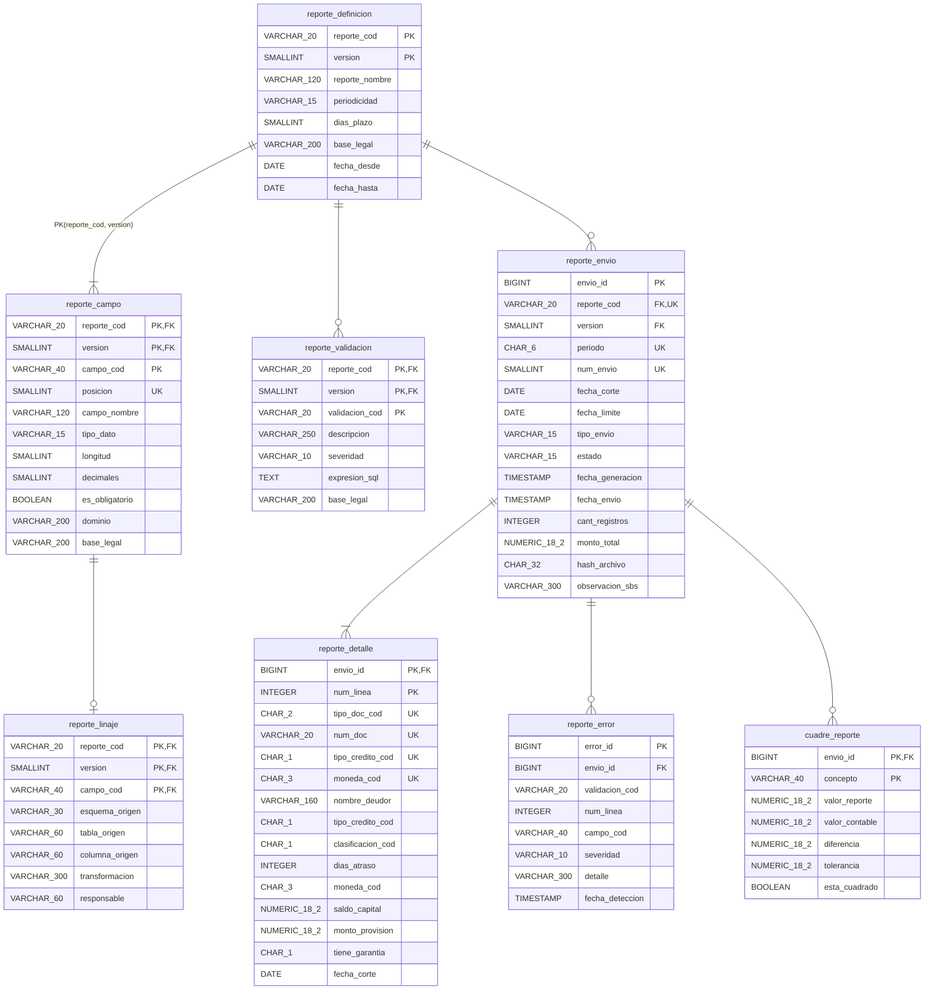

# Caso 10 — Modelo lógico y diccionario de datos

## Diagrama E-R lógico



---

## La clave compuesta `(reporte_cod, version)` y su efecto en cadena

Esta es **la decisión estructural del caso**, y se propaga a cuatro tablas.

```
reporte_definicion   PK (reporte_cod, version)
       │
       ├─ reporte_campo       PK (reporte_cod, version, campo_cod)   FK (reporte_cod, version)
       │        │
       │        └─ reporte_linaje   PK (reporte_cod, version, campo_cod)  FK a reporte_campo
       │
       ├─ reporte_validacion  PK (reporte_cod, version, validacion_cod)
       │
       └─ reporte_envio       FK (reporte_cod, version)   ← el envío "recuerda" su estructura
```

**Qué se gana.** Cada envío queda amarrado a la versión con la que se generó. Regenerar el archivo de
marzo de 2026 produce **exactamente** lo que se remitió, con 10 campos, sin el campo de garantía —
aunque hoy la versión vigente tenga 11.

**Qué cuesta.** Claves de tres columnas y FK compuestas. Es incómodo de escribir. Es correcto.

**La alternativa que parece más limpia y no lo es:** una clave sustituta `definicion_id` con
`UNIQUE (reporte_cod, version)`. Funciona, pero oculta la clave natural en los `JOIN` y hace más
fácil que alguien una un envío con la definición equivocada. Aquí, con la clave natural propagada,
el error es sintácticamente imposible.

> **Nota de diseño:** `reporte_envio` sí tiene clave sustituta (`envio_id`), porque su clave natural
> —`(reporte_cod, periodo, num_envio)`— se propagaría a `reporte_detalle`, que es la tabla grande.
> **La regla no es "siempre natural" ni "siempre sustituta": es propagar lo natural donde documenta,
> y cortarlo con una sustituta antes de que llegue a las tablas de volumen.** La clave natural sigue
> garantizada por `uq_reporte_envio`.

---

## Vigencia: el intervalo cerrado y por qué aquí sí funciona

```
version 1:  fecha_desde = 2026-01-01   fecha_hasta = 2026-06-30
version 2:  fecha_desde = 2026-07-01   fecha_hasta = 9999-12-31
```

La regla **CAL-13** verifica que la fecha de corte de cada envío caiga dentro de la vigencia de la
versión que declaró usar:

```sql
WHERE e.fecha_corte NOT BETWEEN d.fecha_desde AND d.fecha_hasta
```

`BETWEEN` es un intervalo **cerrado en ambos extremos**, y aquí eso es correcto porque la fecha de
corte es una **fecha**, no un instante: no hay ambigüedad entre `2026-06-30` y `2026-07-01`.

> **Cuándo esto sería un error:** si la columna fuera `TIMESTAMP`. Entonces `fecha_hasta` a las
> `00:00:00` dejaría fuera casi todo el último día. Para vigencias sobre instantes se usa intervalo
> **semiabierto** `[desde, hasta)`. Es la misma discusión del caso 02 con los parámetros de
> clasificación, y el error más frecuente en tablas de vigencia de todo el sector.

---

## Verificación de formas normales

| Tabla | Forma normal | Comentario |
|---|---|---|
| `reporte_definicion` | **3FN** | Todo depende de `(reporte_cod, version)` |
| `reporte_campo` | **3FN** | `posicion` depende de la clave completa; por eso es `UNIQUE`, no clave |
| `reporte_validacion` | **3FN** | `expresion_sql` es un atributo de la validación, no un dato derivado |
| `reporte_linaje` | **3FN** | Relación 1:1 opcional con el campo |
| `reporte_envio` | **2FN deliberadamente** | Ver desnormalizaciones |
| `reporte_detalle` | **2FN deliberadamente** | Ver desnormalizaciones |
| `reporte_error` | **3FN** | |
| `cuadre_reporte` | **2FN deliberadamente** | Ver desnormalizaciones |

### Desnormalizaciones deliberadas

| Dónde | Qué se repite | Por qué se acepta |
|---|---|---|
| `reporte_envio.cant_registros`, `.monto_total` | Derivables del detalle | **Son el contenido remitido.** Si mañana alguien corrige el detalle, el total remitido debe seguir siendo el que se remitió. **CAL-12** verifica que coincidan mientras el envío no haya sido corregido |
| `reporte_detalle.nombre_deudor` | Está en `caso02.cliente` | **El reporte es una foto.** Si el cliente cambia de razón social en agosto, el archivo de marzo debe conservar la razón social de marzo |
| `reporte_detalle.fecha_corte` | Está en `reporte_envio` | Permite validar y exportar el detalle sin `JOIN`; el archivo la lleva en cada línea |
| `cuadre_reporte.diferencia`, `.esta_cuadrado` | Derivables | **Atados por `CHECK`**: no pueden divergir. Ver abajo |

> **La primera fila es la más importante y la que más se discute en revisión de diseño.** El reflejo
> del modelador es: *"no guardes totales, calcúlalos"*. En un sistema transaccional, correcto. En un
> registro de lo remitido a un supervisor, **incorrecto**: el total es un hecho histórico, no una
> agregación. Es el mismo criterio que hace que una factura guarde su importe en lugar de
> recalcularlo con el precio de hoy.

### La desnormalización que no se acepta

```sql
CONSTRAINT ck_cuadre_dif    CHECK (diferencia = valor_reporte - valor_contable),
CONSTRAINT ck_cuadre_estado CHECK (esta_cuadrado = (ABS(diferencia) <= tolerancia))
```

`diferencia` y `esta_cuadrado` **son** derivados, pero están guardados. La diferencia con las otras
desnormalizaciones es que aquí **el motor impide que diverjan**: una fila inconsistente no entra. El
resultado es un dato derivado con la comodidad de una columna y la garantía de un cálculo.

**La alternativa habría sido una columna generada**
(`GENERATED ALWAYS AS (valor_reporte - valor_contable) STORED`). También es válida, y más estricta.
Se prefirió el `CHECK` porque hace **visible la regla en el esquema**: quien lea el DDL ve la fórmula
*y* el criterio de tolerancia juntos.

---

## Diccionario de datos (extracto)

### `reporte_campo` — la tabla que sustituye al código

| Columna | Tipo | Nulo | Descripción | Regla |
|---|---|---|---|---|
| `reporte_cod` | `VARCHAR(20)` | No | Código del reporte | PK, FK |
| `version` | `SMALLINT` | No | Versión de la estructura | PK, FK |
| `campo_cod` | `VARCHAR(40)` | No | Código técnico del campo | PK |
| `posicion` | `SMALLINT` | No | Orden en el archivo de ancho fijo | `UNIQUE` por reporte+versión |
| `campo_nombre` | `VARCHAR(120)` | No | Nombre según el instructivo del supervisor | |
| `tipo_dato` | `VARCHAR(15)` | No | `TEXTO`, `NUMERO`, `FECHA`, `ENTERO` | `CHECK` |
| `longitud` | `SMALLINT` | No | Ancho del campo en el archivo | `> 0` |
| `decimales` | `SMALLINT` | No | Decimales; 0 salvo montos | `0 <= decimales <= longitud` |
| `es_obligatorio` | `BOOLEAN` | No | Si el supervisor lo exige | |
| `dominio` | `VARCHAR(200)` | Sí | Valores admitidos, en texto legible | |
| `base_legal` | `VARCHAR(200)` | Sí | Norma que sustenta el campo | |

> **`ck_reporte_campo_dec`** (`decimales <= longitud`) parece trivial. No lo es: un campo de longitud
> 5 con 8 decimales es imposible de escribir en un archivo de ancho fijo, y el error se descubriría
> recién al generar. Aquí se descubre al definir.

### `reporte_envio` — el registro de lo remitido

| Columna | Tipo | Nulo | Descripción | Regla |
|---|---|---|---|---|
| `envio_id` | `BIGINT` | No | Clave sustituta | PK, identidad |
| `reporte_cod`, `version` | | No | Estructura con la que se generó | FK compuesta |
| `periodo` | `CHAR(6)` | No | `AAAAMM` | `CHECK` de formato |
| `fecha_corte` | `DATE` | No | Último día del periodo | CAL-13 la contrasta con la vigencia |
| `fecha_limite` | `DATE` | No | Último día para remitir | Derivada de `dias_plazo` |
| `num_envio` | `SMALLINT` | No | 1 = original; 2+ = rectificatorio | `>= 1`, `UNIQUE` con periodo |
| `tipo_envio` | `VARCHAR(15)` | No | `ORIGINAL` / `RECTIFICATORIO` | **Atado a `num_envio` por `CHECK`** |
| `estado` | `VARCHAR(15)` | No | Ciclo de vida del envío | `CHECK` de dominio |
| `fecha_generacion` | `TIMESTAMP` | Sí | Cuándo se armó el archivo | |
| `fecha_envio` | `TIMESTAMP` | Sí | Cuándo se remitió | **No puede existir sin generación** |
| `cant_registros`, `monto_total` | | No | Totales **derivados del detalle** | CAL-12 |
| `hash_archivo` | `CHAR(32)` | Sí | Huella del archivo remitido | CAL-16 lo exige si hay envío |
| `observacion_sbs` | `VARCHAR(300)` | Sí | Texto de la observación recibida | |

**Tres restricciones que valen más que el resto de la tabla:**

```sql
-- 1. El tipo de envío no es un campo libre: se deduce del número
CONSTRAINT ck_reporte_envio_coh CHECK (
    (num_envio = 1 AND tipo_envio = 'ORIGINAL')
 OR (num_envio > 1 AND tipo_envio = 'RECTIFICATORIO'))

-- 2. No se puede haber enviado algo que nunca se generó
CONSTRAINT ck_reporte_envio_fec CHECK (fecha_envio IS NULL OR fecha_generacion IS NOT NULL)

-- 3. El periodo es AAAAMM, y punto
CONSTRAINT ck_reporte_envio_per CHECK (periodo ~ '^[0-9]{6}$')
```

La tercera evita el problema más aburrido y más caro del mundo regulatorio: `'2026-06'`, `'202606'`,
`'Jun-26'` y `'62026'` conviviendo en la misma columna porque cuatro procesos la escribieron.

### Ciclo de vida del estado del envío

```mermaid
stateDiagram-v2
    [*] --> EN_PROCESO : se genera el detalle
    EN_PROCESO --> VALIDADO : ninguna validacion BLOQUEA
    EN_PROCESO --> EN_PROCESO : se corrige y revalida
    VALIDADO --> ENVIADO : se remite (queda hash)
    ENVIADO --> ACEPTADO : el supervisor conforma
    ENVIADO --> OBSERVADO : observacion de contenido
    ENVIADO --> RECHAZADO : error de formato, no se proceso
    OBSERVADO --> [*] : se conserva; el rectificatorio es un envio NUEVO
    ACEPTADO --> [*]
    RECHAZADO --> [*]
```



> **Ninguna transición sale de `OBSERVADO` hacia otro estado del mismo envío.** Eso es deliberado:
> un envío observado **muere observado**. La corrección es otra fila.

---

## Matriz source-to-target (extracto)

| Campo del reporte | Origen (`esquema.tabla.columna`) | Transformación | Responsable |
|---|---|---|---|
| `TIPO_DOC` | `caso02.deudor.tipo_doc_cod` | Directo | Arquitectura de Datos |
| `NUM_DOC` | `caso02.deudor.num_doc` | `TRIM` y relleno según longitud del tipo | Arquitectura de Datos |
| `NOMBRE_DEUDOR` | `caso02.deudor` (varias columnas) | `ape_paterno + ape_materno + nombres` | Arquitectura de Datos |
| `TIPO_CREDITO` | `caso02.deudor_clasificacion_mes.tipo_credito_cod` | Directo, dominio validado contra `cat_tipo_credito` | Riesgos |
| `CLASIFICACION` | `caso02.deudor_clasificacion_mes.clasificacion_cod` | Derivado de `dias_atraso` con **`caso02.fn_clasificar()`** y la norma vigente a la fecha de corte | Riesgos |
| `DIAS_ATRASO` | `caso02.deudor_clasificacion_mes.dias_atraso` | Fecha de corte menos vencimiento de la cuota impaga más antigua | Riesgos |
| `MONEDA` | `caso02.credito.moneda_cod` | Si el deudor tiene varios créditos, la moneda del de mayor saldo | Contabilidad |
| `SALDO_CAPITAL` | `caso02.deudor_clasificacion_mes.saldo_capital` | Suma del capital vigente del deudor a la fecha de corte | Contabilidad |
| `PROVISION` | `caso02.deudor_clasificacion_mes.monto_provision` | `saldo_capital × tasa_provision` según clasificación y garantía | Contabilidad |
| `GARANTIA` | `caso02.deudor_clasificacion_mes.tiene_garantia` | Booleano convertido a `S`/`N` | Riesgos |
| `FECHA_CORTE` | `caso02.deudor_clasificacion_mes.fecha_corte` | Último día calendario del periodo, formato `AAAAMMDD` | Arquitectura de Datos |

**Esta tabla no es documentación complementaria: es una tabla del modelo** (`reporte_linaje`), y
CAL-02 verifica que esté completa para la versión vigente. La diferencia entre un linaje en un Excel
y un linaje en una tabla es que el segundo **no puede quedar desactualizado en silencio**.

> **La fila de `CLASIFICACION` es la que evita el peor error del proceso regulatorio:** reimplementar
> la clasificación dentro del generador del reporte. Si el generador tuviera su propia lógica, el
> reporte y el sistema de créditos podrían clasificar distinto al mismo deudor — y el banco tendría
> dos verdades. Por eso el linaje apunta a **la función del sistema origen**, no a una copia.
