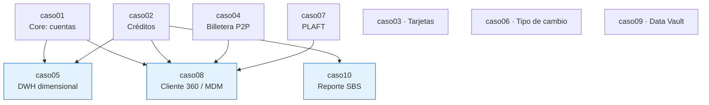

# Reporte de validación del laboratorio

> **Qué certifica este documento:** que los 10 casos de este repositorio se ejecutan de principio a
> fin contra PostgreSQL, que sus datos se cargan sin errores, que sus consultas de negocio devuelven
> resultados y que **todas sus reglas de calidad quedan en estado `OK`**.
>
> Es la respuesta al requisito de origen del proyecto: *"antes de terminar debes validar que toda la
> data y los escenarios sean 100 % desarrollables"*.

---

## 1. Resultado

| | |
|---|---|
| **Fecha de la corrida** | 2026-09-17 |
| **Motor** | PostgreSQL 16.13 (Ubuntu 16.13-0ubuntu0.24.04.1) |
| **Base de datos** | `bcp_lab` |
| **Casos ejecutados** | **10 de 10** |
| **Casos válidos** | **10 de 10** |
| **Reglas de calidad en `OK`** | **151** |
| **Reglas en `FALLA`** | **0** |
| **Pruebas negativas rechazadas** | **62** |
| **Operaciones prohibidas aceptadas** | **0** |
| **Reglas del estándar cumplidas** | **12** |
| **Cifras documentadas verificadas** | **71** |
| **Cifras que no coinciden** | **0** |
| **Errores de PostgreSQL** | **0** |
| **Tiempo total** | 31 segundos |
| **Código de salida** | `0` |

```
  ✓ VALIDACIÓN COMPLETA: todos los escenarios son 100 % desarrollables.
```

---

## 2. Detalle por caso

Cada caso pasa por cuatro etapas: **modelo físico → carga de datos → consultas de negocio → reglas
de calidad**. Basta que una falle para que el caso se marque como fallido.

| Caso | Nombre | DDL | Datos | Consultas | Reglas | Tablas | Vistas | Filas |
|---|---|:-:|:-:|:-:|---|---:|---:|---:|
| `caso01` | Core bancario: cuentas de ahorro | ✅ | ✅ | ✅ | **10 / 10** | 12 | 2 | 30 042 |
| `caso02` | Originación y seguimiento de créditos | ✅ | ✅ | ✅ | **12 / 12** | 16 | 1 | 32 117 |
| `caso03` | Tarjetas de crédito y estados de cuenta | ✅ | ✅ | ✅ | **13 / 13** | 13 | 1 | 43 380 |
| `caso04` | Billetera digital y transferencias P2P | ✅ | ✅ | ✅ | **15 / 15** | 19 | 1 | 606 419 |
| `caso05` | DWH dimensional de colocaciones | ✅ | ✅ | ✅ | **16 / 16** | 9 | 2 | 42 060 |
| `caso06` | Tipo de cambio y posición en ME | ✅ | ✅ | ✅ | **15 / 15** | 7 | 2 | 6 350 |
| `caso07` | PLAFT: monitoreo de operaciones | ✅ | ✅ | ✅ | **16 / 16** | 16 | 2 | 29 643 |
| `caso08` | Cliente 360 / MDM | ✅ | ✅ | ✅ | **16 / 16** | 9 | 1 | 37 190 |
| `caso09` | Data Vault de inclusión financiera | ✅ | ✅ | ✅ | **16 / 16** | 14 | 2 | 24 424 |
| `caso10` | Reporte regulatorio a la SBS | ✅ | ✅ | ✅ | **17 / 17** | 8 | 2 | 3 076 |
| | **Total** | | | | **151** | **123** | **16** | **848 188** |

> `caso04` concentra el 71 % de las filas: es la tabla particionada de transferencias, y está así a
> propósito. Es el único caso donde el volumen es parte de la lección.

---

## 3. Orden de dependencia

Cuatro casos leen datos de otros. No es un capricho del laboratorio: es la realidad de un banco,
donde **ningún sistema analítico nace de la nada**. El validador respeta el orden y lo hace explícito.



| Caso | Requiere | Por qué |
|---|---|---|
| `caso05` | `caso01`, `caso02` | Un DWH se alimenta de los sistemas fuente, no de datos inventados |
| `caso08` | `caso01`, `caso02`, `caso04`, `caso07` | El MDM integra **cuatro sistemas reales** del laboratorio |
| `caso10` | `caso02` | El reporte regulatorio se **extrae** del sistema de créditos |

Cada uno de esos casos empieza con una comprobación que **detiene el script** si falta su fuente:

```sql
DO $$
BEGIN
    IF NOT EXISTS (SELECT 1 FROM information_schema.schemata WHERE schema_name = 'caso02') THEN
        RAISE EXCEPTION 'Falta el esquema caso02. Cargue primero el caso 02.';
    END IF;
END $$;
```

> **Eso también es modelado.** Un ETL que arranca sin sus fuentes no produce un error: produce un
> resultado vacío que parece correcto. La comprobación previa convierte un dato silenciosamente
> equivocado en una falla ruidosa, que es siempre preferible.

---

## 4. Qué verifican las 151 reglas

Las reglas no son adorno: cada una defiende una decisión de modelado. Agrupadas por familia:

| Familia (agrupada) | Reglas | Qué protege | Ejemplo |
|---|---:|---|---|
| **Consistencia** | 29 | Que las fechas, los estados y las relaciones no se contradigan | Un envío no puede ser anterior a su generación |
| **Cuadre** | 21 | Que los agregados coincidan con el detalle | `saldo_contable` = suma de movimientos; totales del reporte = detalle; partida doble suma cero |
| **Dominio** | 15 | Que los códigos estén dentro de lo que la norma admite | Clasificación `0`–`4`; tipo de crédito `1`–`8`; parámetros vigentes |
| **Integridad referencial** | 13 | Que ninguna fila apunte a algo que no existe | Todo movimiento tiene cuenta; todo satélite tiene su hub, con el hash correcto |
| **Diseño metodológico** | 12 | Que el modelo respete la metodología que declaró usar | Grano declarado; dimensiones conformes; particiones; **hubs sin atributos** |
| **Trazabilidad** | 10 | Que se pueda reconstruir de dónde vino cada dato | Linaje campo a campo; `sistema_origen`; hash del archivo remitido |
| **Regulatoria** | 10 | Que se cumpla la norma peruana aplicable | Ningún envío remitido con errores bloqueantes; datos sensibles segregados |
| **Unicidad** | 7 | Que no haya duplicados donde el negocio no los admite | Un deudor una vez por envío; un cliente por documento |
| **Completitud** | 7 | Que no falte lo que debe estar | Todo envío generado tiene detalle; miembro desconocido presente |
| **Historización** | 5 | Que la historia no se solape ni se pierda | SCD-2 sin solapamiento; satélites insert-only |
| **Razonabilidad** | 4 | Que los valores tengan sentido, no solo que sean válidos | Provisión ≤ saldo; reglas que no alertan a todo el universo |
| **Matching (MDM)** | 3 | Que la identidad se resuelva de forma determinista | Sin fusiones de homónimos; supervivencia por atributo |
| **Volumen** | 10 | Que HAYA datos, no solo que los que hay cumplan | Una por caso: es la única que falla sobre una base vacía |
| | **151** | | |

**Y dos reglas que validan el diseño en lugar de los datos** (CAL-07 y CAL-08 del `caso09`): consultan
`information_schema` para verificar que **nadie agregó atributos descriptivos a un hub o a un link**.
Si alguien lo hace "por comodidad", la validación falla en la siguiente corrida.

---

## 5. Las pruebas negativas: lo que una regla sobre datos no puede ver

Las 151 reglas comprueban los **datos**. Hay una clase entera de defectos que no pueden detectar, y
es la que más importa cuando alguien construye su propio modelo.

**El experimento.** Quita `uq_cliente_doc` del DDL del caso 01 y vuelve a correr las reglas:

```
caso01 -> 10 reglas OK, 0 FALLA
```

Todo verde. La regla CAL-01 cuenta clientes duplicados por documento, y no hay ninguno en la carga,
así que no hay nada que contar. **El hueco solo se manifiesta el día que alguien inserta el
duplicado**, que en producción es el día que se integra una fuente nueva.

Las pruebas negativas atacan por el otro lado: **intentan la operación prohibida y exigen que la
base la rechace**.

```
 prueba |             descripcion             |        deberia_impedirlo        | estado
--------+-------------------------------------+---------------------------------+--------
 PN-01  | Dos clientes con el mismo documento | unicidad de (tipo_doc, num_doc) | FALLA
```

Con la restricción quitada, PN-01 pasa a `FALLA` de inmediato.

**Tres propiedades de diseño que las hacen utilizables:**

| Propiedad | Por qué |
|---|---|
| Se comprueban por **comportamiento**, no por nombre de restricción | Sirven con el modelo del estudiante aunque haya llamado a sus constraints de otro modo |
| Una prueba que **falla no deja rastro** | Si la base acepta lo prohibido, el cambio se revierte con un `RAISE` propio (`ERRCODE ZZ001`). Verificado: 500 clientes antes, 500 después |
| **No se sustituyen** en modo `--mi-solucion` | El examen no lo escribe quien se examina |

> **La segunda propiedad costó un error.** La primera versión del arnés dejaba el dato imposible
> dentro del laboratorio cuando una prueba fallaba, y eso hacía que la siguiente corrida diera un
> resultado distinto. Un arnés de pruebas que ensucia lo que prueba es peor que no tenerlo.

---

## 6. Las cifras de los READMEs se verifican solas

Cada `README.md` de solución dice qué debe producir el caso: *"900 deudores, 1 400 solicitudes,
700 créditos…"*. Esas cifras son **promesas al lector**, y una promesa que nadie comprueba se rompe
en silencio: basta que alguien ajuste un generador y olvide el README.

`validacion/cifras-documentadas.sql` compara **lo documentado contra lo que la base contiene**, en
las 66 cifras que los READMEs citan:

```
 regla    | familia | descripcion                        | documentado | en_la_base | diferencia | estado
----------+---------+------------------------------------+-------------+------------+------------+--------
 DOC-0803 | caso08  | duplicados resueltos = 195         |         195 |        195 |          0 | OK
 DOC-0906 | caso09  | sat_persona_canal_digital = 1600   |        1600 |       1600 |          0 | OK
 DOC-1010 | caso10  | registros del rectificatorio = 417 |         417 |        417 |          0 | OK
```

Se ejecuta como etapa final de `validar.sh`, y **se comprobó que falla cuando debe**: al borrar tres
filas de un satélite, la verificación las detecta y las nombra.

```
 DOC-0906 | caso09  | sat_persona_canal_digital = 1600   |        1600 |       1597 |         -3 | FALLA
```

> **Por qué esto merece ser código y no una revisión manual.** Las 66 cifras se verificaron a mano
> una vez y coincidían todas. La segunda vez que alguien toque un generador, nadie las va a revisar
> a mano. Una aserción ejecutable sí.

---

## 7. Cómo reproducir esta validación

### Requisitos

- PostgreSQL 14 o superior (probado en 16.13)
- Cliente `psql` en el `PATH`
- Una base de datos vacía

### Ejecución

```bash
createdb bcp_lab
cd data-modeler-bcp-peru
./validacion/validar.sh
```

### Un solo caso

El validador **resuelve los prerrequisitos automáticamente**:

```bash
./validacion/validar.sh caso10     # ejecuta caso02 y luego caso10
./validacion/validar.sh caso08     # ejecuta caso01, 02, 04, 07 y luego caso08
```

### Otra base o servidor

```bash
PGHOST=localhost PGPORT=5432 PGUSER=modelador PGDATABASE=laboratorio ./validacion/validar.sh
```

### Interpretar el resultado

| Código de salida | Significado |
|---|---|
| `0` | Todo válido |
| `1` | Al menos una regla en `FALLA` o un error de SQL |
| `2` | Se pidió un caso que no existe |
| `3` | No hay `psql` o no se pudo conectar a la base |

Los registros de cada etapa quedan en `validacion/salida/`:

```
caso10-01-ddl.log        caso10-03-consultas.log
caso10-02-datos.log      caso10-04-calidad.log
```

> **Cuando una regla falla**, el validador imprime la línea exacta. Esa línea dice qué regla, de qué
> familia y **cuántas filas incumplen**. Es, deliberadamente, el mismo formato que usaría un tablero
> de calidad de datos en producción.

---

## 8. ¿Funcionará igual en tu máquina?

Esta es la pregunta que importa, y la respuesta honesta tiene dos partes.

### Lo que sí se probó, y pasó

| Variable | Probado | Resultado |
|---|---|---|
| **Intercalación del idioma** | Base creada con `es_ES.utf8` (la que tendrías en Perú) además de `C` | ✅ 10/10, 151 reglas, 71 cifras |
| **Base de datos vacía desde cero** | `createdb` limpio, sin rastros de corridas previas | ✅ código de salida 0 |
| **Ruta con espacios** | `/tmp/qa lab/validacion/validar.sh` | ✅ correcto |
| **Repositorio de solo lectura** | Permisos sin escritura | ✅ falla con mensaje claro, salida 3 |
| **Sin `psql` en el `PATH`** | `PATH` reducido | ✅ falla con mensaje claro, salida 3 |
| **`bash` antiguo** | Revisión de construcciones de bash 4+; ninguna presente | ✅ portable a bash 3.2 |

> **Sobre el `bash` antiguo:** el script **tenía** un fallo real aquí. Usaba `${#ARRAY[@]}` sobre
> arrays vacíos bajo `set -u`, y eso aborta con *"unbound variable"* en **bash 4.3 y anteriores** —
> que incluye el **bash 3.2 del sistema en macOS**. Reventaba justamente en la corrida exitosa, que
> es cuando la lista de fallos está vacía. Ahora el conteo va en variables escalares y las
> expansiones usan el idiom portable `${arr[@]+"${arr[@]}"}`.

### Lo que NO se probó, y podría diferir

| Variable | Situación | Qué hacer |
|---|---|---|
| **Versión de PostgreSQL** | Probado **solo en 16.13**. La documentación pide 14+, y esa cifra sale de revisar la sintaxis usada, **no de haberlo ejecutado en 14** | Si usas 14 o 15 y algo falla, dime la versión y el error |
| **Extensiones** | `fuzzystrmatch`, `pg_trgm` y `unaccent` vienen en `postgresql-contrib`, que en algunas distribuciones **se instala aparte** | `sudo apt install postgresql-contrib` — sin ellas el caso 08 no arranca |
| **Windows** | El validador es un script de `bash`. **No corre en `cmd` ni en PowerShell** | Usa WSL, Git Bash, o ejecuta los `psql -f` a mano en el orden del README |
| **Permisos de `CREATE EXTENSION`** | Requiere superusuario o un rol con privilegio. En una base gestionada (RDS, Cloud SQL) puede estar restringido | Pide al administrador que las habilite, o salta el caso 08 |
| **Memoria y disco** | El caso 04 genera ~600 000 filas y tarda 15-60 s | Con una máquina modesta, reduce `generate_series` como explica su `FUENTES.md` |

### La respuesta corta

**Si tienes PostgreSQL 16 con `postgresql-contrib` y ejecutas en Linux o macOS, sí: va a pasar.**
Con PostgreSQL 14 o 15 es muy probable que también, pero **no está comprobado**. En Windows
necesitas WSL o Git Bash para el validador; los scripts SQL en sí corren igual.

Y si algo falla, el validador te dice **qué regla, de qué caso y cuántas filas incumplen**, con el
registro completo en `validacion/salida/`. Esa es la diferencia entre "no me funciona" y un
diagnóstico.

---

## 9. Qué significa y qué no significa esta validación

**Lo que certifica:**

- Los 10 modelos físicos se crean sin error en PostgreSQL 14+.
- Los datos de los 10 casos se cargan completos y sin violar ninguna restricción.
- Las **98 preguntas de negocio** devuelven resultados (PN-01 a PN-10 en cada caso; PN-01 a PN-08
  en el `caso01`).
- Las 151 reglas de calidad pasan.
- Las **62 pruebas negativas** son rechazadas por el modelo, como deben.
- Las **66 cifras citadas en los READMEs** coinciden exactamente con lo que la base produce.
- Los escenarios narrados en los enunciados **ocurren realmente en los datos**: hay deudores que se
  deterioran, hay alertas de PLAFT que se disparan, hay un envío regulatorio que se observa y se
  rectifica, hay duplicados que el MDM resuelve y homónimos que **deja en revisión manual**.

**Lo que NO certifica:**

| No significa que… | Porque… |
|---|---|
| …los datos sean reales | Son **sintéticos y deterministas**. Las fuentes reales y sus URLs están en cada `FUENTES.md` |
| …los modelos sirvan tal cual en producción | Son **ejercicios de aprendizaje**; un sistema real exige seguridad, retención, tuning y operación |
| …el material sea guía de cumplimiento normativo | La normativa vigente la publican **la SBS y el BCRP**. Aquí se reproduce el *mecanismo de modelado*, no el formato oficial |
| …las cifras representen al BCP | El BCP se usa como **contexto de negocio público**; ninguna cifra proviene de sus sistemas |

---

## 10. Determinismo

Ningún script usa `random()`. Todos los datos se generan con expresiones deterministas sobre
`generate_series` (módulos, restos y aritmética de fechas). **Consecuencia práctica:** dos personas
que ejecuten el laboratorio en máquinas distintas obtienen **exactamente las mismas filas**, y por
lo tanto los mismos resultados en las consultas de negocio.

Eso es lo que permite que este documento afirme "417 registros en el envío de junio" o "953
duplicados resueltos" y que el lector pueda comprobarlo.

> **Es también una buena práctica de ingeniería de datos, no solo del laboratorio.** Un juego de
> datos de prueba con `random()` produce fallas que no se reproducen — y una falla que no se
> reproduce no se corrige: se archiva.
